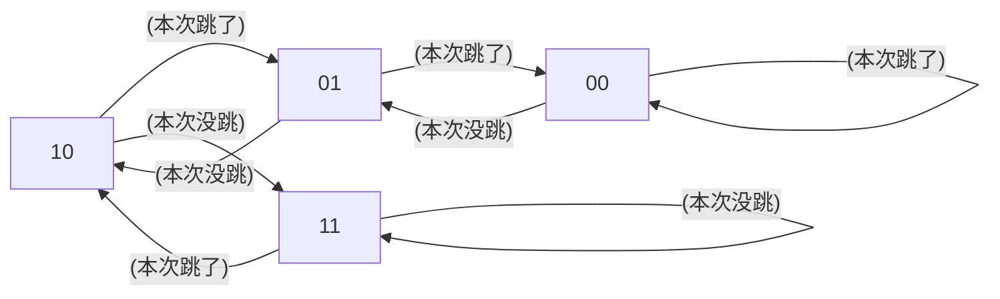

# chap3: Instruction-level Parallelism (ILP)

## 目录
- ILP 基础概念（与计组重合）
- ILP 在体系里学的三种算法（不知道取什么名字了）
- Branch prediction

## ILP 基础概念

!!! note
    是写得简单点了哈。写不动了。要不大家看计组王道好了。

**三种竞争**

- 数据竞争 Data Hazard
    分为（注意下面命名方法都是按“本应发生的顺序”，比如 RAW 就是指，正常的运行顺序就是先写后读。）
    - RAW 写后读：真依赖。只有它是真依赖的原因是只有它需要读的是写出来的数据，所以必须要等。其它两个都只是需要一个寄存器这个空位，所以写的东西即使写在别的地方也行，如果有别的地方可以写就不用等。
    - WAW 写后写：它是啥依赖不用记。
    - WAR 写后读：它是啥依赖不用记。

- 结构竞争 Structural Hazard
    是指如果两个指令需要同时用同一个 Function Unit，比如同时用一个需要两时钟周期才能算完的 ALU，结果该 Function Unit 只有一个，那么后来的指令就得等先来的指令算完才能去算。

- 控制竞争 Control Hazard
    是指如果遇到跳转指令，结果用于判断跳转条件的寄存器值还没好，就需要等寄存器准备好才能知道跳不跳，那就需要停下等。

**流水线类型**

- 单周期流水线
    以耗时最长的一个阶段的用时为机器周期。
    所有指令跑完用时的计算：(指令数 + 阶段数 - 1) * 机器周期。理解起来就是只有第一条指令的前 n-1 个周期没有指令完成，之后每个周期都完成一条指令。

- 多周期流水线
    会考填表题。就是那种乘法等 6 个周期除法等 24 个的。lab 里会复习到。

- 还有下图这几种
    

看的时候注意总结一下每一种的 CPI 是大于等于还是小于 1。我总结不出来了。

## ILP 在体系里学的三种算法

!!! note
    本来这块该写的但是我写不动了

直接去 bing 搜索 (1)Scoreboard, (2)Tomasulo, (3)Tomasulo w speculation, 去找一个南大同学写的知乎帖子，我是看这套帖子看懂的。还有 lab 里这块的实验也能帮助理解。

请再结合这张图记忆一下：

还有一个上述资料似乎没讲到的点，关于 ISSUE 时机，我记得是
- Scoreboard: 需要的 Function Unit 为空，且需要写的 Reg State 没有别的指令还准备写（避免 WAW）时。
- Tomasulo: Reservation Station 有空时。
- Tomasulo w ROB (即 w speculation): Reservation Station 和 ROB 都空时。

!!! warning
    但是上述 Tomasulo w ROB 似乎跟我考的一个期末题不兼容，不知道，等后人来为我指出

## Branch prediction

回忆 control hazard，流水线 CPU 遇到跳转语句如果判断条件还没就绪，就需要等操作数才能继续往下走。我们想让 CPU 随便先猜一个往下走着，如果等操作数准备好发现猜错了，大不了再掐掉，猜对了那就节约时间了。

猜的根据有什么呢，确实有根据，统计表明大部分程序里发生跳转（branch taken）和不发生跳转（branch not taken）的数目是严重不成比例的，经常其中一个可能能占到 90% 多的情况。那么，假设如果知道之前很多跳转语句都跳了，接下来发生的跳转语句也大概率会跳。

因此，我们可以设计一个状态机，有四种编码 00(很可能跳) 01(应该跳吧) 10(应该不跳吧) 11(很可能不跳)，如果状态机在 00 和 01 状态就预测下一次也跳转，如果状态机在 10 和 11 就预测下一次不跳转。

而状态转移是这样发生的：

!!! note
    我知道 mkdocs 应该渲不了 mermaid，但是我懒，请大家脑渲一下。。或者看自己老师 ppt。。是一个有四个状态的红红蓝蓝的状态机

计算题会考使用这样的 branch prediction，预测失误的概率是多少。
