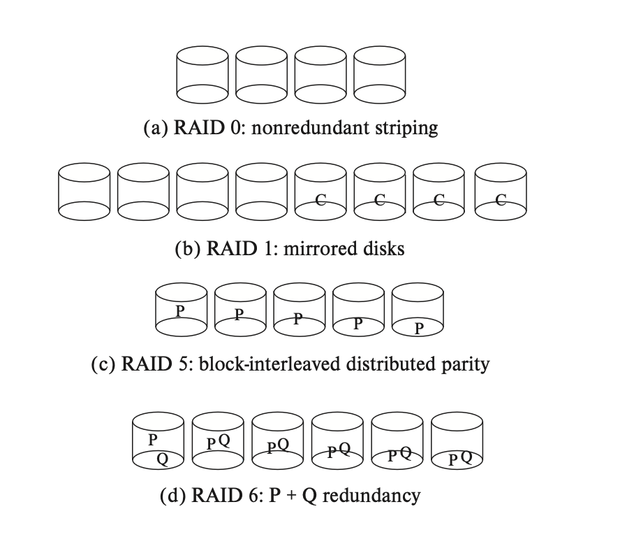

# Database Design 数据库设计

这章关注如何在磁盘 disk 上实现一个 database。

## Storage Structure 存储结构

首先需要介绍 storage hierarchy。一个从顶（容量最小最快的）向下（容量最大最慢的）的图示如下，

```
    /\   Primary storage 主存储器: CPU register 寄存器, cache 缓存, main memory 主存
   /--\  Secondary storage 二级存储器: flash memory 闪存, magnetic disk 磁盘
  /----\ Teriary storage 三级存储器: optical disk 光盘, magnetic tape 磁带
 --------
```
其中最顶层 primary storage 是 volatile（易失的），意思是如果计算机断电重启，就会丢失；下面两层都是 non-volatile（不易失的），意思是即使计算机断电，也不会丢失。

下面依次简单介绍每个存储器：

- Cache 缓存
    缓存是速度最快的存储器，但造价和维护成本最高，所以相对比较小。虽然数据库无需维护 cache，但有的数据库在设计查询的时候会关注 cache 效率。
- Main memory 主存
    主存里的数据可以直接被 CPU 执行计算操作，这里的计算操作就是指 machine instruction 机器指令。主存也相对小，虽然现在有的商业数据库可以被整个塞进主存。主存是 volatile 也就是断电丢失的，系统坏掉也会丢失。
- Flash memory 闪存
    闪存及以下的存储器就都是断电不丢失的了。闪存的维护成本比主存低，比磁盘高。
    闪存可以用于在“USB flash drive”（U 盘）中保存数据；还有 Solid-state drive 固态硬盘（SSD）也使用了闪存，但是提供了磁盘一样的接口，可以代替磁盘的功能。
- Magnetic disk 磁盘
    也叫 hard disk drive 硬盘。磁盘是主要的长期 online 存储的介质，但是 CPU 如果想要操作磁盘上的数据，就先要把数据移到主存里，处理完再移出来。磁盘的存储能力在逐年上升。
- Optical disk 光盘
    常见的 disk video disk（DVD）就是一种光盘。光盘上的数据被用激光读写。它是一种 write-once, read-many (WORM) 介质，即只能写一次，但是能读很多次。 
- Magnetic tape 磁盘
    磁盘一般是用来备份和存档不常用的数据的，这类数据就不常使用，一般需要被安全地长期保存。磁盘上的数据必须被顺序读取，即读写头在磁盘上移动，读哪里移到哪里，所以它叫 sequential-access storage，这样读取是非常慢的。直接读取的 direct-access storage，比如磁盘和 SSD storage，读取就相对快一些，因为可以直接读取盘上的任何地方。

### RAID

!!!
    (这块在 db 和 os 里都不考，但是都会经常提到，很神秘，所以顺便做一下笔记)

RAID 全称是 redundant arrays of independent disk 独立磁盘冗余阵列。它的来历是因为，过去的系统设计者们认为使用多个小型、廉价磁盘组成的存储系统是一个更经济高效的选项，所以原来 RAID 中的 I 是 inexpensive 的意思。但现在所有磁盘在物理尺寸上都很小，容量更大的磁盘实际上具有更低的每兆字节成本。开发者使用 RAID 系统现在主要因其更高的可靠性和性能，和管理操作简便。

!!! 
    TODO

通过并行来加速



- RAID level 0 

- RAID level 1

- RAID level 5

- RAID level 6


## File System 文件系统

数据库是存储在一系列的文件中的，文件内部，每个文件中有一系列的 records 记录，每个 record 含有一系列的 fields 域。

在设计时，一般有一些假设：（1）假设记录的长度是固定的，（2）假设每个文件里只有一种记录，（3）假设不同的文件被用于不同的关系。

### 记录的类型


### 记录的排布

一个新的记录要插入文件时，可以有几种算法来决定插入到文件的哪个位置：

- **Heap**: Record can be placed anywhere in the file where there is space. 新的记录可能被插入任意空位。
- **Sequential**: Store records in sequential order, based on the value of the search key of each record.
- **In multitable clustering file organization**: In a multitable clustering file organization, records of several different relations can be stored in the same file Motivation. Store related records on the same block to minimize I/O. 在一个多表文件结构中，多个不同关系的记录可以存储在同一个文件中。将相关的记录保存在同一个数据块中，可以最大限度减少I/O。
- **B+ tree**: Ordered storage even with inserts/deletes. 即使在插入和删除的时候也能有序存储。
- **Hashing**: A hashed function computed on search key; the result specifies in which block of the file the record should be placed. 对搜索键进行散列计算的函数；结果指定了记录应该放在文件的哪个块中。


每个文件被划分为固定长度的 blocks。block 是数据存取和空间分配的基本单位。

一个 block 包含多条记录。在传统的数据库中，记录的长度不能超过 block，每条记录一定都是完整的。记录之间用链表来连接。

记录分为定长记录和变长记录两种。

- Fixed-length records 定长记录
    
    Storage record i starting from byte n*(i-1) where n is the size of each record. Record access is simple but records may cross blocks.

    Modification of fixed-length records: do not allow records to cross block boundaries.

    Deletion of record i: alternatives

    可以不 move records，but link all free records on a free list. 要删除的条目打上标记，形成一个空记录的链表。未来要插入时也应选择空记录，只要通过指针就可以找到，然后更新记录即可。

    

- Varaible-length records 变长记录
    variable-length records arise in database systems in several ways:

    - storage of multiple record types in a file
    - record types that allow variable lengths for one or more fields such as strings (varchar)
    - record types that allow repeating fields (used in some older data models)

    variable length attributes represented by fixed size (offset, length), with actual data storad after all fixed length atrributes.

    null values represented by null-value bitmap ()

    不定长的保存在后面，定长的（offset length）保存在前面。


slotted page structure 分槽页

- number of record entries
- end of free space 的指针，偏移量也要调整。也可以暂时不调整，等后面如果需要分配内存但不够时，再一次性调整之前的空间。


典型的变长记录有如下特点：

- 属性按顺序存储
- 变长的变量用 offset + data 的形式存储，空值用 null-value bitmap 存储

存储缓冲区的管理


## Index 索引

数据库中引入索引概念，是为了加快查找速度。

在引入索引的时候，需要关注的因素都有如下几种

- Access type 访问类型
    
- Access time 访问时间

- Insertion time 插入时间

- Deletion time 删除时间

- Space overhead 空间开销


一般来说，键的排列方式分为 ordered index 顺序索引和 hased index 两种。

- 顺序索引 （TODO 你是不是指 B+ 树啊）
- hash index

而索引指向数据的方式又分为：

- Dense index 密集索引
    密集索引下，每一条数据记录都有对应的索引。

- Sparse inedx 稀疏索引
    此时不是每一条记录都有对应的索引。索引只指向对应的一部分记录，其余记录通过链表一样的指针连接起来。此时需要的空间和插入删除新索引的开销较小，但是比密集的索引慢。

- Secondary index 二级索引
    索引通过一个大的 bucket 来寻找所指向的地方。

- Multilevel index 多级索引
    分为 outer index 和 inner index。


### B+ 树

介绍常用的 B+ 树数据结构。与 fds 中定义相同，但是再介绍一次。

B+ 树是一种平衡的（每层都是满的）多分树（不止两个节点）。一个 m 阶的 B+ 树满足如下条件：

- 每个节点最多只有 m 个节点
- 每个非叶子结点（除了根节点）具有至少 ⌈m/2⌉ 个子节点。
- 如果根节点不是叶节点，则根节点至少有两个子节点。
- 具有 k 个子节点的非叶节点包含 k-1 个键。
- 所有叶子都出现在同一水平，高度一致。
- 两个搜索键之间的指针指向的数据，总是在这两个搜索键之间。

在实现中，B+ 树的一个节点的大小和一个磁盘区块一样大（通常是 4 KB），而索引的规模一般在 100 左右。

[B+ Tree Visualization](https://www.cs.usfca.edu/~galles/visualization/BPlusTree.html) 是一个 B+ 树可视化的工具。

分别分析几种数据操作下，B+ 树的性能：

- 查找 search

    查找算法就是从根节点开始向下比较，根据与每个父节点的大小关系一路比较找到要找的叶子结点。如果 N 为叶子的总数，那么查询的时间复杂度不会超过 $log_n/2(K)+1$。

- 插入 insert

    插入算法涉及：先找到该插入的位置直接插入，如果当前的节点数量超过了阶数 M 则拆成两个部分，并向上更新索引。TODO 所以时间复杂度是...

- 删除 delete

    删除算法设计：直接把要删除的节点删除，然后把没有索引 key 了的非叶节点删除，从旁边找一个叶节点合并出新的非叶节点。TODO 所以时间复杂度是...

B+ 树的相关计算

高度的估计：可以分析高度的上下界

- 高度最小的情况是所有叶节点都满 $h = \lceil log_N(M) \rceil$
- 高度最大的情况是所有叶节点都半满 $h = \lfloor log_{} \rfloor + 1$

size 大小的估计：也是分析高度的上下界

- $$
- $$

### Hash 索引


## Query Process 查询处理

查询处理的基本步骤是：（1）Parsing and translation 解析和翻译 （2）Optimization 优化 （3）Evaluation 评估。

我们最关注的其实是优化步骤。优化一步是基于以下假设：一种 SQL 查询可能对应了多种等价的关系代数表达式。可以通过估计每种优化方法的 cost 来评估方法的好坏。查询优化会选择最节约的方式进行查询。

那么问题就规约成了从所有等价的关系代数表达式中，选择 cost 最小的一个。那么问题就变成了如何计算 cost！

Cost is generally measured as *total elapsed time* for answering query. Many factors contribute to the time cost: disk access + CPU + network communication. 但是前面讨论过，一个查询被执行的时候需要被加载到磁盘上，而磁盘读写非常慢；CPU 时间可以忽略不计；只要不是网络应用就不用管网络传输开销。所以目前我们关注的 cost 最大的来源就是磁盘访问时间，其中包含 seek, block read, block write 的用时。因此定义以下 cost 计算方法：

在 B 个 block 中查询 S 次的时间 = B * 转移到一个 block 的时间 + S * 一次查询的时间。

而查询中，读写耗时更多，其中写比读更耗时。所以我们希望查找和查询的时间都更少。

（TODO：这里计算的时候要基于两个假设，cost 依赖于主存中缓冲区的大小，更多的内存可以减少 disk access；另外通常考虑最坏的情况，即主存只提供最少的内存来完成查询工作）

接下来来估计关系代数各个操作的 cost

**Select 选择的 cost 计算**

有三种 select 的算法

- 线性搜索

    去依次查询每个 block 判断是否满足查询条件。

- 索引搜索

    

- Primary index, equality on key 搜索一条记录


- Primary index, equality on non-key 需要搜索多条记录


- Secondary index 二级索引


**Sort 排序的 cost 估计**

sort 操作一般使用外部归并排序。对于一个大小为 M 的内存，b_r 表示 block 的数量。sort 分为以下两个步骤：(1) create sorted runs，数据从磁盘读入内存中，因为内存大小是 M，每次能处理 M 个数据项 (2) merge the runs。

需要的 merge pass 的总数 $\lceil log_{M-1}(b_r/M) \rceil$。

创建和每次 run 的过程中 disk access 的数量 2br。

外部排序中总的 disk access 次数 $(2\lceil log_{M-1}(b_r/M) \rceil+1)b_r$


**Join 连接的 cost 估计**

以下有几种实现 join 的算法 (1) nested-loop join (2) block nested-loop join (3) indexed nested-loop join (4) merge-join (5) hash-join。

- nested-loop join

    计算 theta-join 表达式：

    ```
    for each tuple tr in sr do begin
        for each tuple ts in s do begin
            test pair (tr, ts) to see if they satisfy the join condition
    ```

    r is called the outer relation and s the inner relation of the join.

- block nested-loop join
    
    ```
    for each block br of r do begin
        for each block bs of s do begin
            for each tuple tr in br do begin
                for each tuple ts in bs do begin
                    check if (tr, ts) satisfy the join condition
                        if they do, add tr·ts to the result
                end
            end
        end
    end
    ```

    最坏的情况：
        block transfer b_r * b_s + b_r

    基础情况：

- index nested-loop join


- merge-join

    

- hash join

    hash


**Duplicated Deletion 重复消除**

排序和投影可以消除重复

考得不多。


**Aggregation 聚合**

也可以用排序或投影来做。


## Query Optimization 查询优化


原则：往往先去做选择和投影（已经对初始表做过一次选择，减少了很多记录），再连接

有两种查询优化的方法：（1）找到等价的查询效率的最高的关系代数表达式（2）制定详细的策略来处理查询。下面分别来介绍


**等价关系代数表达式法**


**制定详细的策略来处理查询**

