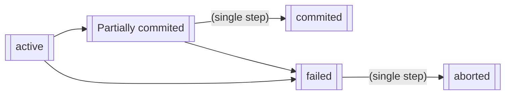

# Transaction 事务

## 简介

事务是程序执行的基本单位，会引起一些数据项的更新。我们定义事务有以下四个基本属性：

- Atomicity 原子性
    事务是 non-or-all 的，即所有步骤要么全部执行后 commit，要么就 rollback 回滚到没做的状态。

- Durability 持久性
    事务完成后更新数据，即使软硬件出了问题，更新的数据也必须存在。

- Consistency 一致性
    定义说：事务必须使数据库从一个一致性状态转换到另一个一致性状态。可以这样理解，如果有一个保存存款的数据库，一开始存取记录加起来结果是等于总数的，那么事务执行完，还要保持所有记录在这个加起来等于总数的状态。

- Isolation 独立性
    当多个用户并发访问数据库的时候，数据库为每个用户开启的事务，不能被其它事务的操作所干扰。    

为了保证事务的这些属性，一般主要需要考虑两个问题：

- 数据库系统的硬件问题和系统崩溃而导致事务没能完成时，事务可以回滚到没发生的状态
- 多事务并行执行时，不能使读写的错误顺序干扰读写的结果，即多个事务不能互相干扰

于是，我们考虑把一个事务分为多个状态来完成。一个事务有五种状态：

- Active 初始状态
- Partially commited 在最后一句指令被执行之后
- Failed 在发现执行失败之后
- Aborted 回滚结束，会选择重新执行事务还是结束
- Commited 事务被完整地执行

一个转化的状态图如下

我们主要需要保证 partially commited 到 commited，和 failed 到 abort，这两步都是原子性的。

## 调度

这样就涉及到调度概念。Schedules 调度是一系列用于指定并发事务执行顺序的指令。它需要（1）包含事务中的所有指令，（2）保证单个事务中的指令的相对顺序。

如果事务是良构的且是两阶段的，那么任何一个合法的调度都是隔离的
具体的数学推到过程可以参照<<事务处理:概念与技术>>这本书的7.5.8.2节此书乃是关于数据库事务的圣经，无需解释(中文翻译虽然晦涩，也能坚持读下去,强烈推荐

## 串行

如果一个调度与一个串行调度（serial）等价，那么称这个调度是 serializable 可串行化的。

可串行化建立在一个假设上：事务不会破坏数据库的一致性，只考虑有读写两种操作。

我们说一个调度是 conflict serializable 冲突可串行化的，当：

- 
- 

## 并发处理

同时执行多个事务，可以提高运行的效率，减少平均执行时间。

并发控制的处理机制是，让并发的事务独立进行，控制并发的事务之间的交流。

## 故障恢复

故障的种类有：

- database application
    逻辑错误：比如不满足数据库约束条件（主键），系统错误死锁。

- DBMS

- Database 

checkpoint 

Recovery algorithms are techniques to ensure database consistency and transaction atomicity and durability despite failures. 故障恢复算法就是保障数据库 ACD（不知道为什么没有 I）特性的方法。

故障恢复算法有两个部分：

- Actions taken during normal transaction processing to ensure enough information exists to recover from failures. 在正常运行的事务中，要记日志，以保存足够的信息用来恢复。
- Actions taken after a failure to recover the database contents to a state that ensures atomicity, consistency and durability. 在错误发生后，要恢复到一个 ACD 状态。

故障恢复算法具有 Idempotent(幂等性): An recovery algorithm is said to be idempotent if executing it several times gives the same result as executing it once. 意思是算法恢复多次的效果是一样的，因为恢复过程中可能也发生 crash。

**Log-based Recovery 基于日志的恢复法**

log records 日志记录：

日志记录是记录在 stable storage（稳定存储器）上的，一系列记录数据库怎样被成功修改的信息。log 由一串 log records 组成。它有以下几种格式

- \<Ti start\> transaction 开始的标志。
- \<Ti, X, V1, V2\> 当 T 执行了 write(X) 时，就写一个 update log，表示在数据表 X 上，将旧值 X1 更新成了 X2。
- \<Ti commit\> 当 Ti 结束，写一个 commit 记录。
- \<Ti abort\> 如果 Ti roll back 了，写一个 abort 记录。

checkpoint 之间的间隔应当通过日志量来确定。

两种策略
- Redo:

    In the redo phase, the system replays updates of all transactions by scaning the log forward from the last checkpoint. The log records that are replayed include log records for transactions that were rolled back befored system crash, and those that had not committed when the system crash occurred. 
    在 redo 阶段里，系统根据重新扫描上一次 checkpoint 之后的所有记录，重新执行上一次 checkpoint 之后的所有 transaction。这里的 log 记录包括在 crash 之前正在回滚的那些记录，也包括 crash 时还没有提交的那些记录。Redo 阶段也会判断所有 transaction 是否完成了，是否需要 roll back。没完成的 transaction 会被标记为或者 \<Ti abort\> 或者 \<Ti commit\> 的标记。具体来说执行的步骤有下面几条：

    - 

- Undo:

    