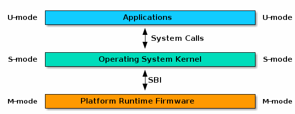
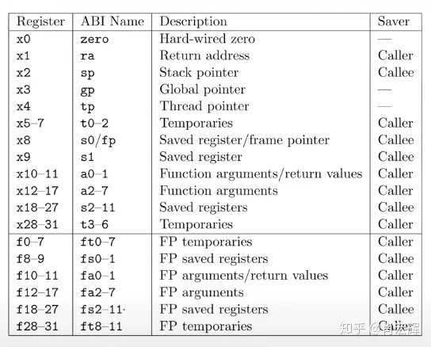
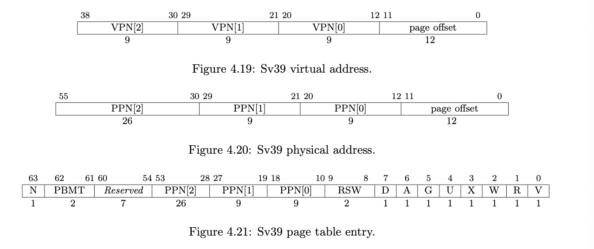

# OS lab

目录：这里会先讲一下用到的背景知识和 mac 下的环境配置技巧（因为手册讲 mac 不多），然后挨个实验我想进行一些综述，不知道精力能支撑写多少，最后补充两个我实验中总遇到的但手册没涉及的问题。自知学得不好，不确定的地方我会标出来。

## overview

!!! warning
    结构图 TODO

一个最后做出来的 lab 结构图:

```mermaid

```

## 背景知识

先介绍一下整个实验和实验环境的大背景。

### 计算机上电到OS运行的过程

嵌入式系统（相比计算机系统比较简单，只能在特定硬件上运行）的启动过程比较简单，用它来做例子讲解，过程是：

- 上电，对硬件进行一些简单的初始化
- 将CPU的program counter移动到内存的bootloader的起始地址。bootloader用于操作系统运行内核之前，初始化硬件，加载操作系统内核。
- riscv架构下bootloader运行在M模式下，bootloader运行完毕后切换到S模式，随后开始运行kernel。

```
Hardware             RISC-V M Mode           RISC-V S Mode 
+------------+         +--------------+         +----------+
|  Power On  |  ---->  |  Bootloader  |  ---->  |  Kernel  |
+------------+         +--------------+         +----------+
```

### sbi和opensbi

介绍实验环境用的第一个工具：sbi (supervisor binary interface)是 s-mode 的 kernel 和 m-mode 执行环境之间的接口规范

opensbi是一个riscv sbi规范的开源实现，总之意思是opensbi是一些对m-mode下硬件的统一定义，在s-mode下的内核可以按照这些规范对不同硬件操作。

我们opensbi可以作为bootloader完成机器启动时m-mode下的硬件初始化和寄存器设置，可以利用opensbi完成字符打印之类的操作。



qemu会把opensbi起始地址加载到0x80000000处.

opensbi初始化后会跳转到0x80200000处，即kernel的起始地址。所以要编译的代码在0x80200000处。

### 特权模式

riscv有三种特权模式：User, Supervisor, & Machine。整个实验中我们一开始都要在 s-mode 操作，之后慢慢实现 u-mode。

| Level | Encoding | Name |  Abbreviation | 介绍 |
| --- | --- | --- | --- | --- |
| 0 | 00 | User/Application | U | 对硬件模式的抽象，有最高级别的权限 |
| 1 | 01 | Supervisor | S | 对应与内核态Kernel。当用户需要内核资源时，向内核申请，并切换到内核态进行处理 |
| 2 | 10 | Reserved |  |  |
| 3 | 11 | Machine | M | 用户态，最低级别权限 |

一般每种模式可以运行的程序有

| supported modes | intended usage |
| --- | --- |
| M | simple embedded systems |
| M, U | secure embedded systems |
| M, S, U | systems running unix-like operating systems |


## 环境配置

### Docker

在官网安装Docker。之后需要打开Docker app，登陆后才能在terminal中使用docker命令。

```shell
$ sudo hdiutil attach Docker.dmg
$ sudo /Volumes/Docker/Docker.app/Contents/MacOS/install
$ sudo hdiutil detach /Volumes/Docker
```

创建容器

```shell
docker pull ubuntu:22.04
docker run -it --name my_linux ubuntu:22.04 bash
```

出现root@xxxxxxx:?# 即创建成功，其中xxxxxxx一串是当前容器的id，需要记录下来，下次可以通过该id进入相同容器。


安装交叉编译工具包，qemu，gdb，这几步需要开着命令行代理，截图略。

### 聪明地使用docker
    
还是最好配置一下 vscode 里的图形界面。步骤：

- 首先在 vscode 里安装 docker 插件。
- 以什么方式关联上 docker 忘记了，可能是输入账号密码登陆。然后在 docker 插件里就可以看到你的所有容器。
- 文件管理上：个人认为每个 lab 的文件夹在 docker 上单独开一个文件夹比较好使。容器里留最新版代码，本地留拷贝。
- gui 使用上：有三种编辑文件和运行的方法。(1) 把容器 attech new window，在单独窗口也即容器里编辑代码和运行终端。(2) 在本地修改代码，每次运行的时候 cp 到 docker，再把容器 attach shell 运行。(3) 直接用 docker 插件去访问文件目录，然后 attach shell 去运行。后两者都极其难用。我不想解释难用在哪里了，虽然也使我熟练掌握了用命令行控制进入新的容器和进入已有的容器和 `ps a` 和 `kill qemu` 等命令。。当然可能也只有笨蛋我按照后两种用了好久。

## 方法介绍

!!! warning
    TODO 这块应该再扩写一下的

- shell脚本：相当于一组打包好的命令行，里面命令用来指示命令行的运行顺序等。可以直接用 `bash [shell file].sh` 来运行。
- qemu：一个可以在x86平台上执行不同架构下程序的模拟器，本实验中用qemu完成对riscv架构程序的模拟。
- gdb：是gnu debugger的缩写，是一个unix/linux系统下的基于命令行的调试工具。能够启动、指定条件停止、检查、更改程序。
- 交叉编译：用一个架构的平台编译另一个架构运行的程序，如用x86编译riscv运行的程序。我们用的交叉编译链是 `riscv-gnu-toolchain` 。
- 内核配置：内核配置是用于配制是否启用内核的各项特性，写在文件defconfig里。
- 编译工具：makefile，makefile知识我没学好，不过现在gpt写得比我好。


### qemu + gdb 调试

需要调试时，因为顶层 makefile 帮我们写好了调试命令，我们第一个 terminal 只需要输入 `make debug`。
然后新开一个 terminal 输入 `gdb-multiarch path/to/vmlinux` 其中 vmlinux 是编译好的文件。

gdb 使用的方法/窍门

- 首先按回车可以自动执行上一条语句，不用重新手打一遍。
- 此外整个实验需要用到的命令见下方表格

| 显示有关的 | 简写 | 指令 |
| --- | --- | --- |
| 显示源代码 |  | layout src |
| 显示汇编代码 |  | layout asm |
| 退出汇编显示 |  | ctrl+x, A |
| 退出gdb |  | quit |
|  |  |  |
| 执行有关的 | 简写 | 指令 |
| 单步执行，运行程序，停在第一执行语句 |  | start |
| 断点后继续执行 | c | continue |
| 单步调试（逐c语言语句，函数直接执行） | n | next |
| 执行单条指令 | si | step instruction |
| 重新开始运行文件（run-text：加载文本文件，run-bin：加载二进制文件） | r | run |
| 结束当前函数，返回到函数调用点 |  | finish |
|  |  |  |
| 断点有关 | 简写 | 指令 |
| 设置断点在foo函数 | b foo | break foo |
| 断在某地址 | b * 0x80200000 | break * 0x80200000 |
| 查看第m个-第n个断点 |  | info breakpoints [LIST] |
| 查看所有断点 |  | info breakpoints |
| 删除N号断点 |  | delete [N] |
|  |  |  |
| 展示值有关的 | 简写 | 指令 |
| 查看函数的调用的栈帧和层级关系 | bt | backtrace |
| 切换函数的栈帧 | f | frame |
| 打印值及地址 | p | print |
| 查看函数内部局部变量的数值 | i  | ifo |
| 查看寄存器 ra 的值 | i r ra |  |
| 追踪查看具体变量值 |  | display []  |
| 以 16 进制打印 <addr> 处开始的 16 Bytes 内容 |  | x/4x <addr> |
| 显示数组 |  |  p *swapper_pg_dir@100 |
| 16进制显示（x倍数只能为1） |  |  p/x swapper_pg_dir [start]@1 |

!!! question "调试的时候需要看什么呢？"
    这是我刚上手调试的时候感到困扰的一个问题。

    后来我逐渐想清楚的是，首先我认为如果不知道正在运行的程序运行的流程（比如先哪个函数再哪个函数），是不适合开始调试的，应当回去再思考一遍 lab 的理论，起码知道自己程序的各种预期结果。暴论一点说其实我觉得调试时长大于开发时长都是不太好的，暴露出肯定哪里理论没啃透就开始动笔了。

    然后可以由大到小，比如先把几个断点打在猜测可能出错了的几个函数上，确定具体在哪个函数出错后再逐 c 语言行运行，确定是哪个 c 语言行出错后再逐汇编行运行，循序渐进找到具体出错的指令。在附近打印打印几个寄存器的值（可以看的寄存器我会在下一节介绍），然后在此基础上思考错误原因。


### 聪明地使用 gdb

gdb 自带的命令行 ui 缺点主要在于不能随时显示寄存器和变量的值，调试会不舒服。有一些更好的 ui 工具。

我没有配所以不能提供很好的我的推荐，贴一些别人的帖子。除了下面帖子里提到的几个，萱萱还提到一个 `gdbpeda`。

[推荐几个好用的GDB图形化功能增强插件](https://www.cnblogs.com/liuhanxu/p/17011775.html)

## lab0

没难度不用讲

## lab1

### C & RISC-V 内联汇编

!!! note
    这块来自于对 lab1 文档的整理。希望有整理得比原文档可读一些。

```c
__asm__ volatile (
        "instruction1\n"
        "instruction2\n"
        ......
        ......
        "instruction3\n"
        : [out1] "=r" (v1),[out2] "=r" (v2)
        : [in1] "r" (v1), [in2] "r" (v2)
        : "memory"
    );
```

其中，三个 `:` 将汇编部分分成了四部分。这四部分中后三部分不是必须的：

- 第一部分是汇编指令，指令末尾需要添加 '\n'。
- 第二部分是输出操作数部分。
- 第三部分是输入操作数部分。
- 第四部分是可能影响的寄存器或存储器，用于告知编译器当前内联汇编语句可能会对某些寄存器或内存进行修改，使得编译器在优化时将其因素考虑进去。


这段暂时用不着我不写了，贴一段lab1中的原文给的示例。e.g. 1

```c
unsigned long long s_example(unsigned long long type,unsigned long long arg0) {
    unsigned long long ret_val;
    __asm__ volatile (
        "mv x10, %[type]\n"
        "mv x11, %[arg0]\n"
        "mv %[ret_val], x12"
        : [ret_val] "=r" (ret_val)
        : [type] "r" (type), [arg0] "r" (arg0)
        : "memory"
    );
    return ret_val;
}
```

e.g. 1. 中指令部分，%[type]、%[arg0]以及%[ret_val]代表着特定的寄存器或是内存。输入输出部分中，`[type] "r" (type)`代表着将 `()` 中的变量 `type` 放入寄存器中（`"r"` 指放入寄存器，如果是 `"m"` 则为放入内存），并且绑定到 `[]` 中命名的符号中去。`[ret_val] "=r" (ret_val)` 代表着将汇编指令中 `%[ret_val]` 的值更新到变量 `ret_val` 中。

e.g. 2

```c
#define write_csr(reg, val) ({
    __asm__ volatile ("csrw " #reg ", %0" :: "r"(val)); })
```

e.g. 2. 定义了一个宏，其中 `%0` 代表着输出输入部分的第一个符号，即 `val`。 `#reg` 是c语言的一个特殊宏定义语法，相当于将reg进行宏替换并用双引号包裹起来。例如 `write_csr(sstatus,val)` 经宏展开会得到：

```c
({
    __asm__ volatile ("csrw " "sstatus" ", %0" :: "r"(val)); })
```

此外，这个示例中的 `({...})` 还涉及了一个 GNU 对 C 的扩展，可以参考 [Statements and Declarations in Expressions](https://gcc.gnu.org/onlinedocs/gcc/Statement-Exprs.html)。复合语句中的最后一项应该是一个表达式，后跟一个分号 `;`。该子表达式的值用作整个语句的值，可以用来实现类似“返回值”的效果。


### 编译的知识

!!! note
    这块来自于对 lab1 文档的整理。希望有整理得比原文档可读一些。

`vmlinux.lds`` 是 GNU ld，一种链接器，将 .o 文件和库文件连接起来成可执行文件。ld使用链接脚本linker script控制。这个文件里有写：

- 目标架构 `OUTPUT_ARCH( "riscv" )`
- 程序入口： `ENTRY( _start )`并且head.S里需要编写对应的_start函数
- kernel代码起始地址 `BASE_ADDR = 0x80200000;`
- 每个段的起始地址 结束地址 对齐方式
- kernel代码结束地址

我们阅读一下这个链接器文件，对之后的实验帮助挺大。

首先可以粗略观察到，kernel 空间里是分段(secition)的，主要的section有：

| 段名 | 主要作用 |
| --- | --- |
| .text | 通常存放程序执行代码 |
| .rodata | 通常存放常量等只读数据 |
| .data | 通常存放已初始化的全局变量 静态变量 |
| .bss | 通常存放未初始化的全局变量 静态变量 |

再细致一点去观察里面的符号。

- 符号 `.` 在链接脚本代表当前地址，它有赋值、被赋值、自增等操作。
- 符号 `*` 有两种用法，其一是 `*()` 在大括号中表示将所有文件中符合括号内要求的段放置在当前位置 `*(.data .data.*)`，其二是作为通配符。
- 在链接脚本中还可以自定义符号，例如文件里所有 `_s` 与 `_e`开头的符号都是本实验助教老师自己定义的。

编译出的文件里：

- vmlinux 通常指 Linux Kernel 编译出的可执行文件 (Executable and Linkable Format / ELF)，特点是未压缩的，带调试信息和符号表的。
- System.map 是内核符号表（Kernel Symbol Table）文件，是存储了所有内核符号及其地址的一个列表。“符号”通常指的是函数名，全局变量名等等。使用 `nm vmlinux` 命令即可打印 vmlinux 的符号表。


### RISC-V 时钟中断

操作系统在启动后由事件(event)驱动，我们将引入一种事件trap，trap给了os与软硬件交互的能力。在boot阶段opensbi实现了M态的trap处理。我们实现的是s态的trap处理。

并且我们明确一下 Interrupt, Exception 和 Trap 的区别 (from riscv unprivileged spec)：

- Interrupt: an external asynchronous (异步的) event that may cause a riscv hart to experience an unexpected transfer of control.
- Exception: an unusual condition occurring at run time associated with an instruction in the current riscv hart.
- Trap: the transfer of control to a trap handler caused by either an exception or an interrupt

实验手册则给了下表，虽然里面没有讲到 trap，但是这个对于 interrupt 和 exception 的解释更清楚。

| Interrupt | Exception |
| --- | --- |
| hardware generated | software generated |
| Asynchronous external requests (generated by e.g. keyboard or printer) | synchronous internal requests for services based upon abnormal events (generated by e.g. illegal instructions, illegal address, overflow, etc.)  |
| normal events | abnormal events |

理解了上述两个概念后可以把 trap 当作一种统称，可以理解为 trap = interrupt + exception。我们后续实现的 `trap_handler()` 既要处理中断也要处理异常。

要实现的中断的流程如下，可以参照这个完成 `do_timer()` `switch_to()` `schedule()` 等函数：

- 在每次处理时钟中断时，操作系统首先会将当前线程的运行剩余时间减少一个单位。之后根据调度算法来确定是继续运行还是调度其他线程来执行。
- 在进程调度时，操作系统会遍历所有可运行的线程，按照一定的调度算法选出下一个执行的线程。最终将选择得到的线程与当前线程切换。
- 在切换的过程中，首先我们需要保存当前线程的执行上下文，再将将要执行线程的上下文载入到相关寄存器中，至此我们就完成了线程的调度与切换。


### RISCV 寄存器

回忆内存结构（如果你明确知道寄存器是什么就不用回忆了），可见寄存器并不在运行内存里：

```
小/快 <---------------> 大/慢
[寄存器] - [cache] - [内存] - [外存]
```

riscv有32个通用寄存器 + 很多控制状态寄存器 (control and status registers (CSRs))。riscv 给每个寄存器有个元信息，这个元信息共用 12-bit 来存储即 csr[11:0]，所以一共支持 4096 个寄存器。具体而言，csr[11:0] 这个数据结构每个位的意义分配如下：

| 位数 | 11:10 | 9:8 | 7:4 |
| --- | --- | --- | --- |
| 长度 | 2 | 2 | 4 |
| 作用 | 11=read-only，other=read/write？ | 能访问该csr的最低的权限模式 | 我猜是保留给每个csr特定的 |

首先，通用寄存器有如下这些：



在编写汇编代码的时候一般使用寄存器的abi的名字而不是寄存器的编号

- x0 - x31是用来做整形运算的寄存器
- f0 - f31是用来做浮点运算的寄存器（有的不一定有）

而下面要单独讲一下 **csr**。

**sstatus (supervisor status register)**

The sstatus register is an SXLEN(代表32或64)-bit read/write register formatted as follows. 我们用的是64位。


也就是说这个寄存器把很多事件的状态都用0或1表示，拼到了同一个寄存器里。

| 位数 | 名称 | 置1表示 | 置0表示 |
| --- | --- | --- | --- |
| 1 | SIE | 响应所有的S态trap | 禁用所有S态trap |
| 5 | SPIE | 在trap发生前的SIE=1 | 在trap发生前的SIE=0 |
| 8 | SPP | 当中断发生完的时候，返回到S-mode | 当中断发生完的时候，返回到U-mode |

手册里还介绍的位有

- MXR: memory privilege.
- WARL: endianness control

**sie (supervisor interrupt enable register)**

如果开启了sstatus[SIE]，就会根据sie中的比特位，决定是否处理interrupt


Bits sip.SEIP and sie.SEIE are the interrupt-pending and interrupt-enable bits for supervisor- level external interrupts. If implemented, SEIP is read-only in sip, and is set and cleared by the execution environment, typically through a platform-specific interrupt controller.
Bits sip.STIP and sie.STIE are the interrupt-pending and interrupt-enable bits for supervisor- level timer interrupts. If implemented, STIP is read-only in sip, and is set and cleared by the execution environment.
Bits sip.SSIP and sie.SSIE are the interrupt-pending and interrupt-enable bits for supervisor- level software interrupts. If implemented, SSIP is writable in sip and may also be set to 1 by a platform-specific interrupt controller.

**stvec (supervisor trap vector base address register)**

中断向量表基址. 


WARL是中断处理程序的地址

MODE是

| Value | mode | 描述 |
| --- | --- | --- |
| 0 | Direct 模式 | 适用于系统中只有一个中断处理程序, 其指向中断处理入口函数 （ 本实验中我们所用的模式 ） |
| 1 | Vectored模式 | 指向中断向量表， 适用于系统中有多个中断处理程序 |
| ≥2 | 保留 |  |

**sscratch (supervisor scratch register)**

Typically, sscratch is used to hold a pointer to the hart-local supervisor context while the hart is executing user mode. At the beginning of a trap handler, sscratch is swapped with a user register to provide an initial working register.


在本次实验中，我们拿sscratch记录s-mode的stack pointer，在trap发生的时候与u-mode stack pointer交换（好像是来着忘了TODO一会核实）

**sepc (supervisor exception program counter)**

会记录 trap 处理过后的返回地址。


**scause (supervisor cause register)**


会记录 trap 发生的原因，还会记录该 trap 是 `Interrupt` 还是 `Exception`。原因有以下几种：


**stval (supervisor trap value register)**


The stval register can optionally also be used to return the faulting instruction bits on an illegal
instruction exception (sepc points to the faulting instruction in memory). If stval is written with
a nonzero value when an illegal-instruction exception occurs, then stval will contain the shortest
of:

ˆ the actual faulting instruction
ˆ the first ILEN bits of the faulting instruction
ˆ the first SXLEN bits of the faulting instruction

The value loaded into stval on an illegal-instruction exception is right-justified and all unused upper bits are cleared to zero.

**satp (supervisor address translation and protection register)**


记录最高级页表的物理地址。MODE位=8时，使用Sv39模式虚拟地址（本实验）


以下是时钟中断相关的寄存器：

**mtime**

计时器，以恒定频率自增（我记得在本实验里是多少分之一秒）

**mtimecmp（machine timer register）**

下一次时钟中断的中断点

**mcounteren（counter enable register）**

（本实验中不用管，但是说明一下：）mtime本来是m态的寄存器，在s态不能读写，但是opensbi已经设置过可以读写m态

### 寄存器操作

操作csr寄存器的riscv指令集 TODO待整理

| func | scr | rs1 | rd |
| --- | --- | --- | --- |
|  |  |  |  |
|  |  |  |  |

- csrrw (CSR read and write) ,这是读写操作，csr中的值写入rd，rs1的值写入csr。
- csrrwi是csrrw的立即数扩展，rs1寄存器保存值变为一个立即数，对csr的操作是一致的。
- csrrs(CSR read and set), 这是读并置位操作，csr中的值写入rd， rs1的值或上(or)csr中的值再写入csr。
- csrrsi是csrrs的立即数扩展，rs1寄存器保存值变为一个立即数，对csr的操作是一致的。
- csrrc(CSR read and clear)，这是读并清除操作，csr中的值读入rd，根据rs1的值对csr中的值按位清0 再写入csr中。
- csrrci是csrrc的立即数扩展，rs1寄存器保存值变为一个立即数，对csr的操作是一致的。

化用一个暂时不想去找来源的 CSDN 帖子的总结：

- 想对csr连读带写，可选用基础的6条csr指令直接搞定.
- 仅仅是读的话，哪条基础指令都可以，一般会用伪指令.
- 以 i 结尾的，不管是基础指令还是伪指令，都是立即数作为参数的，在指令中操作这个立即数替换了 rs1.
- csr基础的操作，就简单的3种区别，w (直接写 )， s(设置) ， c(清除)，不计i的4字母指令都是伪指令.
- [RISC-V中文手册](http://crva.ict.ac.cn/documents/RISC-V-Reader-Chinese-v2p1.pdf)上csr指令有些名字错误，主要看内容描述.
- 伪指令仅仅是方便程序员读写代码，最终编译器还是都给转成了基础指令.

## lab2

### 线程

本实验建立的线程都是内核态线程。一个依据就是某个线程 trap 后不会阻塞其它线程。

线程的 task_struct 可以理解为理论课上讲的 PCB (是不是该叫 TCB？)。里面的东西会随着逐个 lab 添加进去，最终会有以下东西：

- 线程id (pid)：用于唯一确认一个线程
- 运行栈 (user_stack, kernel_stack)：每个线程必须有一个独立的用户栈
- 执行上下文 (pt_regs *)：线程不在执行时，需要保存其上下文（状态寄存器的值），这样之后才能恢复
- 运行时间片 (counter)：为每个线程分配的运行时间
- 优先级 (priority)：在执行相关调度时，配合调度算法选出下一个执行的进程
- demand paging 中用到的所有 vma 信息，和一个需要的 vma 个数计数器
- TODO：还有别的吗，后面可以再确认一下

!!! warning
    TODO 以下内容需要再检查，忽然分不清每个线程总共是开了一个还是两个内存空间

线程内存空间结构如下。

|  | 内核虚拟存储器 | 用户不可见的存储器 |
| --- | --- | --- |
| 0xc000 0000 | 用户栈 | ← sp |
|  |  |  |
| 0x4000 0000 | 共享库的存储器映射区域 |  |
|  |  |  |
|  | 运行时堆（由malloc创建） | ← brk |
|  | 读写段 .data .bss | 从可执行文件加载 |
|  | 只读段 .init .text .rodata | 从可执行文件加载 |
| 0x0804 8000 | 未用的 | 从可执行文件加载 |


## lab3

到本实验结束时，我们的程序将要实现这样一个从启动到开启映射的过程（也对应 `head.S` 开头的一堆函数调用流程）：

- opensbi初始化那一堆东西 bootloader
- call setup_vm: 物理地址翻译成虚拟地址（等值+偏移）。我的理解是这一步是为了方便调试，因为我们一开始同步的vmlinux.lds导致符号表里所有符号都是用虚拟地址表示的，如果这里没映射后边调试就没法进行。等值映射是因为需要在 setup_cm_final() 里建立页表需要用到啥的物理地址，一旦用完，等值映射就可以关掉了。
- call relocate: 开启satp (supervisor address translation and protection register)
- call mm_init: empty physical memory
- call setup_vm_final: 建立页表 建完后就可以关掉等值映射了
- call task_init: 做线程

### virtual memory

lab2中我们做的都是内核线程，可以共享运行空间，即运行不同线程对内训的修改是相互可见的。如果需要线程相互隔离就需要引入虚拟内存，方便多线程高效共享内存。如果很虚地去讲虚拟内存的作用：

- 虚拟内存可以为正在运行的线程提供独立的内存空间，制造一种每个进程的内存都是独立的假象（咋做到的）。
- 虚拟内存到物理内存的映射也包含了对内存的访问权限，方便内核完成权限检查


我们要实现的虚拟内存布局，首先用一个截图来理解：

```
低地址<-                                       ->高地址

start_address             end_address
    0x0                  0x3fffffffff
     │                        │
┌────┘                  ┌─────┘
↓        256G           ↓                                
┌───────────────────────┬──────────┬────────────────┐
│      User Space       │    ...   │  Kernel Space  │
└───────────────────────┴──────────┴────────────────┘
                                   ↑      256G      ↑
                      ┌────────────┘                │ 
                      │                             │
              0xffffffc000000000           0xffffffffffffffff
                start_address                  end_address
```

然后必须要搞明白：虚拟内存从来没有被真正开辟过，被真正开辟的只有物理内存。我们在程序实现过程中开的变量和 alloc 的 page，都是开在 kernel 的栈或者堆上（.data和.bss段），因为查地址时可以查到它们的物理地址。而各种 csr 在 cpu 里，不会加载到内存中。而本次实验所讲的“开启虚拟内存”，本质上只是设计一个虚拟地址到物理地址的转换函数，这个函数放在页表里。

### Sv39 的页表项



理解一下页表项（pte）。它的低位：

- V: valid
- R: readable
- W: writable
- X: executable
- U: user
- G: global 没用过 默认置0
- A: accessed 没用过 默认置0
- D: dirty 没用过 默认置0
- RSW: reserved 默认置0

### 地址翻译过程

`create_mapping()` 函数遍历整个映射大小，依次按二级页表（即根页表的下一级）→三级页表→物理页，检查页表项的V bit看页表项是否存在，不存在则用kalloc() 分配一页作为页表目录；存在则在页表项中记录页表的物理地址。

pte : [ PPN2: 53-28 ][ PPN1: 27-19 ][ PPN0: 18-10 ][ perm: 9-0 ]

vm_addr: [ VPN2: 38-30 ][ VPN1: 29-21 ][ VPN0:20-12 ][ offset: 11-0 ]

因为查询三级页表的流程为：

- 取VPN2为顶级页表偏移地址，根据顶层页表基地址得到次级页表的起始地址 →
- 取VPN1为次级页表偏移地址，根据次级页表页号*次级页表大小得到起始地址 →
- 取VPN0为虚拟内存偏移地址，根据虚拟内存页号*物理页大小得到物理内存地址

所以反推设置的流程为：

- 顶层页表

    - 取now_pte为顶级页表基地址： `now_tbl = pgtbl;`
    - 从va中取顶级页表偏移： `now_vpn = VPN2(va);`
    - 得到当前va在顶级页表中的具体位置： `now_pte = *(now_tbl + now_vpn);`
    - 如果当前位置不存在页，分配一个新的物理页，并计算新页的页表项，更新到顶层页表里

- 次级页表相同
- 零级页表即vm，不再需要检查V位，其余也相同
- 最后每次循环，虚拟地址和物理地址自增 PG_SIZE（4KB），指向下一个虚拟页/物理页。

### 为什么在 head.S 里一开始要给页表项地址 (TODO坏了不记得是不是它了) 减去一个 VA2PA_offset

在 2023 年版的实验中，`vmlinux.lds` 中设置了将编译出的符号表都用虚拟地址来表示，方便调试。也即程序运行到此处读到的页表项地址是虚拟地址。显然，在 `setup_vm()` 之前，虚拟内存还没有被开启，所以要减掉一个偏移量使其能读到页表项的物理地址。在 `relocate:` 处理偏移之后就不用管了。

## lab4

#### 更新后的虚拟内存布局

我们回忆 lab3 里虚拟地址只用了高位，低位没有用，在本实验我们要将低位 `0x0-0x4000000` 分给用户进程。而用户进程的代码实际在物理地址上分配出来的某个地方。总之，要实现以下的内存布局：

```
               PHY_START   new allocated memory            allocated space end                              PHY_END
                   │         │                                │                                                 │
                   ▼         ▼                                ▼                                                 ▼
       ┌───────────┬─────────┬────────────────────────────────┬─────────────────────────────────────────────────┐
 PA    │           │         │ uapp (copied from _sramdisk)   │                                                 │
       └───────────┴─────────┴────────────────────────────────┴─────────────────────────────────────────────────┘
                             ▲                                ▲
       ┌─────────────────────┘                                │
       │            (map)                                     │
       │                        ┌─────────────────────────────┘
       │                        │
       │                        │
       ├────────────────────────┼───────────────────────────────────────────────────────────────────┬────────────┐
 VA    │           UAPP         │                                                                   │u mode stack│
       └────────────────────────┴───────────────────────────────────────────────────────────────────┴────────────┘
       ▲                                                                                                         ▲
       │                                                                                                         │

   USER_START                                                                                                USER_END
```

#### riscv处理器支持的模式

- 用户模式（U-mode）：执行代码无法直接访问硬件，只能通过os提供的接口
- 内核模式（S-mode）：随意干什么都行

lab3创建的都是内核线程 公用了地址空间（页表swapper_pg_dir）。要引入用户态进程需要做：

- 内核进程创建：每个用户态程序启动时，创建一个内核态进程
    - 这样保证每个应用程序的虚拟地址空间是私有的，一个应用程序无法更改属于另一个应用程序的数据。每个应用程序都是独立运行的，如果一个应用程序崩溃，其他应用程序和操作系统将不会受到影响。
- 权限设置：使用户态程序不能访问kernel段。
- 系统调用设置：使用户态程序想访问关键资源时，使用系统调用与os互动。
  
具体在我们的实验操作中，实现用户态和内核态切换的方法是：sstatus[SUM] 和 PTE[U]

- 寄存器 sstatus[SUM] 

    - 本来=0 → s-mode 没法执行用户页里的程序
    - 要把它打开（=1）→ 使s-mode可以执行用户页里的程序

- 页表项 PTE[U] 

    - = 0 内核页
    - = 1 用户页
  
!!! warning
    想写一下在汇编代码里的操作，忘干净了，整体思路是这样的，但一些细节待核实

并且在汇编代码里需要实现一系列 csr 读写操作：

- `__switch_to`: 需要加入保存/恢复 `sepc` `sstatus` `sscratch` 以及切换页表的逻辑。在切换了页表之后，需要通过 `fence.i` 和 `vma.fence` 来刷新 TLB 和 ICache。
- `_traps` 和 `trap_handler()`: 因为我们的线程是在trap里切换的，还要改trap的逻辑。线程在u-mode里运行，到trap要切成s-mode，中断完再切回来。且如果是内核线程（没有u-mode stack）触发了异常就不需要进行切换，所以内核线程的sp永远指向s-mode stack，sscratch（sp？）为0。TODO：有一个非常优雅的直接实现两个 csr 交换的命令。找不到了。会补的。
- `__dummy`: 我们回忆之前 lab2 实现的是，直接将 `__dummy` 函数的写在线程的 sepc（中断返回地址）里，又在 `__dummy` 里写返回地址是 `dummy()` 函数。所以如果我们这里想让进程切换到用户进程后进入用户程序，修改 `__dummy` 运行完所返回的地址为 user app 的第一条指令地址就可以了。

#### buddy system

一种物理内存管理算法，空闲空间首先被看成 2^N 个物理页的大空间，当一个大小为 m 的页请求内存分配时，不停把空间 /2 划分，最后找到最接近m的2的次方的一个空间大小分给 m。当块释放时，分配器就会找到其它空闲的伙伴块去合并。它的实现在这个文章里讲得更好 [Lab 6：RISC-V 动态内存分配与缺页异常处理 - 知乎 (zhihu.com)](https://zhuanlan.zhihu.com/p/456803049)。

#### elf 文件

一个 elf 文件像一个封装复杂版的二进制用户程序。用抽象的画图给它的结构做一个比喻（对不起太抽象了）：

```
Elf_Ehdr     ehdr->e_phoff
⬇️            ⬇️
[            [type: ???][type: LOAD][type: ???] ]
```

就是 elf 文件里散落着几个小段，其中一个类型为 LOAD 的段是需要复制到线程代码段的，但不一定复制到线程头的起始地址 `0x0`，`p_vaddr` 会告诉你这段代码希望被复制到哪里去。e_entry 也贴心告诉你第一条代码指令的起始地址在哪。总之，你需要先通过一些偏移量在 Elf64_Ehdr 这个指针里找到第一个 segment，然后以一个 Elf63_phdr 的大小为单位，挨个去寻找一个类型为 LOAD 的 segment。等找到了就可以拷贝了。

如果你按照一堆指针的写法被搞得晕头转向，甚至只是先用 `readelf -h` 查看一下 elf 文件里各个东西的地址（查看后可以发现与实验指导中给的例子就是同一个文件），然后直接把整个 uapp 程序全部拷到进程里来，直接把 `__dummy` 返回地址指到你在文件里读出来的那个代码起始地址，甚至都能跑。在跑起来之后，根据你的理解一点一点把设置指针的代码按照含义替换上，我感觉这样反着做也行。

## lab5

!!! warning
    下面几个实验我写得有点简略，小部分因为我不记得了，大部分因为我自我感觉没有吃透这个实验，不班门弄斧了。但是这个地方发自内心地想留个 TODO 希望能有机会补完。

本实验与 lab4 内存分配的区别是，为了防止物理内存不足，在 task 初始化请求空间时，先不分配物理内存，而是用 `do_mmap()` 先把 task 的请求的所有参数记录下来，等 task 真正去访问的时候，必然会触发 page fault，然后在 page fault handler 里根据记录的参数，再分配物理内存。

## lab6

实验主要目标是实现创建子进程的逻辑，即在用户程序调用fork()函数，产生220号系统调用的时候，在sys_clone()这个函数里创建子进程，并使其加入被调用的task队列。

## lab7

!!! warning
    lab7 我只完成了占 60% 的第一部分，但其实工作量比较大的还在第二部分。我这里只能总结第一部分了。

本实验每个task都有一个结构体去维护已经打开的文件表。本实验首先修改task struct，在每个task struct中添加了一个页(struct file* 型)去维护这个文件表。

每个文件表有一些函数指针，分别指向对文件的读写操作函数。首先需要实现这些函数，如 `stdout_write()` 和 `stdin_read()` 等。

当用户程序产生文件读写的 system call 时，`trap_handler()` 中需要实现对这些 system call 的处理函数。具体操作就是捕获，然后什么也不做，直接把参数交给上述实现的文件读写函数来操作。


## 常见问题之补充又名我之总是遇见问题

**Q1**: 运行发现程序在几个初始化函数之间来回跳跃，比如已经到了 `set_up_vm_final()`，又跳回 `set_up_vm()`，再往下运行就在这几个函数之间循环。进入 gdb 调试，则发现发生跳转的地方并没有任何 branch 或者 call 语句指向跳往的地址，但是能观察到出现跳转的地方，往往是进了 memset() 或者 memcopy() 函数。

**A1**: 整个实验过程中我遇到了三四次，一开始觉得是以奇怪的方式解决了（比如，突然发现自己在初始化进程，引入外部页表时用到的代码是 `extern unsigned long *swapper_pg_dir;`，而不是 `extern unsigned long swapper_pg_dir[512] __attribute__((__aligned__(0x1000)));`，即，缺少了一个地址对齐。同学指出如果没有对齐，可能会导致页表边缘的一些数据的丢失损坏。），后来慢慢发现规律是：发生这样跳转的指令，都在尝试往 `0x80000000` 这个物理地址以下的物理地址写东西。我们注意到 qemu 提供给我们的物理地址都是 `0x80000000` 以上的地址，虽然没有考证，但是合理猜测其下的地址是 qemu 自己的代码区，支持 qemu 自己的运行逻辑。如果不小心写到了这个地方，当然可能发生不能解释的 qemu 行为。

所以如果遇到这个问题，可行的一步一步检查方法是：

- 检查 lab3 `create_mapping()` 做页表有没有做对。一个漂亮的检查方法是 `printk("[function name]: map from %#llx-%#llx to %#llx-%#llx", pa, pa+size, va, va+size);`，帮助检查从哪个地址 copy 到哪个地址了。
- 检查做好的页表，使用上是否正确。
- 检查 `memset()` `memcpy()` 等函数有没有用对。一样是用上面类似的 prink 去打印起始地址。

总之，根本目标是去看一下有没有往物理地址 `0x80000000` 以下的地方写东西。

**Q2**: 运行程序到一半卡住，没有任何输出了，调试发现最后是在 `__dummy` 的 `sret` 后卡住了。

**A2**: 可以先实现一个漂亮点的 `trap_handler()` 帮助调试。这点在 lab7 的指导里才有提示到，不过我觉得应该早点实现起来。比如：

```c
void trap_handler(uint64 scause, uint64 sepc, struct pt_regs* regs) {  // a0, a1, a2
    
    uint64 stval = csr_read(stval);
    // printk("[S] Trap @sepc = %#llx, @scause = %#llx, @stval = %#llx\n", sepc, scause, stval);
    int done = 0;

    /* Interrupt */
    if ((scause >> 63) && (scause & 0x7FFFFFFFFFFFFFFF) == 5) {
        clock_set_next_event();
        printk("[S] Supervisor Timer Intterupt\n");
        do_timer();
    } 
    /* Exception */
    else {
        /* instrution addr misaligned */
		if (scause == 0) {}
		/* Instruction access fault */
		else if (scause == 1) {}
		/* Illegal instruction */
		else if (scause == 2) {}
		/* breakpoint */
		else if (scause == 3) {}
		/* load addr misaligned */
		else if (scause == 4) {}
		/* load access fault */
		else if (scause == 5) {}
		/* store/amo addr misaligned */
		else if (scause == 6) {}
		/* store/amo access fault */
		else if (scause == 7) {}
		/* ecall U-mode */
        else if (scause == 8) {
            if (sys_call_num == SYS_WRITE) {
                // ...
            } 
            else if (sys_call_num == SYS_GETPID) {
                // ...
            } 
            else if (sys_call_num == SYS_CLONE) {
                // ...
            }
            regs->sepc += 4; // pc + 4
        } 
        /* ecall S-mode */
		else if (scause == 9) {}
        /* Instruction page fault */
        /* Load page fault */
        /* Store/amo page fault */
        else if (scause == 12 || scause == 13 || scause == 15) {
            done = do_page_fault(scause, regs);
        } 
        else {
            printk("[S] Unhandled exception with scause = %d, sepc = %lx\n", scause, sepc);
            while (1);
        }
    }
    // if (!done) while(1);
}

```
总之，建议对 `trap_handler()` 做的改进有两件

- 如果发生 trap 就输出一下当前的 scause（trap 原因），stval（具体发生 trap 的指令地址），sepc（trap 之后的返回地址），一方面看看有没有 trap，另一方面根据这些寄存器的值看看 trap 发生的原因。
- 可以观察到有一些 `while(1)` 语句，这是因为如果你的程序卡住的原因是循环发生 trap，一个 trap 还没结束就进入了另一个，那可能会循环输出你打印的信息看不清。这个语句可以帮你停住让你看清打印的信息。（怎么我讲得听起来好弱智）

如果确实是循环 trap 导致的程序卡住，那么按打印的信息去思考就可以了。如果还是什么输出都没有（我记得也有这种情况），我不记得是什么原因了，但是起码帮你排除了发生了 trap 的可能性，你可以在此基础上继续思考是为什么。