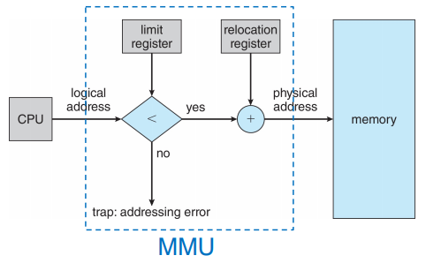
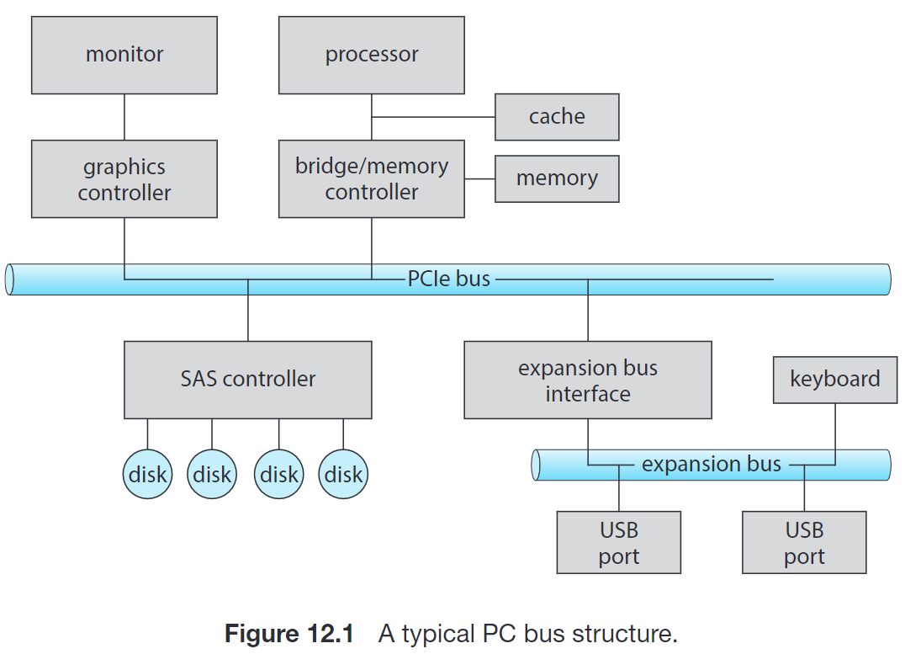

# OS Lecture 内存/存储/文件系统

## 8. 主存

常识：

内存是一个很大的字节数组，CPU根据PC(Program Counter)的值从内存中提取指令。内存中的进程运行的前提是，程序代码和需要访问的数据在内存中。

CPU可以直接访问的通用存储只有main memory和registers。对registers的访问通常可以在一个CPU时钟周期完成，但是访问内存需要多个时钟周期，这就会引起指令的stall。因为我们不想要stall，所以我们在CPU上设计了存取更快的内存cache。

表示源程序地址的方法：Address Binding

源程序中的地址通常是用符号（symbolic，例如各种变量、函数名、汇编中的label等）表示。编译器会将符号绑到relocatable addresses（段名+偏移量）。链接器或加载器（linker/loader）会将relocatable addresses绑定到absolute addresses。当然，如果编译器在编译时就知道程序所处的内存地址，则会生成absolute code。

### 8.1 Partitioning Strategies

在Batch系统中，每次只有一个程序被加载入物理内存，并运行至结束。如果程序需要的存储空间比内存大，则将程序一块一块切开

与prehistory不同的是，现在需要把多个进程同时放入，并且支持快速切换。最简单的内存分配方法是将内存切成partition，每一个包含一块进程。切分的要求有

- Protection: 保证进程间不会互相闯入对方的存储
- Fast execution: 不能由于protection降低访问内存的效率
- Fast context switch: 每当进行context switch时，可以比较快地找到并访问当前进程的内存

如果进程请求空间来运行，但没有足够的内存，可以

- 直接拒绝请求，并给出一个错误信息
- 加入waiting queue中，当有内存被释放的时候CPU来检查是否可以为其分配内存。

Fixed Partition：固定partition的大小。但是可能造成浪费

Variable Partition：不固定partition的大小。OS会维护一个表记录可用和已用的内存。它的缺点是：最开始内存是整一个很大的内存（hole），经过一段时间运行后，出现一系列大小不等的孔，这些小的孔都不能被利用。称为external fragmentation。

Dynamic Storage-Allocation Problem：根据一组hole来分配大小为n的请求，称为dynamic storage-allocation problem. 

- first-fit：分配首个足够大的hole。这种方法会使得分配集中在低地址区，使低地址区先产生大量碎片，然后在每次重新分配时又从低地址区先开始分配，查找开销比较大。
- best-fit：分配最小的足够大的hole。遍历比前者慢，且留下碎片的可能性也很大。
- worst-fit：分配最大的hole，也需要全部遍历。

worst-fit对中小进程较多的情况有用，因为使得剩下的空闲块比较大。但是平均情况下first-fit和best-fit更好一点，其中first-fit更快，其它没有与best-fit有明显差别。

Protection

保证一个进程只能使用自己的内存：使用两个寄存器，一个base，一个limit，分别表示基址和偏移量。当context switch到一个新的进程 or user mode想要进行内存访问，CPU就会load这两个寄存器的值。如果非法了，就trap掉（通常是terminate该进程）。

解决external fragmentation有两个思路：

- 使程序不需要那么大块的内存，而是多个小内存也可以 → segmentation, paging
- 使多个小的内存碎片hole变成一个大的 → Compaction 重排

### 8.2 分段 Segmentation

一个程序由一组段(unordered set of)组成

- 主函数
- 数组
- 符号表
- 子函数

每个都是一个段，在内存中不一定是按照用户写的顺序排列的，顺序很随机。这个顺序是编译器构建的。所以我们需要用一组逻辑地址(logical address)或者叫虚拟地址(virtual address)来访问。

逻辑地址 = 基地址 + 段界

我们有一个segment table，每个条目以segment-number索引，存储base和limit（也可能还包括权限位）。

逻辑地址的映射方式如下图

从逻辑地址映射到物理地址的这一过程是由硬件设备MMU（memory-management unit，内存管理单元完成的）。CPU使用逻辑地址，而寻址的时候就要用物理地址了。

分段是解决external fragmentation的一种尝试，因为它把程序分成了很多段。

这种方法好像也被叫做杂合方法，因为不是为整个内存空间提供页表，而是为每个逻辑分段提供。

### 8.3 分页 Paging

（这个地方我真的真的没看懂，可以留着做lab再看：捏吗今天lab就是这个玩意）

允许进程的物理地址空间不连续的内存管理方案。

我们将physical memory切成等大的块（2的幂，通常为4KB = 2^12 B），称为frames（帧）。

将logical memory切成同样大小的块，称为pages（页）。

在paging中对应关系有：

- 每个物理内存中的frame等距对应一个逻辑地址中的page
- 每个frame base不等距对应一个frame number，是frame开始的地址，number可乘frame大小换算base
- 每个page base不等距对应一个page number，是page开始的地址，number可乘page大小换算base
- 每个page number映射一个frame base（该映射关系放在了page table中）
- 每个page base+offset映射一个frame base+offset，两个offset是一样的

MMU把logical address翻译成physical address的步骤：

- 获取page number p
- 在page table找到第p个page对应的frame number
- frame number换算frame base，并加上offset，找到physical address

比如logical addr是1101[13]，先取page number 11[3]，查找页表比如得到frame number 010[2]（frame的位数不一定跟page位数一样），那么与offset拼起来，就得到了实际地址01001[9]。

还有一个frame table，用来保存物理内存的分配细节，即共有多少帧、帧是否空闲等。每个条目对应一个帧，是否被占用，如果被占用，是哪个进程的哪个页占用的。

为什么paging能满足not contiguous呢？因为我们在PC+1指向下一条指令时，只要在logical addr中是下一条指令就可以，无所谓这个logical addr对应的physical addr在哪里。我们再回忆一下logical addr的格式如下

可见d是2^n+1时<p, d> +1 是 
（就是二进制进了位）。这时一个page结束，进入了下一个page。logical addr仍然是连续的。

硬件支持 Hardware Support：page table的硬件实现有很多方法

- Register Method
    - 最简单的方法是用一组寄存器存，使用时非常迅速，因为访问寄存器非常高效。缺点是寄存器数量有限，page table大小很小时才能用。且因为这是每个进程对应的物理内存地址，所以context switch的时候这些寄存器都要重新加载成别的进程的。
- Page table in Memory & Page-table Base Register (PTBR)
    - 把页表放在内存中，并用PTBR指向页表。在context switch的时候只需要修改PTBR。这样每次访问物理地址都需要两次内存访问：一次用PTBR和page number找到页表在内存的位置，并在其中得到page对应的frame number；一次算出physical addr后访问。
- Translation look-aside buffer (TLB)
    - 用这样一个专用的高速查找硬件cache（associative memory，支持parallel search）。TLB的每个条目由key&value组成，分别表示page number和frame number，通常有64-1024个条目。当需要找page number对应的frame number时，TLB同时对所有key比较，miss则访问内存。
    
    <aside>
    💡 TLB和一般的cache什么区别：
    
    TLB用于存储虚拟地址和物理地址之间的关系。它是page table（内存子集）的一个cache。
    
    cache存储最近使用过的数据。它是整个内存的cache。
    
    </aside>
    
    换页的策略有：LRU，round-robin，random等。
    
  
    TLB with Address-Space Identifier (ASID)
    
    - 每个process都有自己的page table。有的系统会在TLB中放一个ASID，唯一标志一个进程。
    
    Effective Memory-access Time
    
    hit ratio = 没有发生TLB miss的次数的百分比
    
    每一次内存访问的用时为t，那么TLB hit的情况下访问字节总共用时r，miss 用时2r
    
    有效内存访问时间effective memory-access time EAT = tr + 2t(1-r) = t(2-r)
    
    相比直接将page table保存在寄存器，平均（？）内存访问时间多了 [t(2-r)-t]/t = 1-r。
    

### 多级页表（lab3用到的）

另一种不依赖于分段，但也能解决问题的方法：试图去掉页表中所有无效区域，而不是将它们全部保存在内存中。

称为多级页表，将线性表变成了类似树的东西。

首先将页表分成页大小的单元，如果整页的页表项PTE(page table entry, 页表条目)无效，就完全不分配该页的页表。为了追踪页表的页是否有效（如果有效，在内存中的位置），使用名为页目录的新结构。页目录告诉页表的页在哪里，或者页表的整个页不包含有效页。

例子：

下图中，左边是一级页表，尽管第二三页没有有效地址，但是仍然要分配内存。

右边是二级页表，可以看到页表目录仅为第一和最后一页分配内存，释放了中间的内存空间。

与PTE相似，页表目录有个PDE（表示整个页表里的PTE的或）

优点

- 多级页表分配的页表空间，与正在使用的地址空间内存量成比例。因此通常很紧凑，并支持稀疏的地址空间。
- 如果仔细构建，页表的每一个部分都能整齐地放入一页中，从而更容易管理内存。
- 对于一个大的页表，可以塞进零散的空间里

缺点

- TLB(translation look-aside buffer)未命中时，需要从内存里加载两次才能获得正确的地址转换信息（一次用于页目录，一次用于PTE本身）。更多级页表需要更多次加载

<aside>
💡 ⇒ 时空折中

好的系统构建者所做的是：实现最小复杂性的系统来完成手上的任务。

</aside>

### 8.4 交换 Swapping

我们讨论一种内存不够时，正在运行的进程的的一部分可以不在内存里，而是被交换到一个备份存储（backing store中），直到继续运行的时候再拿回到内存。这种思想很像virtual memory。

比如在paging机制中，我们可以只swap out一些pages。

swapping会增大context switching的时间开销。

## 9. 虚拟内存

为什么需要虚拟内存：进程的代码必须在内存中，因为CPU只有能力访问内存，不能访问磁盘。但是上一节引入的swapping机制允许我们把一部分在主存中暂时用不到的内容交换到disk中。

这样就需要我们引入逻辑地址空间(logical address space)的概念，要大于物理地址空间(physical address space)，对应的页表会提供虚拟地址到物理地址的映射。

CPU访问虚拟地址时，会由MMU转换为对应的物理地址。如果page不在物理内存中，会触发一次page fault（exception），有三种可能情况：

- 当前进程的页表中没有这个虚拟地址对应的page → 被OS杀死
- 权限不符，比如试图运行某个权限是RW-的page的代码，或者试图写入某个权限是R-W的page → 被OS杀死
- 当前虚拟地址是合法的，但是对应的page被swapped out了 → 进程被阻塞，把对应的page交换回来，调页完成后唤醒进程。

在一条指令执行期间，可能触发多次page fault，直到解决后成功运行。

Kernel address & Userspace address

因为指令有privileged和non-privileged，地址空间也分成了kernel portion和user portion，kernel只能privileged instruction访问，user都能。所有进程的kernel portion其实是同一块代码，因为所有进程用到的都是同一块kernel。user portion要复制是因为含有的是各个进程的页表、队列等东西。

### 9.1 Lazy Allocation / Demand Paging

OS在分配user space时，会使用lazy allocation：用户申请一块内存时，OS并不会真正在物理内存中分配对应内存，直到真正被访问。

这样设计的原因是很多用户程序申请的内存大小通常比真正要使用的大。例如buffer。

### 9.2 Copy-on-write

允许子进程和父进程使用同一个物理页来工作。

### 9.3 Page Replacement

从内存中交换到磁盘去一整个当前不在使用的frame。

步骤是：
- 找到这个victim frame
- 将其内容写到交换页：可以用一个dirty bit，如果没有改过，那就不用写回了
- 修改页表（和TLB）以表示它不在内存中了

找到victim frame的做法
- Optimal：选择最长时间内不再访问的页面换出。是理想情况，实际并不能预测未来访问情况。是一种评判其它算法性能的理论基准。
- FIFO (First In First Out): 很直觉的做法，但是实际上很多页面经常被访问，所以先进buffer的有可能是非常经常访问的。它可能出现Belady‘s Anomaly：物理帧增加，异常情况反而更多了
- LRU (Least Recently Used)：最久没有被访问的页面。可以每个页表加一个counter，也可以用栈保存page numebrs。开销都挺大。
- LRU-Approximation：引入一个reference bit，当被访问时置1，OS定期把它置0。需要换的时候就找0，说明它在最近这一段时间内都没被访问过。性能更好了。

### 9.4 Allocation of Frames

（这个地方完全没看懂）

给每个进程分配的frame个数：

- 最大值不超过物理内存的frame个数
- 最小值由计算机的架构决定。一般来说，因为每条指令只有解决全部page fault才能运行，所以frame个数一定不能小于单个指令需要的page个数。

替换方法

- 全局置换(global replacement)，每次置换从中选择一个帧来计算，那么不一定需要提前规划每个进程需要的frame个数。这种替换的优势是由更好的系统吞吐量，缺点是一个进程的page fault rate不仅取决于自己，也取决于其它进程。
- 局部替换，则需要提前计算frame个数。

如果需要从最大和最小之间，决定一个进程能够使用的page总数，有多种分配算法

- 平均分配
- 按进程实际需求分配
- 按进程优先级分配

现代计算机都有多个CPU，每个CPU比其它CPU更快地访问内存的某些部分。如果差异比较明显，称这种系统为非均匀内存访问（NUMA，non-uniform memory access）系统。

### 9.5 Thrashing

如果进程可用的帧较少（少于频繁访问的页面数目），那么频繁出现page fault。同一个page被频繁换入换出，以满足运行的要求。这种高强度页面调度叫抖动（thrashing），其页面调度用时甚至可能大于执行时间。

### 9.6 Kernel Memory Allocation

kernel中的很多数据结构大小区分比较大，小的可能会小于一个page，因此kernel的设计应当尽量节省内存，努力减少碎片。原因是

- kernel可能一部分常驻物理内存中，不受调页系统的控制
- 有的硬件设备可能和物理内存直接交互，因此需要连续的物理内存

两者对物理内存的要求都比较严格

分配方法

- buddy system：从物理连续的段上分配内存，每次分配内存大小是2的幂次方。当释放时，会合并（coalesce）相邻的块，形成更大的块供之后使用
- slab allocation：OS中很多object的大小是固定且已知的。内存会被划分为若干个固定大小的块，每个分配一个具体的类型。当进程需要分配内存，会查询缓存，如果找到一个空闲的块就使用。

## 10. Mass Storage 大容量存储

### 10.1 HDD/NVM

现代计算机的大部分二级存储由hard disk drives (HDDs) 和 nonvolatile memory (NVM) devices 提供。

- HDD 就是硬盘驱动器。
- NVM 设备根据定义是断电后存储数据还能保持的设备。

课本里认为NVM（electronic）不包含HDD（mechanical）

HDD

结构

- 每个disk platter（盘片）长得像CD，直径一般是1.8-3.5 inches（这是多少 反正不大）。disk platter通过磁性材料在上边保存信息，通过检测磁性来读取信息。
- platter 表面被分为了很多track（磁道），再细分为sector（扇区）。在一个arm position下的track组成一个cylinder（柱面）。
- read-write head：每个platter附近有一个，附着在disk arm上，arm会使所有head形成整体共同移动。
- sector被编号，是logical block addr在disk drive上的映射。从最外层的cylinder的第一个section为0号，一直编到内部的cylinder。

参数

- Rotation Per Minute (RPM) 每分钟旋转次数。常见的HDD有：5400, 7200, 10000, 15000RPM
- Transfer rate：在HDD和计算机之间数据流的速率
- Positional Time (a.k.a. random-access time): 将disk arm移动到所需要的sector所用的时间。=
    - seek time (将arm移动到cylinder用时，3ms-12ms) +
    - rotational latency (旋转到head在所需sector上所用时间，与转速有关)

NVM Devices

- 固态硬盘 (solid-state disks, SDD)
- USB drives (thumb drive, flash drive)
- DRAM disk replacement

比HDD更可靠，更快，更贵，寿命短，容量更小

### 10.2 磁盘调度 HDD Scheduling

主要为了优化两个参数

- access time = seek time  + rotational latency
- disk bandwidth: data bytes / time from request to completion

一般会考虑minimize seek time，因为rotational latency一般管不到

First-Come First-Served (FCFS)

Advantages

- every request gets a fair chance
- no indefinite postponement

Disadvantages:

- does not try to optimize seek time
- may not provide the best possible service

Shortest seek time first (SSTF)

总是选择距离当前最近的request。不一定最好

cannot calculate seek time in advance

high variance

可能导致starvation

SCAN / Elevator algorithm

非常形象，一直往一个方向走不回头，直到碰到边界，再返回

long waiting time for requests that are just visited.

C-SCAN

不是边返回边扫，而是直接返回开头

provides more uniform wait time than SCAN

LOOK / C-LOOK

在 SCAN / C-SCAN 的基础上，只走到最大/最小的request编号就返回，而不是走到section的头。

怎样选择scheduling algorithm：一般选择SSTF，当IO负荷比较大时，选择 LOOK / C-LOOK

### 10.3 磁盘管理

磁盘格式化步骤

- 低级格式化（low-level formatting, aka. 物理格式化）：把磁盘分成扇区
- 分区（partition）：OS在磁盘上写，把磁盘分成一些cylinder组成的logical disk
- 逻辑格式化（logical formatting）：OS将文件系统等写在磁盘上，形成卷（volume）

boot block

在刚打开电源或重启时，一个自举（bootstrap）程序会初始化系统的各个部分，如CPU寄存器、设备控制器、内存，然后找到OS内核，加载到内存，从而运行OS。

一般bootstrap的启动程序tiny bootstrap loader program存在ROM，它在磁盘中的boot partition把bootstrap程序load进来。

### 10.4 RAID

磁盘冗余阵列（redundant array of independent disk, RAID）技术。

定义好像是一个拥有大量磁盘的系统，来改善数据的读写速率（因为可以并行），且可靠（使用冗余来降低出现错误的期望）。

## 11. IO

### 11.1 方式

- 轮询（polling）: 当PC需要和某个IO设备交互时，查询设备对应的IO控制器中状态寄存器的相关位，当该位表示读写可以进行时就通过状态寄存器通知控制器。
- 中断：在interrupt request line上通知CPU
- 直接内存访问 (DMA, Direct Memory Access): 对于需要大量传输的设备，上述两种操作过多会占用CPU资源，因此很多计算机提出了DMA，将IO交给一个DMA控制器完成，它让设备直接与内存交互。使用虚拟地址技术的叫DVMA Direct Virutual-memory Access。

### 11.2 应用程序IO接口

IO系统相关的系统调用将不同的IO设备的工作方式封装到一些类中，从而形成较少的通用类型，为应用程序隐藏硬件的具体差异。

- Data transfer mode
    - character：逐个字节传输（如terminal）
    - block：以块为单位传输（如disk）
- access method
    - sequential：如modem
    - random：如（CD-ROM）
- Transfer method
    - synchronous（同步）：需要按预计的响应时间进行传输，并和系统的其它方面相协调
    - asynchronous（异步）：响应时间不需要规则，或者可预测，不需要与其它计算机事件相协调（如网络I/O）
- Sharing
    - sharable：可以被多个进程或线程并发使用（如keyboard）
    - dedicated：不能（如tape）
- device speed
- I/O direction：R-(CD-ROM) / -W(graphic controller) / RW(disk)

同时大多数操作系统也支持应用程序透明地向一个设备驱动器传输任意数据。在UNIX中， `ioctl()` 系统调用可以实现这一功能。这一系统调用通过文件描述符（file descriptor）来确定一个设备，因为UNIX中设备可以通过文件的方式访问。

## 12. 文件系统接口

文件系统（file system）是为了给用户提供disk的逻辑视图。

- 文件（file）
- 目录结构（directory structure）

### 12.1 文件

常见的文件属性字段

- Name
- Identifier
- Type
- Location
- Size
- Prtection
- Timestamp
- User identification

这些信息存在目录结构里

文件操作

- create
- read / write
- repositioning within a file (aka. seek)
- delete
- truncate: 清空文件内容，但保留文件属性

文件打开: 打开文件表（open-file table），file-open count

文件锁（file lock）：类似于reader-writer lock。分共享锁（shared lock），独占锁（exclusive lock）。分强制锁定（mandatory lock）和建议锁定（advisory lock）。

文件类型：文件扩展名，或文件头的magic number

文件结构：

- 无结构 no structure
- simple record structure
- complex structures

### 12.2 访问方式

- 顺序访问（sequential access）
- 直接访问/相对访问/随机访问
- 索引顺序访问（indexed sequential-access）：先确定所访问的内容在哪一块，然后在对应块中寻找。

### 12.3 目录结构

- 单级目录 single-level directory: 所有文件都在同一目录
- 两级目录 two-level directory：第一级用户文件目录，所有用户文件目录汇集成主文件目录
- 树形目录：两级的自然推广。绝对路径和相对路径
- 无环图目录：支持目录共享子目录或文件。软链接（用指针），硬链接（复制被引用文件的所有信息，在改写时需要与原文件保持一致性，引用计数）
- 通用图目录：允许目录中有环，垃圾回收麻烦

### 12.4 文件系统挂载

directory structure 可以构建在多个volume上，这些（别的？）volume必须先挂载（mount）到文件系统的某个位置，这个位置称为挂载点（mount point）。

### 12.5 保护

Access Control List (ACL): 指定每个用户及允许的访问类型。

e.g. in Linux

- owner, group, others
- read, write, execute

<aside>
💡 当一个文件的 read 或 write bit not set 时，root 用户仍然能够读或写它。

当一个目录的 execute bit 对于一个用户所在的分类 not set 时，该用户不能进入该目录；但是 root 用户可以。

但是，如果一个文件对三类用户的 execute bit 均 not set 时，这个文件被认为不是可执行的，因此 root 用户也不能执行这个文件。

</aside>

## 13. 文件系统实现

- UNIX 使用 Unix FS (UFS)，基于BFFS（Berkeley Fast FS）
- Windows 支持 File Allocation Table (FAT)
- Linux 的标准文件系统是extended file system

### 13.1 分层设计

文件系统通常分很多层

- application programs: 负责给出 read/write/open某个目录的指令，被传递给logical file system
- logical file system：管理所有文件系统所需的metadata。有一个File Control Block (FCB) 来管理这些信息。负责把rwx某个目录的指令解析为rwx某些logical block的指令
- file-organization module：负责logical file blocks到physical file blocks的转换。也负责管理free-space，跟踪未使用的blocks，并在需要时分配。
- basic file system：管理file-system的缓存，提高访存性能。如果miss了，就传递给IO control
- I/O control：包括驱动和中断处理程序，以在主存和磁盘系统之间传递信息。将上层的指令转换为low-level，hardware-specific的指令，来实现相关操作。

### 13.2 数据结构

上述文件系统中用到的特殊数据结构有

In disk structures:

File control block (FCB) (per file)：保存name, ownership, permissions, ref count, timestamps, pointers to data blocks on disk. 每个FCB有个唯一标识号，与目录条目相关联。

在unix中FCB叫inode

在NTFS中，每个FCB是一个叫master file table的结构的一行。

boot control block (per volume):

volume control block (per volume): 

directory (per FS): 

### 13.3 VFS 虚拟文件系统

OS可以同时支持多种类型的文件系统。定义了一套通用的文件系统访问接口，open(), read(), write(), close() 和 file descriptiors 等，与具体的实现分离。VFS负责对应这些接口和具体的函数指针。

### 13.4 目录实现

保存file name 到 FCB 的映射关系。

- linear list: 查找费时
- 有序表，平衡树，B+树
- hash table

### 13.5 Disk Block Allocation

文件保存在disk blocks上的策略。

contiguous allocation: 每个文件在磁盘上占有的blocks是连续的。会造成碎片。文件是可扩展的。可以实现确定每个文件的最大大小。也可以当空间不够时维护一个指针，记录添加的连续空间（extent）的信息。目录需要记录每个文件的起止地址。

linked allocation: 每个block记录下一块空间的地址，有点像链表。目录则只记录起止地址。

indexed allocation: 给每个文件记录一个索引块 (index block)，记录每个文件的第i个块在磁盘的哪个地方。目录只需要保存索引块在哪里。

### 13.6 空闲空间管理

可以用bitmap，用1标记空闲的block。为了减少bitmap占用的空间，可以以cluster为单位记录。

可以将free space用链表链接，但访问效率较低。

可以引入grouping，维护若干个block形成的链表，每个block保存若干空闲块的地址。

counting：维护连续空闲块的链表，即，链表的每个节点是连续的空闲块的首块指针和连续的长度。