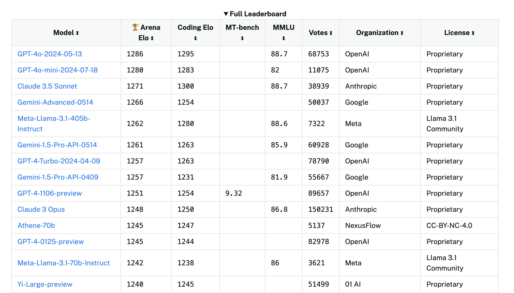
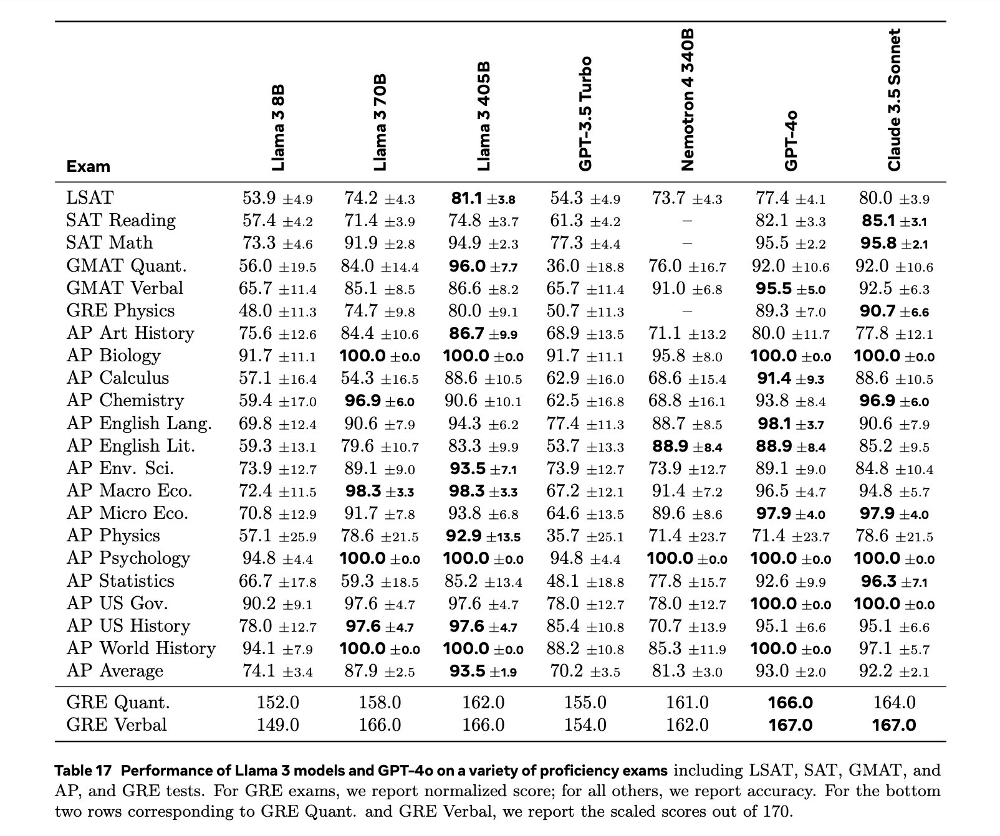

# Llama-3.1-405B 技术报告

## 简介

这篇技术报告是 MetaAI 在 2024 年 7 月 23 日随 405B 模型发布的。先前 Llama 3 系列已经发布过 8B 和 70B 两个大小的模型，本次发布的模型在规模上增量非常大。尽管规模的提升使其成为最强的开源大语言对话模型（在本文写成时，2024 年 8 月 1 日，根据公认比较可信的评价指标 Chatbot Arena，截图如下），但本文在 benchmark 上展现出来的性能数值，相比 70B 提升不大，普遍在 1-3 个点。且考虑到模型占用的 GPU 成本，对于普通人日常用途，405B 可能性价比不如 70B 高。

报告的原文见文末 ArXiv 链接。

### 文章结构

Llama-3.1-405B 有文字、视频/图像和语音等多个模态的能力。本文的架构分为多个章节，先讲文字能力的预训练（pre-training）、微调（post-training）、定性能力、定量能力、局限性等，再讲视频/图像和语音的训练过程和性能数值。

技术报告原文的结构如下：

- 第一节：Introduction 简介
- 第二节：General Overview 概述
- 第三节：Pre-training 预训练
- 第四节：Post-training 微调
- 第五节：Results 定量结果
- 第六节：Inference 推理性能
- 第七节：Vision Experiments 视觉模态能力
- 第八节：Speech Experiments 语音模态能力
- 第九节：Related Work 相关工作
- 第十节：Conclusion 结论

### n 句话亮点

- Data: 训练用了 15T 的多语言数据，主要在质量上有提升（比如采取了更激进的数据过滤策略）。李沐表示 15T 的数据量训练目前能训练的语言模型已足够了，接下来需要在质量而非数量上进一步提升。 

- Scale: 训练使用了 $3.8 \times 10^25$ FLOPs，scaling law 表示更大的参数量应该会使 performance 更好。

- Managing Complexity: Llama-3.1-405B 模型没有采取现在常用的 MoE 架构，而是把普通的 dense Transformer 结构直接做大，并且使用了相对简单的微调策略（SFT, RS, DPO）等，所以称作步骤不是特别复杂。也有消息称 MetaAI 本来将一个 MoE 架构和一个 dense Transformer 一起训练，但是 MoE 架构的模型效果不太好，所以只放出了 dense Transformer 架构版的。其中：

    - dense Transformer: 是 Transformer 模型的标准版本。每个输入 token 都通过相同的一组全连接层（Transformer 层），每个 Transformer 层都包括多头自注意力机制和前馈神经网络。
    - mixture of experts: MoE 包括多个专家 experts 网络，在输入数据通过模型时，只有一部分网络被激活；训练时训练一个门控网络决定哪一部分专家网络被激活。相比简单的 dense Transformer，可以部分节省计算资源。

## 性能

### Benchmarks 预览

在多个 benchmark 上测试 Llama-3.1-405B 的性能。此处想对本文用到的 benchmark 进行一点概述。

pre-train 阶段结束后，用于测试的 benchmark 有：

- Reading Comprehension 阅读理解
    - `SQuAD V2` (Rajpurkar et al., 2018) stf 做的一个阅读理解 benchmark，收集了 wikipedia 文章，对里面内容做 QA。
    - `QuaC` (Choi et al., 2018) 全称是 QA in context，也是对 wikipedia 文章做 QA，但是所标注的 QA 数据是连续的很长的对话。比如格式是，speaker A 问，这个人出生地是哪里，B 回答，A 再问这个人哪一年做了哪个事等，如此继续。
    - `RACE` (Lai et al., 2017) 是中国的英语考试阅读理解题。
- Code 代码
    - `HumanEval` (Chen et al., 2021) 格式有点像 leetcode 题目，每条数据包含题目要求和一组测试点，自动测试程序会运行模型生成的代码，判断通过多少测试点。
    - `MBPP` (Austin et al., 2021) 格式大致同上。
- Commonsense Reasoning / Understanding 常识推理
    - `CommonSenseQA` (Talmor et al., 2019) 在 conceptnet 数据集的基础上产生 multichoice 问题。
    - `PiQA` (Bisk et al., 2020) physical ... 物理领域的常识推理。
    - `SiQA` (Sap et al., 2019) social ... 社交 / 文化领域的常识推理。
    - `OpenBookQA` (Mihaylov et al., 2018) 基础科学问题。
    - `WinoGrande` (Sakaguchi et al., 2021) adversarial Winograd challenge，因为 Winograd 已经被很多模型训练过了，制作了与 Winograd 数据集同格式的新数据。
- Math, Reasoning, and Problem solving 数学推理
    - `GSM8K` (Cobbe et al., 2021) 小学数学问题，问题是应用题，提供一系列思维链解题过程，每个步骤都能用简单的加减乘除解决。
    - `MATH` (Hendrycks et al., 2021b) 竞赛数学题，与 GSM8K 同格式，复杂的数学符号用 LaTeX 写成。
    - `ARC Challenge` (Clark et al., 2018) 全称 AI2's Reasoning Challenge，是 3-9 年级的科学题，格式是 multichoice。
    - `DROP` (Dua et al., 2019) discrete reasoning over paragraphs 文本段落中夹杂数字或大小等关系，对这些数字或文本进行推理。
    - `WorldSense` (Benchekroun et al., 2023) 用文本描述的图形和空间方位关系，对图形属性和空间方位进行推理。
- Adversarial 对抗攻击？
    - `Adv SQuAD` (Jia and Liang, 2017) 手动造了 SQuAD 格式的更难的问题。
    - `Dynabench SQuAD` (Kiela et al., 2021) dynamic benchmark collection，有一个网站 [Dynabench](https://dynabench.org/about)，允许用户随时上传新的数据。
    - `GSM-Plus` (Li et al., 2024c) 将 GSM8K 里面的数字改掉，比如 3 改成 30，整数改成小数等。
    - `PAWS` (Zhang et al., 2019) 问题格式是，交换某个表达中的两个词（比如，flight from NYC to Florida 中的 NYC 和 Florida），判断是否等价。
- Long context 长文本
    - `QuALITY` (Pang et al., 2022) 长文本上的 multichoice 问题。
    - `many-shot GSM8K` (An et al., 2023a) 似乎这个 benchmark 搜关键词没有找到，原文中引用对应的文章也不是这个名字。
- Aggregate 综合
    - `MMLU` (Hendrycks et al., 2021a) massive multi-task language understanding，包含 57 个 STEM 学科，用来测量大模型在预训练中获得的知识。因为比较老了，很多大语言模型都在这个数据集上 overfit 了。
    - `MMLU-Pro` (Wang et al., 2024b) 在 MMLU 中去掉了一部分质量差的问题，做了一个更 challenging 的 test set。（发现还是即将一起去 Waterloo 的 Yubo 同学一作）
    - `AGIEval` (Zhong et al., 2023) 由一些考试题组成，高考，SAT，GRE ... 等。
    - `BIG-Bench Hard` (Suzgun et al., 2023) 专门选择了一些表现不如人类好的 benchmark 集合起来。

post-train 阶段结束时，测试用的 benchmark 如下：

- General 综合类 
    - `MMLU` (Hendrycks et al., 2021a) 同前文。
    - `MMLU-Pro` (Wang et al., 2024b) 同前文。
    - `IFEval` (Zhou et al., 2023) Instruction-following evaluation for LLMs，定义了一系列“可以验证的指令”，比如“写 400 字”“至少说 3 次关键词”，测试模型遵守指令的能力。
- Math and Reasoning 数学推理
    - `GSM8K` (Cobbe et al., 2021) 同前文。
    - `MATH` (Hendrycks et al., 2021b) 同前文。
    - `GPQA` (Rein et al., 2023) graduate-level Google-proof QA benchmark，由 biology, physics, chemistry 领域的专家写成的非常难的问题。
    - `ARC-Challenge` (Clark et al., 2018) 同前文。
- Code 代码
    - `HumanEval` (Chen et al., 2021) 同前文。
    - `MBPP` (Austin et al., 2021) 同前文。
    - `HumanEval+` (Liu et al., 2024a) 将 HumanEval 扩大了 80 倍做成了这个数据集。
    - `MBPP EvalPlus (base)` (Liu et al., 2024a) 将 MBPP 扩大了 35 倍做成了这个数据集。
    - `MultiPL-E` (Cassano et al., 2023) 扩展 HumanEval 和 MBPP 到了 18 种编程语言。
- Multilinguality 多语言
    - `MGSM` (Shi et al., 2022) 将 GSM8K 数据集翻译成了 10 种文字不同的语言。（是我博导的工作）
    - `Multilingual MMLU` (internal benchmark) 内部数据集，没有搜到，可能没有公开。
- Tool-use 使用工具
    - `Nexus` (Srinivasan et al., 2023) 很奇怪，这个数据集能搜到的条目只有 huggingface 并且点开 404 了。
    - `API-Bank` (Li et al., 2023b) 由 73 个 API 工具构成，根据模型产生的对话中调用 API 的情况，测试模型是否能调用、检索+调用、规划+检索+调用 API。
    - `API-Bench` (Patil et al., 2023) 分为两个 subtask：query-based API（根据自然语言描述的需求输出 API） 和 code-based API（根据挖去 API 的代码填空）。分为 Python 和 Java 语言版本。
    - `BFCL` (Yan et al., 2024) Berkeley function calling leaderboard，多编程语言，且有 function call 类型的数据。
- Long context 长文本
    - `ZeroSCROLLS` (Shaham et al., 2023) zero-shot benchmark for long text understanding，一个综合的长文本多任务数据集。
    - `Needle-in-a-Haystack` (Kamradt, 2023) 大海捞针实验。
    - `InfiniteBench` (Zhang et al., 2024) 多任务 100K token 长文本数据集。

### 性能数值

在这些 benchmark 上测试时，由于单次结果不稳定（先前我们普遍的做法常常是多次结果求平均值等），本技术报告采用 Maddan et al.(2024) 提出的 95% confidence interval (CIs) 方法，通过计算置信区间来估计方差。这个方法假设测试得到的数值服从正态分布，如果单次测试得到的数值为 S，数据集大小为 N，那么置信区间为

$$ CI(S) = 1.96 \times \sqrt{\frac{S \times (1 - S)}{N}} $$

由置信区间宽度除以临界值 1.96 可以得到标准差 -> 方差。

post-train 完成后，结果的总表如下

可以看出其实 Llama-3.1-405B 在 70B 上有提升，但相比参数量的提升，性能提升并不是很大，很多 benchmark 上都在 2-3 个点。考虑到前面提到可能 405B 可能训练了 MoE 和 dense Transformer 两个模型但是后者没训成功，不知道发布版 405B 性能比预期低是不是也是这个原因。

## 训练

### Pre-train 预训练

#### 整体问题

预训练牵扯到的问题有四块：

1. 怎么把比较大的数据集弄出来
2. 怎么把 scaling law 体现出来，会决定用多少数据和模型参数量是多少
3. 怎么有效在 pre-train 阶段训练这么多参数
4. 怎么做 pre-train

预训练大约用了半年，调参是年初开始的。

#### 数据清洗

用到的数据是在互联网上 common crawl 下来的截至 2023 年的数据，之后进行数据清洗。数据的选用一般属于公司秘密，不能讲太清楚。清洗的步骤虽然也没有讲，不过大致遵循（1）找一批数据观察大多是如何脏的 -> （2）写脚本洗掉这种特点 -> （3）返回（1）循环。有明确讲的数据清洗原则/类别有以下几条：

1. 洗掉 personally identifiable information (PII) 即一些个人姓名、邮箱、url，和成人内容；但李沐表示这两种东西也不会洗太干净，前者洗太干净了可能会使训练文档本身的意思有变化，后者太干净了可能模型在一些打擦边球应用上效果不太好，所以做法可能是对文档鉴定一个百分比，如果其中需要洗掉的内容占比太多，则不要了。

2. 在结构化文档中提取文本，比如去掉 html 和 markdown 的标签，只保留文本。

3. 分别做了 url、文档和行级别的去重。在 url 级别，保留了所有页面最新的版本；在文档级别，使用了 MinHash 算法；在行级别，将每 30M 里超过 6 次的行去除掉了，这显著提升了评测表现。
   
   其中 MinHash 算法是一种快速比较两个集合相似度的算法，可以通过比较单词相似度来实现文本聚类。它预设两个文本的相似度是通过计算词集 A 和词集 B 的 Jaccard 相似度 $ J(A, B) = \frac{| A \cap B |}{| A \cup B |} $。目的是不需要实际计算两个集合的交和并。具体我认为这篇帖子讲得很清晰 [LSH系列2：MinHash&LSH——文档（集合）相似性](https://blog.csdn.net/qq_39583450/article/details/108954384)。

4. 启发式过滤，过滤了以下三种内容：用 n-gram 过滤了一些行重复没去掉的内容，用脏词表过滤脏词，用 K-L 散度过滤分布太特殊的 token。

5. 代码和推理数据。从爬的数据里，用 fasttext 或 Llama 2 来判别出一些代码、数学等 STEM 文章。这些文章进一步用 DistlRoberta 选出了高质量的训练数据。

6. 多语言数据。用 fasttext 从爬下来的数据中识别出了 176 种语言，这些多语言数据也进行了去重、筛选等清洗步骤。

#### 数据混合

如何决定训练数据的分布比例：

- 知识分类。通过一个分类器对文章所属的知识种类进行分类，之后减少那些分布过多但对模型效果帮助不大的类别，比如艺术、娱乐。

- scaling law。用一种混合比例先训练一个小的模型，测试表现，用 scaling law 计算出在更大模型上使用该混合比例的表现，进而确定混合比例。

训练数据混合比例的总结：

- 50% 通用知识
- 25% 数学推理
- 17% 代码
- 8% 多语言

可见多语言数据不需要太多，主要知识用英语学过后可以泛化到其它语言。

#### 退火

在训练过程中，随着模型逐渐接近训练完成，逐渐降低对新数据的权重，可以让模型更加稳定地适应新数据，而不会导致模型参数剧烈波动。随着学习率降低，只有高质量的数据才能显著提升模型的性能。因此退火提供了一种更有效的方法来评估小型特定领域数据集的价值。

### Model Architecture 模型架构

性能的提升主要来源于数据质量的提高和模型更大了。

模型与之前的区别：group query attention (GQA) 可以带来内存的节省。

### Post-train 微调

TODO 

## 多模态能力

视频/图像能力的训练在文字能力训练结束之后，有额外的 encoder 和 decoder，训练时将文字能力的权重冻结，只调其它模态的参数。

TODO

## 相关工作

TODO

## 参考资料

- [The Llama 3 Herd of Models](https://arxiv.org/abs/2407.21783)
- [Llama 3.1论文精读 · 1. 导言【论文精读·54】](https://www.bilibili.com/video/BV1WM4m1y7Uh/?spm_id_from=333.337.search-card.all.click)
- [Llama 3.1论文精读 · 2. 预训练数据【论文精读·54】](https://www.bilibili.com/video/BV1u142187S5/?spm_id_from=333.1365.list.card_archive.click&vd_source=add8ed6a0a0c3142a3e6ce9e4b286af6)