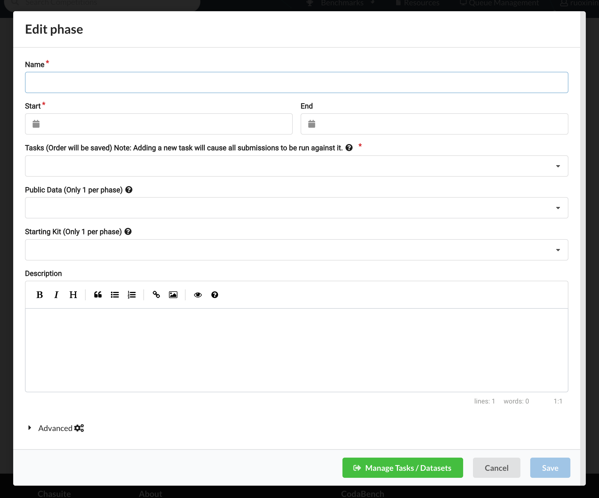
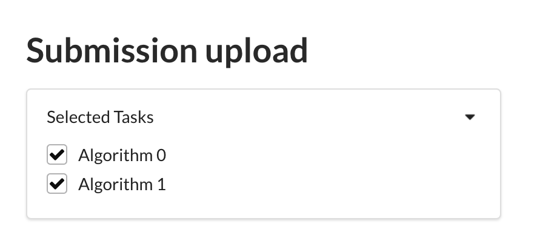

# Codabench 比赛创建教程

## 简介


[Codabench](https://www.codabench.org/) 是一个为数据科学和机器学习比赛设计的低代码模型测试平台。平台提供 CPU，允许比赛创办者通过上传脚本和数据的方式创办比赛，并允许其它用户使用平台 CPU 来运行代码得到结果。前序工作是 [CodaLab](https://codalab.org/)，2023 年 Codabench 团队仿照 CodaLab 改进出了 Codabench。

Codabench 的优点是提供公共 CPU，使比赛创办方在将正确答案保密的情况下，不必亲手收集参赛者的答案并一一亲手测试，而是允许用户自行通过平台测试并得到结果，减轻负担。而用户也可以更迅速知道自己的分数，不必等待比赛方验证这个时间较长的流程。

## 运作

比赛创办者通过上传比赛配置后，每当有用户加入并提交一个运行请求，平台将在 CPU 上为每个提交创建一个 Docker，包含比赛创办者提供的比赛配置和该用户提交的数据，在 Docker 中运行指定路径的代码，并将结果显示在平台展示的 terminal 上。

## 创建

在 Codabench 官网注册登陆后，点击右上角 `Benchmark` -> `Management`，可以选择 `Create` 或 `Upload` 来创建比赛。


- `Create` 是使用平台 UI 创建比赛
- `Upload` 是在本地写好配置文件，直接上传后被解析为一个比赛

更推荐用 `Upload` 来创建，因为 UI 的用户提示比较欠缺。

### 上传创建

'bundle' 指比赛创建者上传的压缩文件。里面含有：

- `competition.yaml` 是比赛的 metadata
- 'scoring program' 是平台所运行的评测脚本
- 'reference data' 是评测脚本所读的 gold answer 数据

需要期待用户上传：

- result data 用户上传的答案数据
- ingestion program 是指用户提交的代码，如果希望用户将方法/模型上传，需要在 scoring program 中留出给 ingestion program 的接口

下面介绍几个官方文档讲得不太清楚的细节。

#### `competition.yaml` 文件

`competition.yaml` 文件不能改名，且必须位于 .zip 中的最顶层（即多选 `competition.yaml` 和其它文件夹后创建 .zip，而非把含有 competition.yaml 和其它文件夹的上层文件夹创建为 .zip）。具体如图所示。下文所提到的无顶层文件夹 / 文件位于压缩包顶层，都是指如图所示的压缩包结构。


`competition.yaml` 支持的字段有：

```yaml
title: # 比赛名
version: # 1 指是 CodaLab bundle，2 指 CodaBench bundle，区别是有些 competition.yaml 字段不兼容
description: # 比赛描述
image: # 比赛 logo.png
registration_auto_approve: True  # do not require approval from organizers to join
docker_image: codalab/codalab-legacy:py39 # the Docker image in which submissions are run，用此 default 即可
enable_detailed_results: True # 不明，可以 default

# Documentation web pages
terms: pages/terms.md # 必须有一个 terms
pages:  # 可任意加页面
  - title: # e.g., Overview
    file: # e.g., pages/overview.md

# Definition of the tasks
tasks:
- index: 0
  name: # e.g., Development Task
  description: # 描述
  is_public: true   # 公开可见
  input_data: # e.g., feedback_phase/input_data, 此处及下列路径需要填写所上传 bundle 里的路径，而非所生成 Docker 中的
  reference_data: # e.g., feedback_phase/reference_data
  scoring_program: # e.g., scoring_program
  ingestion_program: # e.g., ingestion_program
solutions: []   # 不明

# Sample code submission
solutions:      # 可能会显示在比赛首页的 resources 列表
  - index: 0
    tasks:
    - 0
    - 1
    path: solution/
    
phases:
- index: 0
  name:             # phase 标题
  description:      # 描述
  start: 1-1-2024   # Month / Day / Year
  end: 1-30-2024    # end 结束时间可以缺失，表示永远可提交
  max_submissions_per_day: 5    # 最大似乎是 100？
  max_submissions: 100          # 最大似乎是 10000？
  execution_time_limit: 600     # 每次提交允许的最长运行时间，超过这个时间将显示 run time exceed
  tasks:            # 与该 phase 关联的 tasks
  - 0
  solutions: []
  starting_kit: # e.g., starting_kit, 可能会显示在比赛首页的 resources 列表
  public_data: # e.g., starting_kit, feedback_phase/input_data

# Fact sheets to add more information in the leaderboard
fact_sheet: {                   # 似乎是展示在 leaderboard 中支持用户修改的更多信息。`method_name` 该字段应与下方 `results` 平级。
    "method_name": {
        "key": "method_name",
        "type": "text",
        "title": "Method name",
        "selection": "",
        "is_required": "false",
        "is_on_leaderboard": "true"
    }
}

# Leaderboard
leaderboards:
- index: 0
  title: Results                    # leaderboard 的 title
  key: Results                      # `output.json` 中用于定位的 key
  submission_rule: "Force_Last"     # 可以去掉，默认似乎是允许展示多个结果
  columns:
      - title: Average Accuracy     # 在 output.json 中，读取该 json 的哪个 key
        key: avg_accuracy           # `output.json` 中用于定位的 key
        index: 0                    # 展示在 leaderboard 表格中的第几列
        sorting: desc               # 升序/降序排列
        computation: avg            # 同一用户的多个提交，按什么计算方法排序？
        computation_indexes:        # 在哪一列上计算
          - 1
```

#### scoring program 的路径说明

奇异的是，比赛运行时所创建的 Docker 中文件结构并不是 bundle 的结构，或者示例 competition.yml 中指示的路径，而是会把各种资源结构打乱放在不同的位置。对我们影响就是，如果 scoring program 需要读其它文件（多代码文件 / gold answer 等），就需要按创建好的 Docker 中的新文件路径读取。

比如，在我的测试中，Docker 的实际文件夹结构如下：

```
.
- app
    - codalab           // 不明
    - data              // 不明
    - input
        - res           // 用户结果
        - ref           // gold anwser
    - shared            // 不明
    - program           // 所上传脚本
        - score.py
        - metadata.yaml
    - output            // 脚本输出，用于 leaderboard 读取
        - output.json
```

如果上述路径在你的测试中不 work，可以先上传一个含有 competition.yaml / scoring program / reference data / result data / ingestion program 等所有资源的测试 bundle，要求 scoring program 输出 Docker 的文件夹结构树，在 terminal 中依次记下资源的路径。


#### scoring program 的输出说明
   
scoring program 在运行完成后被期待写一个 output.json 文件，其路径在前一节有说明。其结构据推测应当是，

```json
{
    "leaderboards_key": {
        "column_key1": 0,
        "column_key2": 0,
        ...
    }
}
```

其中几个 'key' 分别对应在 competition.yaml 的 leaderboards 设置中自定义的 key。

#### 常见报错

将 bundle 拖入 Upload 页面后，如果报错显示 Creation Fail，此时首先应当检查是否有 `competition.yaml` 文件，文件名和内容格式正确，并且位于压缩包顶层（参照上方压缩图示）。一般是此错误。


#### bundle 模板

[codalab/competition-examples/codabench](https://github.com/codalab/competition-examples/tree/master/codabench) 官方提供的几个 bundle 模板，可以对比 Codabench 上同名比赛查看创建结果，在本仓库拿一些需要的写法。

### UI 创建

进入 Codabench 首页，点击右上角 `Benchmark` -> `Management`，选择 `Upload` 来创建比赛。

顶层有 `Details` / `Participation` / `Pages` / `Phases` / `Leaderboard` / `Administrators` 六个页面，其它较易懂，不再赘述，`Phases` 的设置比较复杂。


Phases 构成比赛主体。一个比赛可以有一个或多个 phase，这样设计可能是有些比赛分成在多个数据集上测试；一个 phase 又可以包含多个 tasks，可能是为了支持有些比赛每个 phase 又有多个数据集。phase 之间不共享资源/Docker 环境，同一个 phase 的不同 task 之间共享资源/环境。 

最简单的方式可以只定义一个 phase。区分数据集甚至可以只通过 scoring program 来实现。

在 phase 的 edit 界面最下方，可以通过 Manage tasks 按钮打开 task 的 edit 界面。



该界面中 `Submission` / `Datasets and programs` / `Bundles` 三个页面都可以忽视，只需要使用 `Tasks` 这个页面。

task 的本质意义是 scoring program 和 reference data / ingestion program / result data 的关联方式。

如果定义一个 phase 有多个 tasks，在用户提交时，会显示选择提交哪个 task 的复选框。当复选框被勾选时，task 所关联的 scoring program 被运行。



当然也有不创建多个 task，将多个评测合并为一个脚本的方法，可以在脚本里检测用户上传了哪些结果，据此选择运行哪些评测。这里 scoring program 的设计自由度比较高。

在 task 的编辑页面里，


资源文件夹名必须与比赛初始化时 `competition.yaml` 指定的文件夹名相同，压缩包名和在这里填写的资源别名则任意。例如，在 `competition.yaml` 中指定了 reference data 的文件夹名是 `ref_data`，那么在上传时也需要将一个名为 `ref_data` 的文件夹进行压缩。但是压缩后得到的压缩包名字随意，可以叫 `AAA.zip` 等；上传后在 UI 处会允许你为这次上传的资源起一个别名，也是随意的，可以叫 `ref_data20240925` 等。如遇到资源上传失败但无报错，可以优先考虑这个原因。

每个 task 中，必须添加的资源是 scoring program，有这个才能运行。可根据需要添加 reference data。

资源只有在没有与之关联的 task 时才能被从资源列表中删除。当存在没有 task 关联的资源时，下面 Quota and Cleanup 中会高亮 Delete unused datasets/programs，可以点击一键清除。

## 修改

只支持通过 UI 修改。不能重新上传 bundle，每次重新上传 bundle 就视为创建一个新的比赛。

进入 Codabench 首页 -> 右上角 `Benchmark` -> `Management` -> 选择一个已有的比赛右侧 `Edit` 按钮。

其余步骤同上方 `### UI 创建` 一节。

## 使用

1. 提交：上传无顶层文件夹的多个结果文件夹压缩包。读条结束后将显示一个 running xxx，自动进入运行。如未显示 running 这个框，一般是平台 CPU 紧缺，可以等待一段时间再尝试。如果显示则说明开始运行了。
2. 查看结果：点击 running xxx 可以查看运行期间的 terminal 输出，此处 terminal 是正常的 terminal，会显示所有 warning / error / 输出。运行完成后应当显示 Finish。
3. 查看报错：如果状态不是 Finish，如 Scoring / Running / Error，可以点击当前提交对应的状态栏。


Download 中可以下载到的内容与 logs 中能输出的内容相似，直接查看 logs 即可。


terminal 的左侧分为 prediction 和 scoring 两种，当有 ingestion program 时第一个 terminal 才会有输出。stdout 和 stderr 将 terminal 输出分开了，stdout 是程序指定的正常输出，stderr 是 error 输出，有时候会存在其中一个没有输出的情况，可切换查看。

Leaderboard 的结果不会自动更新到 Leaderboard，需要用户同意。点击运行结果右侧的按钮更新到 Leaderboard。


## 参考资料

- [Codabench: Flexible, Easy-to-Use and Reproducible Benchmarking Platform](https://arxiv.org/abs/2110.05802)
- [Codabench Repo Wiki](https://github.com/codalab/codabench/wiki)
- [Codabench Repo Issue](https://github.com/codalab/codabench/issues)

现有官网参考资料似乎都不太全面，不能覆盖各种常见错误，因此一些创建步骤和行为是通过测试和推测得知的。如果本文有误，欢迎联系作者改正！