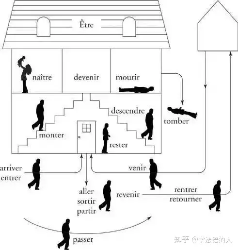

# French Tense summarization

## Overview：语态和时态

动词的变位有两种属性：语态和时态。语态对应一个动作的绝对进行程度属性，而时态对应动作的相对发生时间。

我找到了一个关于语态比较好的示意图，横向表示动词的完成程度，纵向表示动词本身的持续时长，于是上、下、左、右可以大致对应瞬态动词、持续动词、将要去做、已经完成。
```
          瞬态
           /\
          /  \
         /非常态\
         -------
不定态  /         \  完成态
       ------------
           常态
```
而时态表示动作发生的时间顺序。我们可以将上述三角套入过去、现在、将来这三个相对时间，组合得到对应时态下的多个语态。

法语的 3 种时态有：

- 过去时 (le passé): 过去时间点发生的
- 现在时 (le présent): 现在发生的
- 将来时 (le future): 将来时间点发生的，未发生的

同时还有 6 种语态：

- 不定式 (l'infinitif): 未经变化的动词属于不定式，位于梯形左边。
- 直陈式 (l'indicatif): 表达客观存在的事实，位于梯形中下。
- 命令式 (l'impératif): 祈使句。变位比较局限的一种语态，个人认为可以理解为也在梯形中间，表达一种希望动作发生的愿望，但是并不强调该动作的时间点。
- 条件式 (le conditionnel): 用来表达与现实相反、猜测或婉转语气的一种语态，强调按照客观常理应该发生。对应梯形右侧。
- 虚拟式 (le subjonctif): 表达自己的心情和感受（愿望、失望、猜测、情绪），强调根据主观意愿希望发生。对应梯形左侧。
- 分词式 (le participe): 动词的分词式，分为现在分词和过去分词两种，分别在梯形左右侧。

于是可以组合产生多个时态下的多个语态，它们一般合称叫时态，有点歧义，不过就这样叫好了。下面一一介绍。

## 具体时态介绍

首先提供一个 overview。

{ width="80%" }

Fig 1. 仅与客观现实有关的几个时态的时间轴

**直陈式 (l'indicatif)下的时态**

| 时态 | 定义 | 大致构成规则 | 一类动词构成 | 构成 | 第三组构成 |
| -- | -- | -- | -- | -- | -- |
| 直陈式现在时<br>l'indicatif présent | 发生在现在的动作或存在的状态。 | 动词词根 - 词尾 + 不同人称主语对应的词尾 | j'aime,<br>tu aimes,<br>il/elle/on aime,<br>nous aimons,<br>vous aimez,<br>ils/elle aiment | je choisis,<br>tu choisis,<br>il/elle/on choisit,<br>nous choisissons,<br>vous choisissez,<br>ils/elles choisissent | je dors,<br>tu dors,<br>il/elle/on dort,<br>nous dormons,<br>vous dormez,<br>ils/elles dorment |
| 直陈式复合过去时<br>le passé composé | 表示从现在角度看已经发生的动作。表达的是“某事已经完成”的概念。 | être 的直陈式现在时 + 动词过去分词（少部分表示趋向性、位置或状态变化的不及物动词、所有代词式动词，see Fig 2） 或<br>avoir 的直陈式现在时 + 动词过去分词（其它） | .. | .. | .. |
| 直陈式未完成过去时<br>l'imparfait | 表示过去发生的动作，只是事情的完成状态是不明确的， |  |  |  |  |
| 直陈式愈过去时<br>le plus-que parfait |  |  |  |  |  |
| 直陈式简单过去时<br>le passé simple |  |  |  |  |  |
| 直陈式先过去时<br>le passé antérieur |  |  |  |  |  |
| 直陈式最近过去时<br>le passé proche |  |  |  |  |  |
| 直陈式简单将来时<br>le furture simple |  |  |  |  |  |
| 直陈式先将来时<br>le future antérieur |  |  |  |  |  |
| 直陈式最近将来时<br>le future proche |  |  |  |  |  |
| 直陈式过去将来时<br>le futur dans le passé |  |  |  |  |  |

Fig 2. le passé composé 中使用 être 助动词的动词

{ width="80%" }


**命令式 (l'impératif)下的时态**

| 时态 | 定义 | 大致构成规则 | 一类动词构成 | 构成 | 第三组构成 |
| -- | -- | -- | -- | -- | -- |
| 命令式现在时<br>l'impératif présent |  |  |  |  |  |
| 命令式现在时<br>l'impératif présent |  |  |  |  |  |


**条件式 (le conditionnel)下的时态**

| 时态 | 定义 | 大致构成规则 | 一类动词构成 | 构成 | 第三组构成 |
| -- | -- | -- | -- | -- | -- |
| 命令式现在时<br>l'impératif présent |  |  |  |  |  |
| 命令式现在时<br>l'impératif présent |  |  |  |  |  |


**虚拟式 (le subjonctif)下的时态**

| 时态 | 定义 | 大致构成规则 | 一类动词构成 | 构成 | 第三组构成 |
| -- | -- | -- | -- | -- | -- |
| 命令式现在时<br>l'impératif présent |  |  |  |  |  |
| 命令式现在时<br>l'impératif présent |  |  |  |  |  |


**分词式 (le participe)下的时态**

| 时态 | 定义 | 大致构成规则 | 一类动词构成 | 构成 | 第三组构成 |
| -- | -- | -- | -- | -- | -- |
| 命令式现在时<br>l'impératif présent |  |  |  |  |  |
| 命令式现在时<br>l'impératif présent |  |  |  |  |  |

## References

- [英语语法中，时态的基本逻辑是什么？-知乎](https://www.zhihu.com/question/535260065)
- [法语语法知识 | 那些让你抓狂又不得不面对的法语语式与时态总结-知乎](https://zhuanlan.zhihu.com/p/113775039)