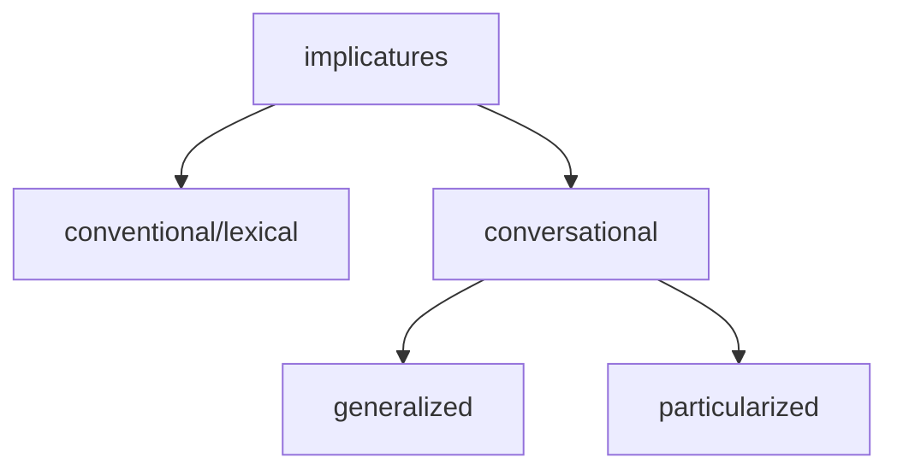
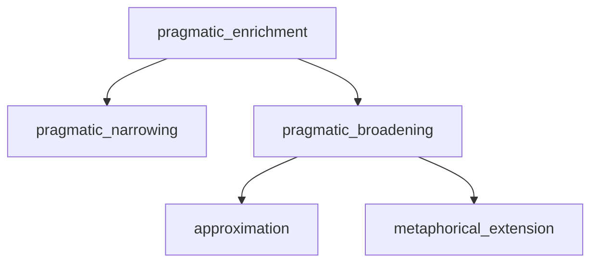

# Introduction and Concepts

## What is Pragmatics

- Briefly: Meaning and context. The study of language use.
- Specifically: The study of how contextual factors interact with linguistics meaning in the interpretation of language.
- Context is the soul of pragmatics.

## How pragmatics differ from other linguistics branches?

Charles W. Morris (1901-1979) American semiotician and philosopher. supervised by Charles S. Pierce. In his Foundations of the Theory of Signs (1938), Morris proposed that semiotics should have three divisions:

- syntax: Structural rules. Relation of signs (/words) to each other. The way words combine to form phrases and sentences.
- semantics: Meaning in Language itself. Signs (/words) and things which they denote. Literal, propositional / truth-conditional meaning.
- pragmatics: Meaning in context. Signs (/words) and interpreters. Implicit, context-related, non-literal, non-truth-conditional meaning.

```
syntax  -------------> semantics -------------> pragmatics
              ⬆️ 	                     ⬆️ 	       
						decoding              use in context
```

During the course of everyday communication, human beings as social animals convey more than the literal, propositional meaning (i.e. we don’t always mean what we say literally).

There is more to the literal meaning of a sentence when we consider the sentence in relation to the context, i.e., the situation of uttering the sentence.

Sentence that cannot be considered in isolation → utterance

- sentence 句子
- utterance 话语

Pragmatics looks beyond truth-conditional meanings, and explores non-literal, implicit, context-related meanings.

Thus both semantics and pragmatics deal with meaning, yet there is a division of labour: semantics deals with meaning in context. 

### Levels

- lexical pragmatics
- intercultural pragmatics
- historical pragmatics
- socio-pragmatics

## Context, Deixis and Reference 语境，指示与指称

### Deixis

Definition

- Deixis means pointing via language. The phenomenon of deixis constitutes the singlemost obvious way to show how (situational) context determines meaning.
- Any linguistic form used to accomplish ‘pointing’ is called a deictic expression, e.g., you, I s/he, this, that, here, there
- Among the first words acquired by children
- Used in face-to-face spoken interaction

Deixis and context: Deictic does not have concrete meanings. Deictic words depend on context for meaning.

- situational context: every non-linguistic factor that affects the interpretation of words, phrases, and utterances
    - who is speaking
    - the time of speaking
    - the location of speaking
    - gesture or body language of the speaker
    - topic of the discourse
- linguistic context: refers to the language surrounding the expression in question
    
    ```
    The boy said he has five girlfriends.
    ```
    
    Both *he* and *the boy* refer to the boy. 
    
    *He* refers to the boy anaphorically, *the boy* refer to the boy deictically.
    

Types of deixis

- proximal: this, here, now
- distal: that, there, then

defined in relation to the deictic center (person, time, place, discourse, social)

- gestural: terms used in gestural deictic way, be interpreted with audio-visual-tactile
- symbolic: symbolic usages of deictic terms

- personal deixis
    - any expression used to point to a person
    - basic three-part division: speaker, addressee, others. you and I can exchange
    - inclusion/exclusion distinction: ‘we’ including addressee and speaker. Some language (Fijian) grammaticalize this distinction
- spatial/space/place deixis
    - words used to point to a location. e.g., here, there
    - locations can be specified relative to other objects or a fixed reference point / the location of participants
    - pure place-deictic words: here, there, this, that
    - some languages have demonstratives with three-or-four-way distinctions/proximal-distal dimension: Turkish, Tlingit, Japanese
    - some verbs of motion: come/go
    - deictic projection: location from the speaker’s  perspective can be fixed mentally as well as physically. (psychological distance)
- time/temporal deixis
    - expressions used to point to a time (e.g. now, then, yesterday, today)
    - deictic simultaneity: coding time (CT) = receiving time (RT)
- discourse/text deixis
    - use of expressions referring to a part of the discourse
    - words and phrases that indicate the relationship between an utterance and the prior discourse
- social deixis
    - honorifics 敬语
    - absolute social deixis
        - authorized speakers: only certain types of speakers may use particular words/morphemes.
        - authorized recipients: only certain types of addressees may be addressed with certain words/morphemes. e.g., Mr. President

The deictic cycle. Harman, 1990.


### Reference

Definition: The act of using a word/phrase to pick out something in the world. 

Types of referring expressions (指示语)

- proper nouns (Mike, Mary)
- definite NPs (the linguist, the writer)
- indefinite NPs (a.. )
- pronouns (he, she)

Choice of referring expressions: based on the speaker’s assumption about what the listener knows.

- Shared visual contexts: Look at her/this!
- Shared memory: Remember that weird guy in the first semester?
- Shared world knowledge: We need to find a cop (entity is unknown but can be assumed to exist)

Conditions for successful reference: must be collaborative

- The speaker has the intention to refer
- The addressee recognizes the intention and then identifies something.

## Presupposition

Differences between semantic and pragmatic presuppositions

- semantic presupposition: only within the sentence. does not consider the speaker
- pragmatic presupposition: held by the speaker. Presupposition is what is assumed to be the case prior to making an utterance.

for pragmatic presupposition

- presupposition should be shared by all participants
- Robery Syalnaker: people who communicate have mutula knowledge or a common ground (belief or a background set of assumptions)

cancellation of presuppositions

Presuppositions are cancellable or defeasible by changing the words to alter the previous proposition.

```
F: 有些人养猫了
~F: 有些人没养猫
```

projection problem

presupposition may not survive when simple sentences are projected into complex ones.

```
Mary didnt manage to find a job.
Mary didnt manage to find a job. In fact, she didnt even try.
```

```
Mike didnt date Mary again.
Mike didnt date Mary gain, if indeed he ever did.
```

presupposition triggers (触发语): how to determine speakers’ presupposition in the course of verbal communication? 

- Definite descriptions 有定描写: It gives definite descriptions associated with presuppositions of existence. e.g. the/this/that + NP, 3rd person pronoun, possessive + N (my, your, his/her).
    
    ```
    Sue's neighbour's daughter got married last week.
    => Sue has a neighbour.
    => The neighbour has a daughter.
    ```
    
- Factive verbs 实情动词: sth has happened. e.g. regret, realize, know, be aware that, be sorry that, be glad that, be proud that, be pleased that, be odd, be strange, be disappointed that.
    
    ```
    John regretted having started the project.
    => He started the project.
    ```
    
- Implicative verbs 含蓄动词: e.g. manage, forget, happen, avoid…
    
    ```
    I forgot to bring the book.
    => I ought to have brought the book.
    
    We happened to meet Bob in the cinema.
    => We didnt expect to meet Bob in the cinema.
    ```
    
- “Change of state” verbs 表状态改变的动词: e.g. finish, stop, begin, start, carry on, continue, cease, leave, arrive, enter, come, go, turn, transform..
    
    ```
    He stopped / didnt stop smoking cigars
    ```
    
- Iteratives 表反复的词语: words expressing repetition. e.g. repeat, back, again, too, another time, any more..
    
    ```
    The spaceship came back to earth.
    => The spaceship used to be on earth.
    ```
    
- Verbs of judging 判断性动词: accuse, charge, criticize 总感觉这个跟前面的factive verb有点像，可能是前面那个一般是加that表that后面的是presuppotion, 而这个表示动词本身的属性(e.g. 情感色彩) 但是好像区别也不大
    
    ```
    Joe accused Zeo of forgery.
    => Joe thinks forgery is bad
    ```
    
- Temporal clauses 时间状语从句: before, after, since, ..
    
    ```
    After his father died, he stepped into a large fortune.
    => His father died.
    ```
    
- Cleft sentence 切分句/断裂句: it is.. that/who.. = 强调句。这个好牵强。。
    
    ```
    What I lost is my passport
    => I lost something.
    ```
    
- Non-restrictive attributive clauses
    
    ```
    Jack, who visited China last year, is fond of Chinese tea.
    => Jack has been to China
    ```
    
- Counterfactual conditionals
    
    ```
    If I had not burnt the cake, we would be having it for tea.
    => I burnt the cake.
    ```
    
- Questions
    
    ```
    Does Frank speak English or French?
    => Frank speaks one of the two European languages.
    ```
    

## Conversational Implicature

Implicature

Grice’s theory of conversational implicature, *Logic and Conversation.* 

An outline of a systematic theory of language use, which can account for the way people read between the lines when understanding everyday language.

meaning of a sentence

- what is literally said by a sentence
- a variety of inferences that may reasonably be drawn from the speaker’s use of that sentence in a particular context

Grice’s new terms

- implicate: 指代词
- implicature:  covers the family of uses of “what is implied” / “what is suggested” / “what is meant”

Grice draws a distinction

- entailment (semantically)
- implicature (pragmatically)

```
- Smith doesn't seem to have a girlfriend these days.

- He has been paying a lot of visits to New York lately.

=> entailment: he visits New York recently
=> implicature: Smith may be having a girlfriend in New York.
```

features

- cancellable
- non-detachable: you cannot get rid of the implicature by substituting a synonymous expression.
- calculable: (1) what is literally said + (2) contextual information

Grice’s cooperative principle

common purpose/common direction: Conversational partners normally recognize a common purpose or a common direction in their conversation.

common objectives (~= joint project): At any point of a conversation, certain “conversational moves” are judged suitable or unsuitable for accomplishing their common objectives. 

- Maxim of quality
    - Make your contribution as informative as required
    - Do not make your contribution more informative than required
- Maxim of quantity
    - Make your contribution one true.
    - Do not say what you believe to be false
    - Do not say that for which you lack adequate evidence
- Maxim of relation
    - Make your contribution relevant
- Maxim of manner
    - Be perspicuous
    - Avoid obscurity of expression
    - Avoid ambiguity
    - Be brief (avoid unnecessary prolixity)
    - Be orderly

How the cooperative principle is applied:

- conversational partners are being cooperative
- they are supposed to follow the four principles
- if an utterance superficially spears not to conform to any of the maxims, the listeners would look for a way of taking it so that it conforms in some way.

How to follow the maxims:

- hedges: 模糊限制语
    - quality: as far as I know, I may be mistaken, I guess
    - quantity: to cut a long story short, I wont bore you with all the details
    - relation: by the way, anyway, I dont know if this is important
    - manner: this may be a bit confused, Im not sure if this makes sense, I dont know if this is clear at all
    

How to break the maxims: 

The cooperative maxims are guidelines instead of rules. They can be creatively infringed/violated.

- quantity:
    
    ```
    Chandler: Where is the book you are reading?
    Monica: Its in the living room where there is also light and no one will kick you in the shin.
    ```
    
- quality
    
    ```
    Two travelers arrived at the hotel and were shown a rather dirty room.
    “What,” said one, “does this pigsty (猪圈) cost?” Promptly the owner replied, “For one pig, two dollars; for two pigs, three dollars.”
    ```
    
- relation
    
    ```
    (The American ambassador Joseph Chroates was once mistaken for a doorman by a guest at an embassy function).
    Guest: Call me a taxi.
    JC: OK, you’re a taxi.
    ```
    
- manner
    
    ```
    Miss X sang “Home Sweet Home” vs.
    Miss X produced a series of sounds which corresponded closely with the score (乐谱) of ‘Home Sweet Home’.
    ```
    

The Horn scales & scalar implicature

When any form on a scale (most, some, always, often, must, may…) is used or asserted, the negative of all forms higher on the scale is implicated.

types of implicature



## Lexical Pragmatics

Criticism of relevance theory

- RT seems to work at the macro-level, but is rather vague at the micro-level.

To calculate the processing cost,

Lexical pragmatics

- at micro-level
- the lexical meaning is also relevance-determined

pragmatic enrichment



- pragmatic narrowing: superordinate → subordinate
    
    ```
    Doctors also *drink*.
    => drink alcohol
    ```
    
- pragmatic broadening
    - approximation: e.g. the water is boiling (close to a boiling point, but not *at*)
    - metaphorical extension: metaphor & hyperbole