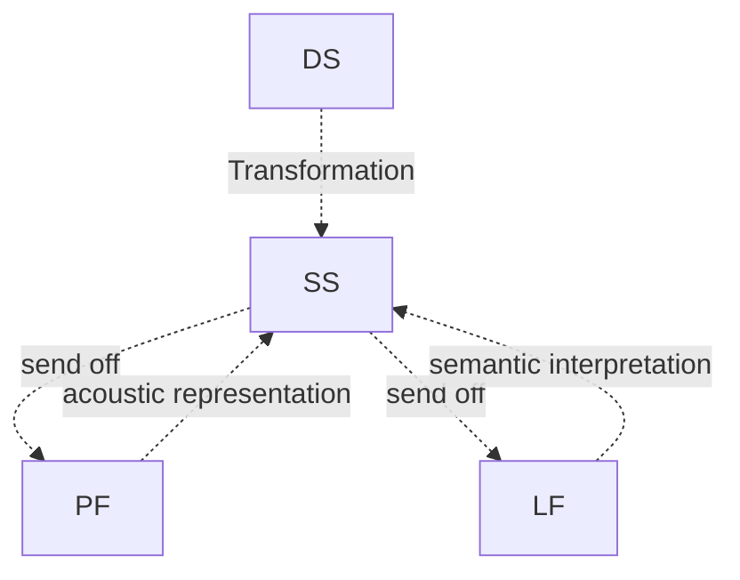

## Scope Ambiguity

## Scope and Anaphora

antecedent vs. postcedent

anaphor vs. cataphor

Predicate logic is suited to capture natural language meaning

allow recursion = recursivity

two sources of recursion

- coordination: john likes cats, dogs, beer
- embedding: John said that Mary knws that Bill thinks that Jane claims that

```latex
some boy kissed every girl.

Every girl was kissed by some boy.
```

```latex
Someone mentioned tehy called everyone.

\forall x: Px\forall y(M(x, Cxy))

```

linear order: negative polarity item



Transformation: 

- Jane laughed at Bill
- Bill was laughed at by Jane

<aside>

</aside>

CALLOUT: annotation, connotation and denotation

- annotation
    - a critical or explanatory commentary or analysis
    - a comment added to a text
    - the process of writing such comment or commentary
    - (computing) metadata added to a document or program
    - (genetics) information relating to the genetic structure of sequences of bases
    
- connotation: intension.
    - A meaning of a word or phrase that is suggested or implied, as opposed to a denotation, or literal meaning. A characteristic of words or phrases, or of the contexts that words and phrases are used in.
    
        *The **connotations** of the phrase "you are a dog" are that you are physically unattractive or morally reprehensible, not that you are a canine.*
        
    - A technical term in logic used by J. S. Mill and later logicians to refer to the attribute or aggregate of attributes connoted by a term, and contrasted with *denotation* .
    
        *The two expressions "the morning star" and "the evening star" have different **connotations** but the same denotation (i.e. the planet Venus).*

- denotation
    - its explicit or direct meaning, as distinguished from the ideas or meanings associated with it or suggested by it. Simply put, a word’s *denotation* is what that word *means* or directly represents.


### Solution for scope ambiguity
Quantifier-raising 
- NC RM
- syntactic structure comes before the semantic structure
- The movement we make in SS to remove ambiguity in DS is called quantifier-raising.
- take the quantifier to the higher position to show the scope

Quantifier-in
- Montague grammar
- The derivational illustration is called quantifier-in.
- each predicate take an argument once a time

Quantifier storage
- Cooper storage
- semantic ambiguity not represented in syntactic structure
- semantic representation in which scope ambiguities are obtained without special syntactic rules

## Quantifier-in
interrogative: asking a question
```
which woman does every man love?
```

which scopes over every.

## Scope ambiguity
e.g. 
some boy did not laugh.
```
\exist x (Boy(x) and ~Laugh(x))
~\exist x (Boy(x) and Laugh(x))
```

some boy kissed no girl.
```
\exist x (Boy(x) and ~\exist y (Girl(y) and Kiss(x, y)))
~\exist y (Girl(y) and \exist x (Boy(x) and Kiss(x, y))): there was no girl kissed by a boy
```

every boy kissed no girl.
```
\forall x (Boy(x) and ~\forall y(Girl(y) and Kiss(x, y)))
```

### Deictic

No boy said he was hungry.

No boy was present. He was outside instead.: “he” is trying to refer to ”no boy” but outside the scope.


pronoun $\sub$ anaphora

## Discourse Anaphora
e.g. 
```cpp
Every student was present and she was interested.
```

every: scopes over “Every student was present”

every: an indefinite quantifier. “she”’s antecedent is not clear

“she” is hardly bound by the antecedent. “she” is free
* ungrammatical: 不合语法的, syntactic

# infelicitous: 不合适的, semantic, fit the context
- sentence pronoun: within the same clause
- discourse pronoun: in separate clauses

- sentence quantifier:
    ```
    Some boy said he was hungry.
    No boy said he was hungry.
    ```
    
- discourse quantifier:
    ```
    Some boy was present; he was hungry.
    #No boy was present; he was hungry.   // he is free
    ```
    
- coreference
    individual constants
    ```
    Fred thought he was the the best
    ```
    
- binding
    individual variables
    ```
    Every student thinks he/she is the best
    ```
    
So we may conclude the following rules for e-type anaphora. BUT this part has NOT been verified with any authority. Do NOT take them as given truths during exams.

- F: universal quantifier + singular pronoun
- T: universal quantifier + plural pronoun
- F: negated quantifier + singular pronoun
- T: negated quantifier + plural pronoun, semantically plural but grammatically singular
- T: existential quantifier + singular pronoun

e.g. No boy thinks that he has a chance.
```
~\exist x(Boy(x) and Think(x, Has-a-chance(x)))
```

A particular boy said he wanted to kiss every girl. He then did it.
```
\exist !x(Bx and  W(x, K(x, \forall y(Gy -> K(x, y))))) and K(x, y)
```

## Donkey anaphora

if a farmer owns a donkey, he beats it.
```
* \exist x (Fx and \exist y (Dy and O(x, y))) -> B(x, y)
\forall x \forall y (Fx and Dy and O(x, y) -> B(x, y))
```

= every farmer who owns a donkey beats it.
```
\exist x(Fx and \exist y (Dy and O(x, y)) -> B(x, y))  // y is free
```

❗❗❗

A donkey sentence is such that an expected existential is interpreted as universal taking wide scope.

donkey pronoun can be: it, him, they (can also be plural forms) 


“a”: generic indefinite
```cpp
A woman is a difficult thing to please.
```

\[Every farmer \[who owns a donkey] beats it.]

universal wide scope: it scopes more over the relative clause

The problem
- Existential with narrow scope
- interpreted as universal with wide scope
- in conditional clauses
- in restriction of every

Conclusion
- the machinery of predicate logic is broken
- cannot capture meaning of natural language

If a student tries, she passes the exam.
```
(\exist x(Sx and Tx)) -> Py   ; y is free
\exist x((Sx and Tx)) -> Py)
```

interpretation
```
\forall x((Sx and Tx) -> px)
```

Solutions for donkey anaphora:

- E-type anaphora
    - Gareth Evans, 1970s, philosopher, university of Oxford, logic, philosophy of mind
    - pronoun outside the scope of their binder
    - initial examples
        ```
        A student came in. She had a question about the exam.
        she = the student came in
        
        Bill owns some sheep and Max vaccinates them.
        them = the sheep Bill owns. E-type pronoun, some sheep scopes over the first half
        ```
        
    - If a student likes Copenhagen, she is happy.
        ```
        she = for every case we examine, the student is 
        ```
        
    - every student who reads a semantic paper likes it.
        ```
        Bill owns a cat. Max takes care of it.
        Bill is a cat-owner. #Max takes care of it.
        ```
        

- DRT (Dynamic binding theory)
    - discourse anaphora and donkey pronouns
    - intermediate level
    - Irene Heim (1982) and Hans Kamp (1981)
    - Discourse Representation Theory (DRT)
        - embedding conditions
        - language of boxes
        - boxes constantly updated
        - embedded boxes in accessible
    
- Unselective binding
    example of the subject is ‘unselectively bound’ by a special ‘generic operator.
    ```
    Dogs bark.
    A dog barks.
    ```
    
Reference: [Unselective Binding](https://people.umass.edu/scable/LING720-FA18/Handouts/4.UnselectiveBinding.pdf)

# Chapter 6 in short: Discourse/Donkey Anaphora

(加粗的是Donkey anaphora和E-type anaphora的区别)

Discourse: basic unit of interpretation

- Dynamic theory of meaning: look beyond the meaning of individual sentences and determine the way they are pieced together to make discourse
- discourse anaphora: anaphora in sequence of sentences (instead of single sentence)
- Donkey sentence: **is such that an expected existential is interpreted as universal taking wide scope**. / sentences that contain a pronoun with clear meaning but whose syntactical role in the sentence poses challenges to grammarians (wikipedia)
    - universal: each, every, all, not all, not every
    - existential: a, one, some, no
    - e.g.
        ```
        every farmer who owns a donkey beats *it*.
        it: (corresponding to the) existential ("a") but interpreted as universal
        ```
        
        ```
        every police officer who arrested a murder insulted *him*.
        him
        ```
        
        ```
        every farmer who owns some sheep cleans *them*.
        them
        ```
        
- donkey anaphora = donkey pronoun: it, him, they (can also be plural forms)
- Analysis of donkey anaphora: Montague grammar
    
    e.g. 
    
    ```
    \forall x(Farmer(x) and \exist y (Donkey(y) and Owns(x,y)) -> Beat(x,y))
    ```
    

Anaphoric relations in sentence and discourse
- E-type anaphora: **pronoun outside the scope of binder, not bound, content of pronoun reconstructed, reconstruction based on context**
    - in separate sentences
        
        ```
        A student came in. *She*(the student came in) had a question about the exam.
        ```
        
    - in the same sentence but outside the scope
        ```
        If a student likes Copenhagen, *she*(for every case we examine, the student in question who likes Copenhagen) is happy.
        ```
        
    - problem of compound: antecedent must appear as a noun?
        ```
        Bill owns a cat. Max takes care of it.
        Bill is a cat-owner. # Max takes care of it.
        ```
        
- unselective binding + Discourse Representation Theory (DRT)
    - embedded conditions
    - language of boxes, boxes constantly updated
    - Accessibility: the antecedent to be in a box ‘as high as’(same box or left box) or ‘higher than’ the discourse referent for the pronoun
    - ⇒ binds all left variables. unselective quantification over all the variables. unselective binding
- dynamic binding
    - TODO

Anaphora resolution
- TODO