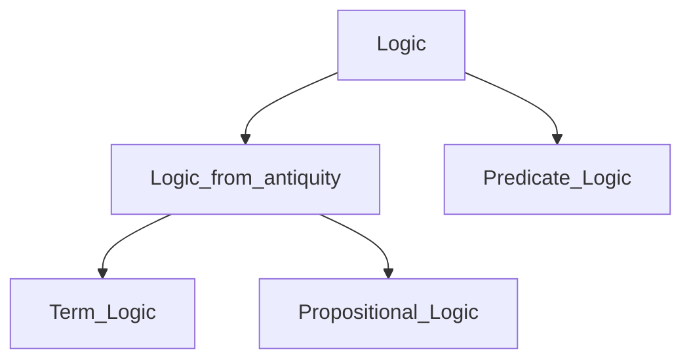
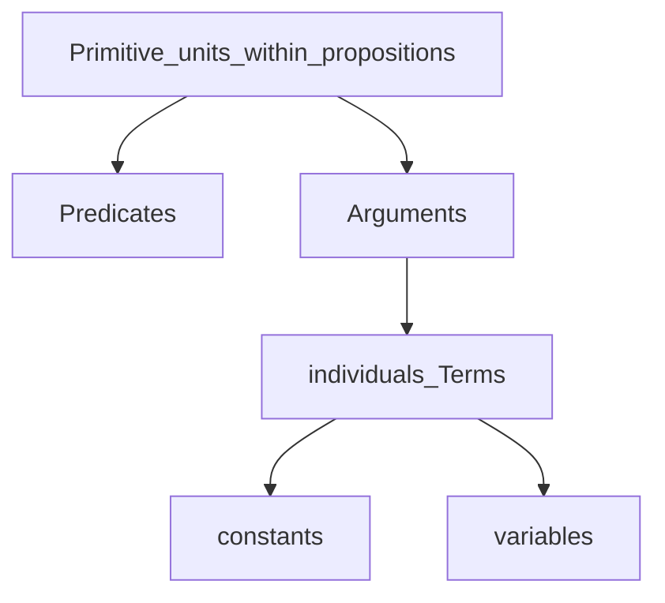
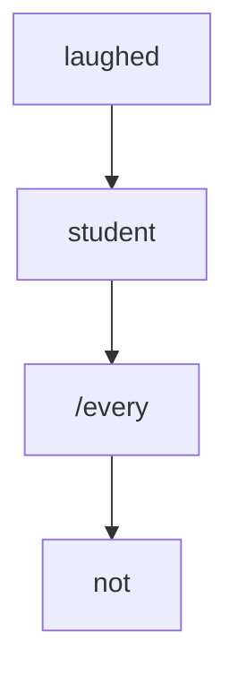
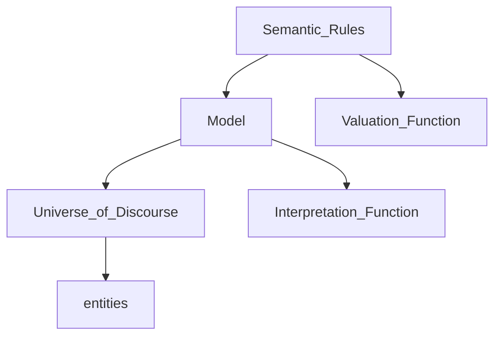

# Logics & Formal Semantics

### Metalanguage
- object language: the language we talk about
- metalanguage: the language that we use to talk about the object language

```sql
a. January has 31 days.
b. *******January******* has 7 letters.
b*. 'January' has 7 letters.
```

Liar sentence

```
(31) Sentence (31) is false.
```

solutions: (不考)

- fuzzy logic 
    ```
    x = NOT(x)
    x = 1 - x
    x = 0.5
    ```
    
- Alfred Tarski
    paradox arises only in languages that are “semantically closed”.
    
- Arthur Prior
    equivalent
    ```
    This statement is false.
    This statement is true and this statement is false.
    ```
    
- Saul Kripke
    Whether a sentence is paradoxical or not can be depend upon contingent facts.
    ```
    A majority of what Jones says about me is false.
    ```
    
    ```
    Smith is a big spender.
    Smith is soft on crime.
    Everything Smith says about me is true.
    ```
    
    If a statement's truth value is ultimately tied up in some evaluable fact about the world, that statement is "grounded". If not, that statement is "ungrounded". Ungrounded statements do not have a truth value. Liar statements and liar-like statements are ungrounded, and therefore have no truth value.
    
- Jon Barwise and John Etchemendy
    “denial” or “negation”
    
- Dialetheism
    
    Dialetheism is the view that there are true contradictions. Dialetheism raises its own problems. Chief among these is that since dialetheism recognizes the liar paradox, an intrinsic contradiction, as being true, it must discard the long-recognized principle of explosion, which asserts that any proposition can be deduced from a contradiction, unless the dialetheist is willing to accept trivialism – the view that *all* propositions are true. Since trivialism is an intuitively false view, dialetheists nearly always reject the explosion principle. Logics that reject it are called paraconsistent.
    
- Non-cognitivism
- Bhartrhari’s perspectivism

## Connectives, truth, and truth conditions

logic overview



logic from antiquity: older

predicate logic: newer

Aristotle: term logic

Gottlob Frege: predicate logic


## History of Logics

- term logic (syllogism logic)
    - Aristotle
    - syllogism
- propositional logic (predicate calculus, semantic, sentence, symbolic logic)
    - antiquity
    - proposition: true and false
    - logical words
- predicate logic
    - gottlob frege
    - meaning
    - quantifier

Not applied for
- question (?)
- exclamation
- modal: modal logic

<aside>
💭 ergo: therefore

</aside>

## Term logic

### Modus Ponens
Means of putting, MP syllogism, affirming the antecedent

```
P(conditional statement): If it rain, I do not go to school.
H: It rains.
C: I do not go to class.
```

Formal fallacy: affirming the consequent. Abductive reasoning.
```
P: If it rains, I will not go to class.
H: I do not go to class.
C: * It rains.
```

### Modus Tollens
Means of carrying, MT syllogism, denying the consequent. 
```
P: If it has not been cloudy, it does not rain.
H: It rains.
C: It has been cloudy.
```

### Hypothetical syllogism
principle of transitivity
```
P: If it rains, the soils goes wet. If the soil goes wet, the plants grow.
H: It rains.
C: The plants grow.
```

### Disjunctive syllogism
two premises and a conclusion
```
P: It either rains or its sunny.
H: It rains.
C: It is not sunny.
```

## Three types of reasoning

- Deductive reasoning
    
    general to the particular. based on entailment
    
- Inductive reasoning
    
    particular to the general. empiricism
    
- Abductive reasoning
    
    formal fallacy. All dogs bark, Fido barks, Fido is a dog.
    
    Abductive reasoning allows inferring a as an explanation of b. As a result of this inference, abduction allows the precondition a to be abducted from the consequence b.
    
    Properly used, abductive reasoning can be a useful source of priors in Bayesian statistics.
    

## Propositional logic
- propositional 1: p
- propositional 2: q
- propositional 3: r
- negation: $\neg$
- conjunction:
- disjunction:
- inclusive disjunction
- exclusive disjunction
- conditional:
- biconditional:

### conditional, material implication
- antecedent
- consequent
- →, arrow.

### biconditional
- ↔
- if and only if
- logical equivalence

### De Swarts formalizations
- $\phi$ phi, any proposition
- $\psi$ psi, any other proposition
- wff, well-formed formula

### Well-formed formula
- Any atomic proposition is itself a wff.
- If $\phi$ is wff, then $\neg\phi$ is wff.
- Two wff’s conbinations under logical operators are a wff.
- No other are wff.

### Propositional practice

| John is happy. | p |
| --- | --- |
| John is not happy. | ~p |
| John is happy or sad. | p or q exlusive |
| John is happy, not sad. | p and ~q |
| If John has eaten, John is happy. | p -> q |
| If John has not eaten, John is not happy. | ~p -> ~q |
| John is hungry or thirsty. | p or q inclusive. |
| John left before you did. | p |
| John is not hungry or thirsty. | ~(p or q inclusive) <-> ~p and ~q |
| John is not hungry and thirsty. | ~(p and q) <-> ~p or ~q inclusive |
| If John did not laugh, then John cried. | ~p → q ↔ p or q |
| If John laughed, then John also cried. | p → q ↔ ~p or q inclusive |
| John did not laugh, or John cried. | ~p or q ↔ p → q |
| John laughed, or John cried and beat on the table.  | p and (q or r) ↔ (p and q) or  (p and r) |
| John is not happy, but rather sad. (scope of “not”) | ~p and q. * ~(p and q) |
| John is not happy, or sad. | ~(p and q) |
| John is not happy, or John is sad. | ~p or q |
| John did not help us or hinder us. | ~(p or q) ↔ ~p and ~q |
| John did not help us or John hinders us. | ~p or q |

- Tautology: necessarily true
- Contradiction: necessarily false
- Contingent: possible

```
John is friendly or John is not friendly.
```

| p | V_e | ~p |
| --- | --- | --- |
| T | T | F |
| F | T | T |

```
John is friendly and John is not friendly.
```

| p | and | ~p |
| --- | --- | --- |
| T | F | F |
| F | F | T |

```
It is not the case that John is not friendly.
```

| ~ | ~ | p |
| --- | --- | --- |
| T | F | T |
| F | T | F |

contingent.

```
It is not the case that John is hungry or John is not grumpy.
```

| ~( | p | or | ~q |
| --- | --- | --- | --- |
| F | T | T | T |
| F | T | T | F |
| F | F | T | T |
| T | F | F | F |


## Material implication →

converse: q→p. affirming the consequent

inverse: ~p→~q. denying the antecedent

contrapositive: ~q→~p. modus tollens

given p→q.

- Sufficient condition: if p is True, p is the necessary condition for q so q must be True.
- Necessary condition: if q is True, q is not a necessary condition for p so p may or may not be True.


Although it was extremely cold, Sally did not stay indoors.

```
~q->p
p and ~q
```

We get a holiday, or we protest.

```
~p->q
p or q
```

Jone said that Jane helped him.

```
p
p and q
```

John’s sister burped

```
p: John has a sister. presupposition, assume it true
q: This sister burped.
p
p and q
```

John arrives before Jane left

```
p before q
```

John did not arrive before Jane left.

```
~p before q
p ~before q
```

## Predication and Quantification

universal quantifier: every, each, all, any, only

existential quantifier: a, some, there is $\exist$, for all $\forall$

predicate, argument

John may like Sally.

```
predicate: may like
```

John has a crush on Sally.

```
predicate: has a crush on
```

Frank is the father of Susan.

```
predicate: is the father of
```

Frank is Susan’s father.

```
predicate: is...'s father
```

Adjunct: if, probably, means, of course, early

Valent, empty place holder: formal subject


### Collective and distributive readings

```
Jogn and Molly ate a pizza.
p: one pizza, ate one together.   distributive
p and q: two pizzas, each ate a pizza.  collective
```

```
Cinthia and Sam have saved 100 dollars.
p: together 100 dollars
p and q: 200 dollars
```

Content verb is a predicate, but functional verbs are not

John obviously spoke with Jane because he had to.

```
predicate: spoke with
argument: John, Jane
adjuncts: obviously, because he had to.
```

If I get a chance, I will probably try to avoid the mistake.

```
predicate: will try to 
argument: I, avoid the mistake
adjuncts: If I get a chance, probably
```

John performed Jill’s operation first.

```

```

The person who talk loudly is Jim’s father.

```
predicate: is someone's father
argument: the person who talk loudly, Jim
adjunct: 
```

the talking loudly person

```
predicate: talking
argument: person
adjunct: loudly
```

predicate: the nodes that are connected in SUD parsing tree

universal dependency (UD)

syntactic-universal dependency (SUD)



lexical  predicates vs. syntactic predicates

- lexical: content verbs, adjectives, common nouns, some prepositions
- syntactic: content verbs plus functional elements, adjective plus functional elements, predicate expressions (nouns, prepositions, subordinators, plus functional elements)

individual constants vs. individual variables

- names and definite descriptions: John, the first one, the idea
- quantified phrases: every man, some idea, no paper

e.g. We think John likes Susan.

```
T(w, Lj,s)
```

Types of predicates:

- converse: husband-wife, above-below, precede-follow
- symmetric: be the roommate of, be married to, be related to
- reflexive: see oneself, praise oneself
- transitive: older than, be north of, be a sibling of

e.g. Monica hid her bicycle.

```
x hide y: Hx,y
Monica: m
her bicycle: b
Hm,b
```

e.g. Monica did not hide her bicycle.

```
x hide y: Hx,y
Monica: m
her bicycle: b
~Hm,b
```

e.g. Monica laughed and cried.

```
Monica: m
laugh: L()
cry: C()
Lm and Cm
```

e.g. Jim sent Monica his dog.

```
Sj,m,d
```

e.g. William did not help or hinder Mike.

```
~ (H1w,m or H2w,m) 
```

e.g. Jennifer promise to help.

```
P(j, Hj)
```

e.g. Jennifer did not promise to help.

```
~P(j,Hj)
```

e.g. Jennifer promise to not laugh.

```
P(j,~Lj)
```

e.g. Mike claimed he wanted to help.

```
C(m, W(m/x, Hm/x))

m: Mike
x: maybe some other
```

e.g. John asked Mandy to stop laughing.

```
A(j, m, S(m, Lm))
```

e.g. John and Larry called Molly.

```
Cj,m and Cl,m
C(j and l, m)
```

e.g. Molly did not call John and Larry.

```
~C(m, j) and ~C(m, l)
~C(m, j and l)
~C(m, j) or ~C(m, l)
```

entailment: (universal instantiation) 

every dog barks → if something is a dog, then it is a dog.

Universal quantification

$\forall$x (Dx → Bx)

D = (d1, d2, d3,…)

$\forall$x (Dx → Bx)= (Bd1 and Bd2 and Bd3, ….)

Existential quantification

$\exist$x (Dx and Bx)

D = (d1, d2, d3,…)

$\exist$x (Dx and Bx) = (Bd1 or Bd2 or Bd3, ….)

e.g. Every cat barfed.

```
\forall x (Cx -> Bx)
```

e.g. The cat barfed.

```
Bc
```

e.g. Bill fed cat.

```
\forall x (Cx -> Fb,x)
```

e.g. Some dog barked at Fred.

```
\exist x (Dx and Bx,f)
```

e.g. Fred scolded some dog.

```
\exist x (Dx and Sf,x)
```

e.g. Fred and Susan avoid some dog.

```
\exist x (Dx and Af,x and As,x)
\exits x (Dx and Af,x) and \exist y (Dy and Af,s)
```

e.g. No dog barks.

```
\forall x (Dx -> ~Bx)
~\exist x (Dx and Bx)
```

e.g. Bill fed no dog.

```
~\exist x (Dx and Fb,x)
\forall x (Dx -> ~Fb,x)
```

e.g. No dog barked at Susan or chased Fred.

```
~\exist x ((Dx and (Bx,s or Cx,f))
\forall x ((Dx -> (~Bx,s and ~Cx,f))
\forall x ((Dx -> ~(Bx,s or Cx,f))
```

Scope ambiguity

e.g. Some boy kissed every girl.

```
\exist x \forall y (Bx and (Gy -> Kx,y)) = \exist x(Bx and \forall y (Gy -> Kx,y))
\forall y \exist x (Gy -> (Bx and Kx,y)) = \forall y (Gy -> \exist x (Bx and Kx,y))
```


Every boy kissed some girl.

```
\forall x (Bx -> \exist (Gy and Kxy)) <=> \forall x \exist y (Gy and Kxy)
```

Every students did not laugh.

```
\forall x (Sx -> ~Lx) <=> ! \exist x (Sx and Lx)
~\forall x (Sx -> Lx) <=> \exist (Sx and ~Lx)
```

Not every student laughs.

```
~\forall x (Sx -> Lx) <=> \exist (Sx and ~Lx)

```



each studnet did not laugh.

```
\forall x (Sx -> ~Lx) 
~\forall x (Sx -> Lx)
```

### Polarity item

any: negative polarity item

John did not pass every exam.

```
~\forall x (Ex -> Pj,x) <=> \exist x (Ex and Pj,x)
\forall x (Ex -> ~Pj,x)
```

John did not pass any exam.

```
\forall x (Ex -> ~Pj,x)
```

- universal quantifier: all, every, each, any
- existential: some, a/an, one, there is

e.g. 

Jack saw a rat.

```
\exist x (Rx and Sj,x) 
```

Jack is a rat.

the quantifier is in the predicate but not the argument. here rat is a constant.

```
Rj
```

Jack knows no genius.

use not exist to render “no”

```
~\exist x (Gx and Kj,x)  <=> \forall x (Gx -> ~Kj,x)
```

Jack is no genius. <=> Jack is not a genius.

```
~Gj
```

These problems are difficult.

```
Dp
```

These problems are difficult ones.

```
Dp
```

All the problems are difficult.

```
\forall x (Px -> Dx)
```

These problems are all the problems.

```
Ap
```

These problems are not all the problems.

```
~Ap
```

Jack is our plumber.

```
Pj
```

Our plumer is Jack. (has presupposition)

```
Pj
```

Everything counts.

whether thing includes animate and inanimate.

```
\forall x (Cx)
\forall x (Tx -> Cx)
```

Everybody counts.

```
*\forall x (Cx)
\forall x (Px -> Cx)
```

predicates

- content words
- adjectives
- predicative expressions (common nouns, adjectives, preposition, subordinators)
- some prepositions.
    
    The present under the tree is big. (prepositions that gives location)
    
- argument nouns.

common nouns

- John is a teacher. Tj
- Every teacher was present. \forall x (Tx → Px)
- The teacher was present. Pt

content verbs are the core of syntactic predicates

adjectives are most always the core of syntactic predicates.

e.g. Mike’s wife thinks Mikes if lazy.

- thinks (Mike’s wife, Mike is Lazy) - propositional
- ‘s (Mike, wife) ‘Mike has a wife’ - presuppositional: does not affect the truth value
- is lazy (Mike) - intensional: does not affect the truth value

predicates inside individual constants are presuppositional

A thin man was present.

- was present (a thin man)
- thin (a man)
- \exist x (Mx and Tx and Px)

predicates inside … .are propositional

e.g. Every barking is harmless

has true or false impact on the truth

```
\forall x ((Dx and Bx) -> Hx)
```

this proposition has to show up in the predicate

The barking dog is harmless.

```
Hd
```

the presupposition does not show in the predicate

John avoids every dog he sees.

```
\forall x ((Dx and Sj,x) -> Aj,x)
```

John said every dog barks.

intensional

```
Sj
S(j,\forall x (Dx -> Bx)) 
Sj,I  ; I for intensional argument predicate
```

### Adjunct predicates

Jane probably teased Sam last night

- teased (Jane, Sam)
- probably (Jane, teased Sam last night) - model adverbs
- last night (Jane teased Sam) - temporal adjuncts

John arrived drunk.

- arrived (John)
- drunk (John)

Jim burped twice.

twice: propositional or presuppositional

Susan did not cheat yesterday.

Mary stayed because John stayed.

- stayed (Mary)
- stayed (John)
- because (Mary stayed, John stayed)

Mary did not stay because John stayed

- ~stay (Mary)
- ~because ()

## restricted quantification

Every boy was hungry

```
\forall x: Bx(Hx)
```

Some boy was hungry.

```
\exist x: Bx(Hx)
```

Every cat barfed.

```
\forall x: Cx(Bx)
```

Bill fed every cat.

```
\forall x (Cx, Fb,x)
\forall x: Cx(Fb,x)
```

Some dog barked at Fred.

```
\exist x (Dx, Bx,f)
\exist x: Dx(Bx,f)
```

Fred and Susan avoid some dog.

```
\exist x(Dx and (Af,x and As,x))
\exist x: Dx (Af,x and Af,x)
```

No dog barks.

```
~\exist x (Dx and Bx) <=> ~\exist x: Dx (Bx)
```


## Formal Predicate Semantics



- model M:
    - Universe of discourse in which all constants have clearly assigned values
    - A limited part of a world (real or imagined), a discourse context
    - Clearly defined
    - Values of linguistics expressions known
- universe/domain of discourse U/D
    - Constants all the constants in M (set members)
- interpretation function I
    - Assign a value to an individual constant
    
    ```
    I(name) → meaning
    ```
    
- assignment function g[x/e]
    - Assign a value to an individual variable
    - g iterates all the variables and assigns the value
    - g() := for x in domain of e
    
    ```
    g(type of object) -> meaning
    ```
    
- valuation function V
    - Assigns a value 1 or 0 to a wffs. (propositions)
    
    ```
    V(p) = 1/0
    V(Bs) = 1/0
    ```
    
- [[\alpha]]^M the denotation of \alpha wrt M (same as interpretation function I)
    
    ```
    [[name]]^M -> meaning
    ```
    

## Relation

- if t is a constant, [[]]^{M,g} = I(t)
- if t is a variable, [[]]^{M,g} = g(t)