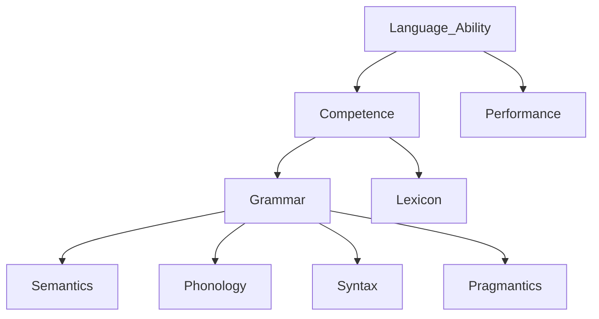
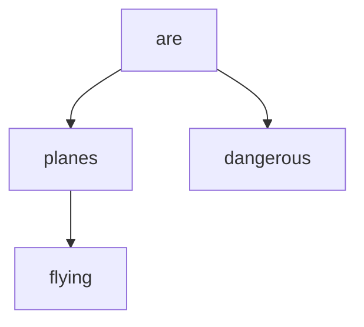
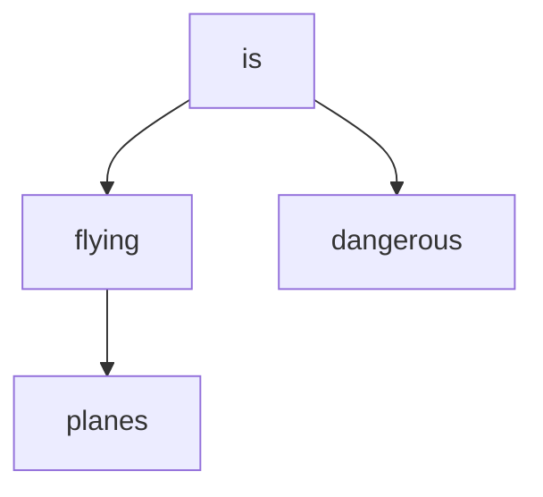
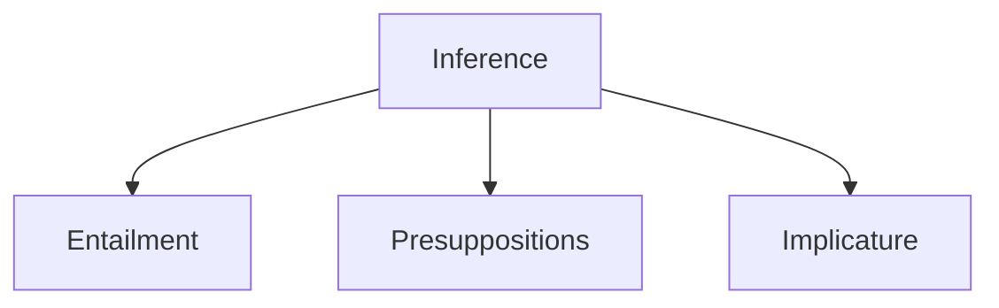

## What is semantics?
- Study of meaning with regard to natural language.
- mean = signify, import, denote, represent
- meaning = sense, significance, signification, acceptance, import

## The topics involving:
- Semantics vs. semiotics
    - semiotics is the use signs to convey meaning
    - Ferdinand de Saussure: signifier (phonic and orthographic form that evokes an idea (the signified)) vs. signified (idea in our mind that the signifier evokes). The referent is the actual object in the world that the signified points to.
    - Charles Sanders Peirce: icon (mimic of reality), index (real indicator of the presence of some real event), symbol (arbitrarily evokes or represents something in the world)

## Meaning capturing: metalanguage tools
- parenthesis
    ```
    small dogs and cats: 
    - small (dogs and cats)
    - (small dogs) and cats
    
    // example of scope of quantifier
    ```
    
- logical quantifier
    ```
    every body did not cry:
    - every not (boy did cry) 'no boy did cry'
    - not every (boy did cry) 'at least one boy did cry'
    ```
    

## Ways to capture meaning: (Henriëtte de Swart)

- mentalistic approach: words itself stands for meaning.
    - prototype: a central or typical member of a category.
    - difficulty: cannot describe functional words: only, of, just
    - by psycho semanticians
- referential approach: words refer to things to entities.
    - intensionality: world-creating predicates
    - difficulty: things do not exists
    - by formal semanticians
    

## Predicate/Predicate Calculus/First-order Predicate Logic

- everything but the subject
    e.g. John **likes grammar**.
    
- content verb or adjective taking arguments
    e.g. like (John, grammar).
    

## Map of Linguistics Theory



## Semantics & Syntax

### Syntax needs semantics

- We can/cannot study syntax without semantics.
    
    ```
    Colorless green ideas sleep furiously.
    ```
    

### Semantics needs Syntax

- Semantics needs syntax: Semantics is how meaning is assigned to linguistic expressions.
    SOV and SVO.
## Semantics & Pragmatics
- irony and metaphor

## Context and Deixis

### Deixis needs context

Deixis is how objects, events and situations relate to the here and now of the speakers. It shows that utterance meaning cannot be fully determined by sentence meaning.

- tense (present and past)
- demonstratives (this, that)
- pronouns (I, you, etc.)
- adverbials (here, there, etc.)

```
(Last week) (I) play(ed) tennis with Chris.
```

### Deictic  vs. Anaphoric use of pronouns

Deictic: pointing context
Anaphoric: linguistic expression context. pronoun resolution: antecedent - pronoun
<aside>
💭 index - indices (higher register) / indexes

</aside>

<aside>
💭 Desiderata (high-register way to say Goal, desideratum. sl.)

</aside>

## Map of Semantics / Taxomony

Semantics
- lexical semantics
    - meaning of lexical items
    - smaller unites
    - mainly words
    - morphemes
- compositional semantics
    - meaning of larger units
    - phrases and sentences
    - word combination

### Utterance / Sentence / Proposition
- utterance: the concrete result of a distinct act of speaking by an actual speaker
- sentence: abstract results of one one more act of sentence/writing
- proposition: the meaning of sentence independent of speaker context

## lexical semantics
- meanings of lexical items
- smaller units

```cpp
abiguity: bank, punch, pitcher
synonymy: beautiful-lovely, 
antonymy: male-female
hyponymy: set -> superset
taxonomy: set -> subset
symmetric relation: marry. mutually entail each other
converse relation: send, sell
meronomy: 
```

### 1) homonymy
- homographs: written the same. lab, match, stroke
- homophones: same pronunciation, distinct orthography. ring vs. wring, phase vs. faze, sent vs. cent

### 2) polysemy
- related meaning for the same words.

### 3) synonymy
- neutral - derogatory

### 4) antonymy
- simple opposite, black and white: dead - alive, pass - fail, hit - miss, present - absent
- gradable: cold - cool - tepid - warm - hot, silent - audible - soft - loud
- reverse: same perspective, distinct directions, often movements involved, pull - push, come - go, lift - push down, leave - return
- converse: same relationship, distinct perspective, above - below, own - belong to, employer - employee. the subject and objects of a predicate.
- taxonomic sisters
    - equal part of a whole
    - color of spectrum: blue, green, red, yellow, purple
    - days of the week: Monday, Tuesday
    - fingers of the hand: thumb, index finger, ring finger, middle finger

### 5) hyponymy
- sets: subsets and supersets
- hyponym of  = type of
- hypernym of  = subsumes
- car - vehicles, bottles - container.
- transitive relationships

### 6) meronymy
part-whole relationship
subtypes of meronymy
- from part to whole: is part of
- from whole to part: has / have
    - steering wheel - car, roof - house, trunk - tree, keyboard - lap
- from member to collection, from collection to member
- from portions to mass (is a portion of), from mass to portion ()can be separated into).
    - mass noun: liquid, salt, paper, homework, love
    - count noun: laptop, tree, car
    - drop of liquid - liquid, grain of salt - salt, sheet of paper - paper, bottle of beer - beer

```cpp
pistachio - almond taxonymy
laugh - cry 
move in - move out
cry - weep
RMB - monetary unit
grilfriend - wife
sit - stand
jump - hop
good - bad
beat - beet
rise - fall reverse
cigarette - cigar taxonymy
kid - goat 
dragon - monster
```

## Compositional semantics
- causation feature: kill - cause to cease to be alive, open - cause to be open,
- problem: too many features need, residual meaning
- semantics need syntax: a. Jim hit Sally b. Sally hit Jim.
- thematic roles: agent - patient - recipient - beneficiary - goal - theme - experiencer - instrument - source - percept (Frank saw the bottle)
- hit (agent, patient)

### Inventory of components
- actor or agent
- patient
- theme
- experiencer
- beneficiary
- instrument
- goal
- source
- recipient
- percept: being perceived


## Important linguistics
Michel Bréal: coined semantics
Ferdinand de Saussure: semiotician, diachronic vs. synchronic. 
Leonard Bloomfield: structural linguistics, Language, behaviorism(stimulus-response testing). reject introspection(theorize about language learning by thinking about on ones own experience)

### Diachronic & Synchronic
- course in general linguistics (1916)
- across time | with time

### Signifier & Signified & Referent
- signified: ideas in mind
- referent: real objects

### Langue & Parole
- competence & performance

### Paradigmatic & Syntagmatic

- paradigmatic relation: a relation “between an individual unit and others that can replace it in a given sequence”.
- syntagmatic relation: a relation “between elements that form parts of some form, sequence, construction”.

Noam Chomsky Syntax

### Generative Grammar

- transformational grammar, deep structure, Standard Theory
- semantic precedes syntax
- transformations manipulate semantic structures
- lexical items inserted at surface syntax
- reliance on semantic features
- reliance on lexical decomposition

### Ambiguity
- lexical ambiguity
- scope (quantifiers)
- syntactic ambiguity
- pronoun resolution

e.g. Flying planes can be dangerous.





### pronoun resolution

- anaphora
    - anaphor(pronoun takes antecendent)
    - cataphor(pronoun takes posteedent)
    
    ```c
    John said he would helps.
    No boy said he would help. no boy: all the boy not, not exist a boy
    ```
    
- coreference(coreferential): refer to same person
- quantification
    - covariance: the relation between “he” and every/all, “he” refers to all single one
    - binding: “he” binds “every”/”all”

## Inference

notes: cf. compare, e.g. for example



any conclusion drawn from a set of propositions, from something someone has said and so on.

### Entailment

- If A is true, then B is true.

```c
Three girls were present. -> More than two girls were present.
Three girls were not present. kills More than two girls were present.
```

Cannot be cancelled

```c
# Three girls were present, but actually two girls come.
#: semantically wrong
```

### Presupposition

- If A is uttered then B is taken for granted.
- survives negation

```c
Jim regrets ignoring the first problem. -> Jim has the first problem.
Jim does not regret ignoring the first problem. -> Jim has the first problem.
```

cannot be cancelled

```c
# Jim regrets ignoring the first problem, but he does not have the first problem.
```

### Implicature

- If A is uttered, then B is assumed to be true.
- kills negation
- can be cancelled

```c
Susan blushes when Jim looks at her, but she does not have a crush on him.
```

### Compositionality
Proposed by Noam Chomsky, the term compositionality entails three dimension. 
- productivity
	- Key idea behind generative grammar. A relatively small number of combinatory rules may allow speakers to use a finite set of words to create a very large number of sentence.
- generativity
- recursivity
	- coordination: I like puppies and ice cream and clear skies and good wine and…
	- embedding: Frank thinks Sam said you deny Sue is cute…

### Principle of compositionally of meaning
The meaning of the whole is a function of the meaning of its parts and the way they are put together.: … is determined by…


