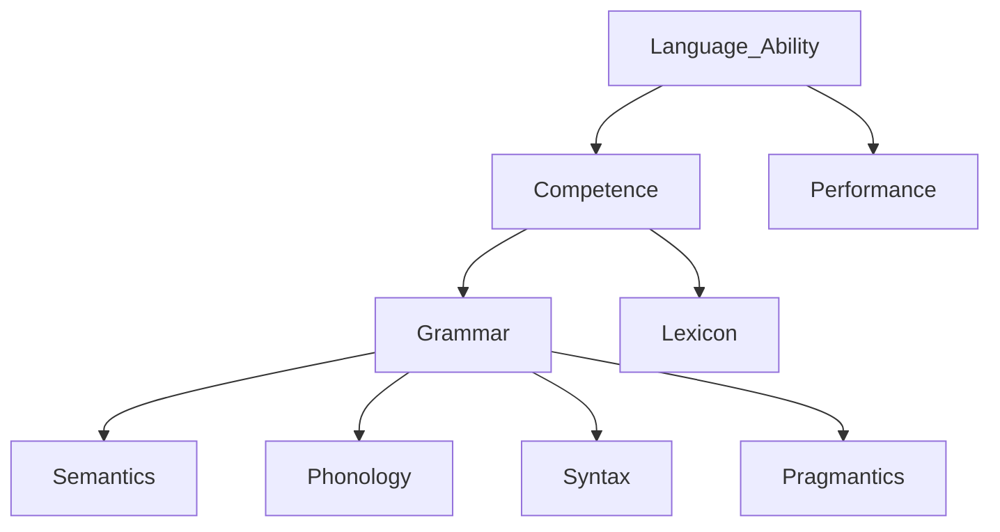
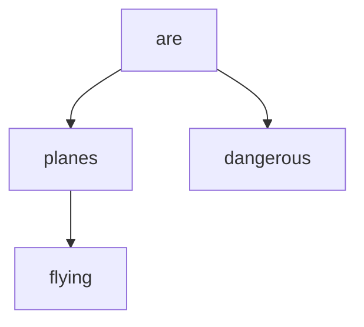
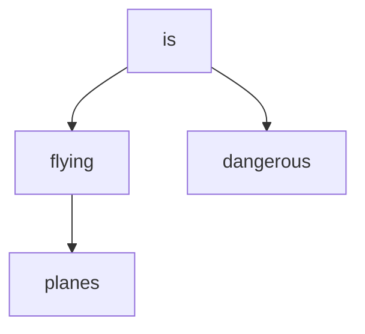
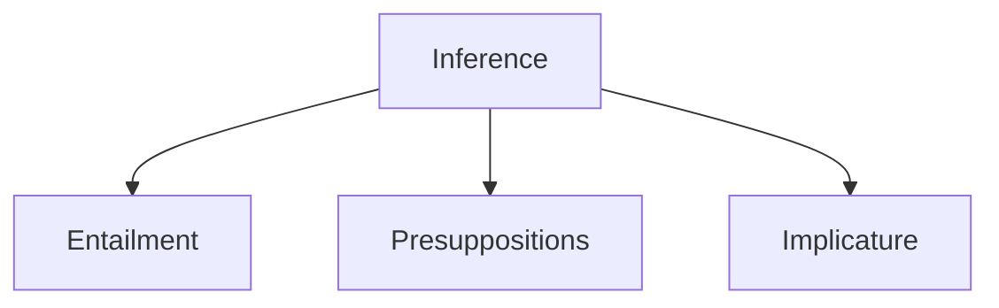
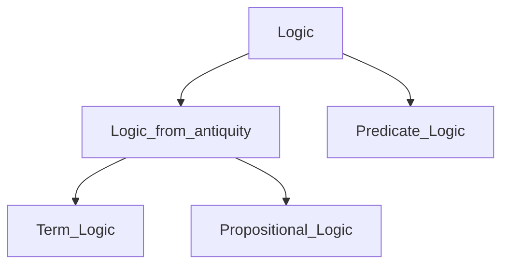
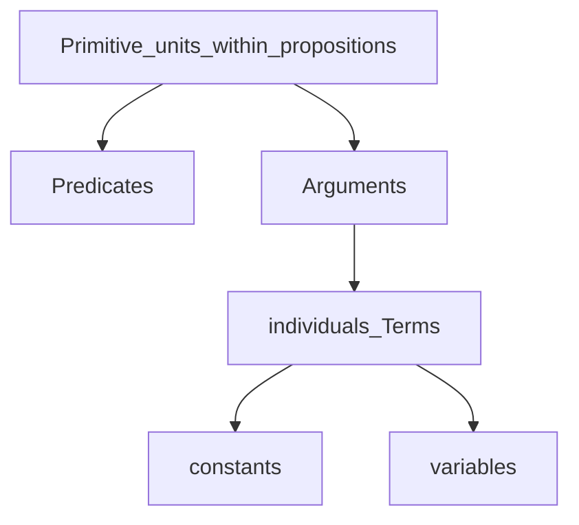
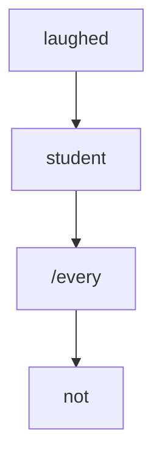
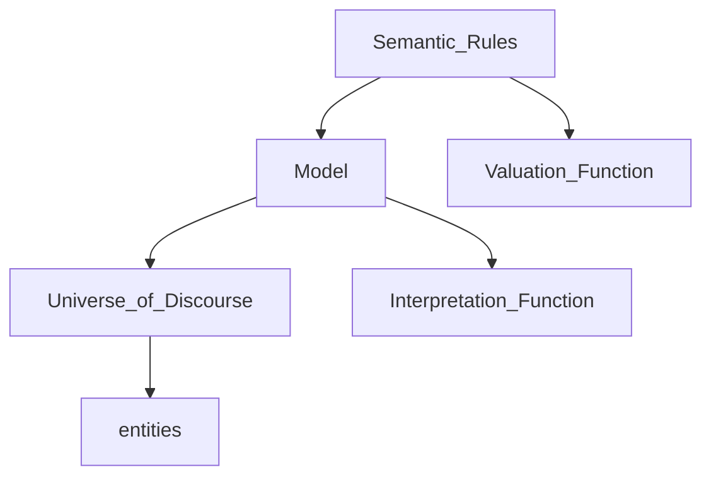
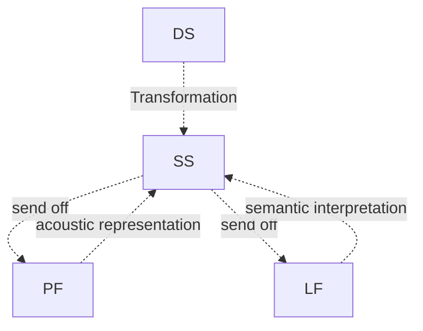

# Semantic Course

# Grading

mid-term: 35%

final: 50%

participation: 15%

## Two tests

Two  tests  will   be  given   during  the  term,  one   in  the   middle   and  one  at   the  end   of  the  term, covering all the material covered up to that point in the course. The tests will be a combination of various types of questions, including true/false and short essay.


# 02/03/2023 Overview

## What is semantics?

study of meaning with regard to natural language.

mean = signify, import, denote, represent

meaning = sense, significance, signification, acceptance, import

## The topics involving:

- Semantics vs. semiotics
    - semiotics is the use signs to convey meaning
    - Ferdinand de Saussure: signifier (phonic and orthographic form that evokes an idea (the signified)) vs. signified (idea in our mind that the signifier evokes). The referent is the actual object in the world that the signified points to.
    - Charles Sanders Peirce: icon (mimic of reality), index (real indicator of the presence of some real event), symbol (arbitrarily evokes or represents something in the world)

# 09/03/2023

## Meaning capturing: metalanguage tools

- parenthesis
    
    ```
    small dogs and cats: 
    - small (dogs and cats)
    - (small dogs) and cats
    
    // example of scope of quantifier
    ```
    
- logical quantifier
    
    ```
    every body did not cry:
    - every not (boy did cry) 'no boy did cry'
    - not every (boy did cry) 'at least one boy did cry'
    ```
    

## Ways to capture meaning: (Henriëtte de Swart)

- mentalistic approach: words itself stands for meaning.
    - prototype: a central or typical member of a category.
    - difficulty: cannot describe functional words: only, of, just
    - by psycho semanticians
- referential approach: words refer to things to entities.
    - intensionality: world-creating predicates
    - difficulty: things do not exists
    - by formal semanticians
    

## Predicate/Predicate Calculus/First-order Predicate Logic

- everything but the subject
    
    e.g. John **likes grammar**.
    
- content verb or adjective taking arguments
    
    e.g. like (John, grammar).
    

## Map of Linguistics Theory



## Semantics & Syntax

### Syntax needs semantics

- We can/cannot study syntax without semantics.
    
    ```
    Colorless green ideas sleep furiously.
    ```
    

### Semantics needs Syntax

- Semantics needs syntax: Semantics is how meaning is assigned to linguistic expressions.
    
    SOV and SVO.
    

## Semantics & Pragmatics

- irony and metaphor

## Context and Deixis

### Deixis needs context

Deixis is how objects, events and situations relate to the here and now of the speakers. It shows that utterance meaning cannot be fully determined by sentence meaning.

- tense (present and past)
- demonstratives (this, that)
- pronouns (I, you, etc.)
- adverbials (here, there, etc.)

```
(Last week) (I) play(ed) tennis with Chris.
```

### Deictic  vs. Anaphoric use of pronouns

Deictic: pointing context

Anaphoric: linguistic expression context. pronoun resolution: antecedent - pronoun

<aside>
💭 index - indices (higher register) / indexes

</aside>

<aside>
💭 Desiderata (high-register way to say Goal, desideratum. sl.)

</aside>

## Map of Semantics

Semantics

- lexical semantics
    - meaning of lexical items
    - smaller unites
    - mainly words
    - morphemes
- compositional semantics
    - meaning of larger units
    - phrases and sentences
    - word combination
    

# 16/03/2023

- utterance: the concrete result of a distinct act of speaking by an actual speaker
- sentence: abstract results of one one more act of sentence/writing
- proposition: the meaning of sentence independent of speaker context

## lexical semantics

- meanings of lexical items
- smaller units

```cpp
abiguity: bank, punch, pitcher
synonymy: beautiful-lovely, 
antonymy: male-female
hyponymy: set -> superset
taxonomy: set -> subset
symmetric relation: marry. mutually entail each other
converse relation: send, sell
meronomy: 
```

### 1) homonymy

- homographs: written the same. lab, match, stroke
- homophones: same pronunciation, distinct orthography. ring vs. wring, phase vs. faze, sent vs. cent

### 2) polysemy

- related meaning for the same words.

### 3) synonymy

- neutral - derogatory

### 4) antonymy

- simple opposite, black and white: dead - alive, pass - fail, hit - miss, present - absent
- gradable: cold - cool - tepid - warm - hot, silent - audible - soft - loud
- reverse: same perspective, distinct directions, often movements involved, pull - push, come - go, lift - push down, leave - return
- converse: same relationship, distinct perspective, above - below, own - belong to, employer - employee. the subject and objects of a predicate.
- taxonomic sisters
    - equal part of a whole
    - color of spectrum: blue, green, red, yellow, purple
    - days of the week: Monday, Tuesday
    - fingers of the hand: thumb, index finger, ring finger, middle finger

### 5) hyponymy

- sets: subsets and supersets
- hyponym of  = type of
- hypernym of  = subsumes
- car - vehicles, bottles - container.
- transitive relationships

### 6) meronymy

part-whole relationship

subtypes of meronymy

- from part to whole: is part of
- from whole to part: has / have
    - steering wheel - car, roof - house, trunk - tree, keyboard - lap
- from member to collection, from collection to member
- from portions to mass (is a portion of), from mass to portion ()can be separated into).
    - mass noun: liquid, salt, paper, homework, love
    - count noun: laptop, tree, car
    - drop of liquid - liquid, grain of salt - salt, sheet of paper - paper, bottle of beer - beer

```cpp
pistachio - almond taxonymy
laugh - cry 
move in - move out
cry - weep
RMB - monetary unit
grilfriend - wife
sit - stand
jump - hop
good - bad
beat - beet
rise - fall reverse
cigarette - cigar taxonymy
kid - goat 
dragon - monster
```

## compositional semantics

- causation feature: kill - cause to cease to be alive, open - cause to be open,
- problem: too many features need, residual meaning
- semantics need syntax: a. Jim hit Sally b. Sally hit Jim.
- thematic roles: agent - patient - recipient - beneficiary - goal - theme - experiencer - instrument - source - percept (Frank saw the bottle)
- hit (agent, patient)

### inventory of components

- actor or agent
- patient
- theme
- experiencer
- beneficiary
- instrument
- goal
- source
- recipient
- percept: being perceived

# 23/03/2023

## Important linguistics

Michel Bréal: coined semantics

Ferdinand de Saussure: semiotician, diachronic vs. synchronic. 

Leonard Bloomfield: structural linguistics, Language, behaviorism(stimulus-response testing). reject introspection(theorize about language learning by thinking about on ones own experience)

### Diachronic & Synchronic

- course in general linguistics (1916)
- across time | with time

### Signifier & Signified & Referent

- signified: ideas in mind
- referent: real objects

### Langue & Parole

- competence & performance

### Paradigmatic & Syntagmatic

- paradigmatic relation: a relation “between an individual unit and others that can replace it in a given sequence”.
- syntagmatic relation: a relation “between elements that form parts of some form, sequence, construction”.

Noam Chomsky Syntax

### Generative Grammar

- transformational grammar, deep structure, Standard Theory
- semantic precedes syntax
- transformations manipulate semantic structures
- lexical items inserted at surface syntax
- reliance on semantic features
- reliance on lexical decomposition

### Ambiguity

- lexical ambiguity
- scope (quantifiers)
- syntactic ambiguity
- pronoun resolution

e.g. Flying planes can be dangerous.





### pronoun resolution

- anaphora
    - anaphor(pronoun takes antecendent)
    - cataphor(pronoun takes posteedent)
    
    ```c
    John said he would helps.
    No boy said he would help. no boy: all the boy not, not exist a boy
    ```
    
- coreference(coreferential): refer to same person
- quantification
    - covariance: the relation between “he” and every/all, “he” refers to all single one
    - binding: “he” binds “every”/”all”

## Inference

notes: cf. compare, e.g. for example



any conclusion drawn from a set of propositions, from something someone has said and so on.

### Entailment

- If A is true, then B is true.

```c
Three girls were present. -> More than two girls were present.
Three girls were not present. kills More than two girls were present.
```

Cannot be cancelled

```c
# Three girls were present, but actually two girls come.
#: semantically wrong
```

### Presupposition

- If A is uttered then B is taken for granted.
- survives negation

```c
Jim regrets ignoring the first problem. -> Jim has the first problem.
Jim does not regret ignoring the first problem. -> Jim has the first problem.
```

cannot be cancelled

```c
# Jim regrets ignoring the first problem, but he does not have the first problem.
```

### Implicature

- If A is uttered, then B is assumed to be true.
- kills negation
- can be cancelled

```c
Susan blushes when Jim looks at her, but she does not have a crush on him.
```

# 30/03/2023

compositionality

- productivity
    
    Key idea behind generative grammar. A relatively small number of combinatory rules may allow speakers to use a finite set of words to create a very large number of sentence.
    
- generativity
- recursivity
    - coordination: I like puppies and ice cream and clear skies and good wine and…
    - embedding: Frank thinks Sam said you deny Sue is cute…

### Principle of compositionally of meaning

The meaning of the whole is a function of the meaning of its parts and the way they are put together.: … is determined by…

### Metalanguage

- object language: the language we talk about
- metalanguage: the language that we use to talk about the object language

```sql
a. January has 31 days.
b. *******January******* has 7 letters.
b*. 'January' has 7 letters.
```

Liar sentence

```
(31) Sentence (31) is false.
```

solutions: (不考)

- fuzzy logic
    
    ```
    x = NOT(x)
    x = 1 - x
    x = 0.5
    ```
    
- Alfred Tarski
    
    paradox arises only in languages that are “semantically closed”.
    
- Arthur Prior
    
    equivalent
    
    ```
    This statement is false.
    This statement is true and this statement is false.
    ```
    
- Saul Kripke
    
    Whether a sentence is paradoxical or not can be depend upon contingent facts.
    
    ```
    A majority of what Jones says about me is false.
    ```
    
    ```
    Smith is a big spender.
    Smith is soft on crime.
    Everything Smith says about me is true.
    ```
    
    If a statement's truth value is ultimately tied up in some evaluable fact about the world, that statement is "grounded". If not, that statement is "ungrounded". Ungrounded statements do not have a truth value. Liar statements and liar-like statements are ungrounded, and therefore have no truth value.
    
- Jon Barwise and John Etchemendy
    
    “denial” or “negation”
    
- Dialetheism
    
    Dialetheism is the view that there are true contradictions. Dialetheism raises its own problems. Chief among these is that since dialetheism recognizes the liar paradox, an intrinsic contradiction, as being true, it must discard the long-recognized principle of explosion, which asserts that any proposition can be deduced from a contradiction, unless the dialetheist is willing to accept trivialism – the view that *all* propositions are true. Since trivialism is an intuitively false view, dialetheists nearly always reject the explosion principle. Logics that reject it are called paraconsistent.
    
- Non-cognitivism
- Bhartrhari’s perspectivism

# Connectives, truth, and truth conditions

logic overview



logic from antiquity: older

predicate logic: newer

Aristotle: term logic

Gottlob Frege: predicate logic

# 06/04/2023

## Overview

- term logic (syllogism logic)
    - Aristotle
    - syllogism
- propositional logic (predicate calculus, semantic, sentence, symbolic logic)
    - antiquity
    - proposition: true and false
    - logical words
- predicate logic
    - gottlob frege
    - meaning
    - quantifier

Not applied for

- question (?)
- exclamation
- modal: modal logic

<aside>
💭 ergo: therefore

</aside>

## Term logic

### Modus Ponens

Means of putting, MP syllogism, affirming the antecedent

```
P(conditional statement): If it rain, I do not go to school.
H: It rains.
C: I do not go to class.
```

Formal fallacy: affirming the consequent. Abductive reasoning.

```
P: If it rains, I will not go to class.
H: I do not go to class.
C: * It rains.
```

### Modus Tollens

Means of carrying, MT syllogism, denying the consequent. 

```
P: If it has not been cloudy, it does not rain.
H: It rains.
C: It has been cloudy.
```

### Hypothetical syllogism

principle of transitivity

```
P: If it rains, the soils goes wet. If the soil goes wet, the plants grow.
H: It rains.
C: The plants grow.
```

### Disjunctive syllogism

two premises and a conclusion

```
P: It either rains or its sunny.
H: It rains.
C: It is not sunny.
```

## Three types of reasoning

- Deductive reasoning
    
    general to the particular. based on entailment
    
- Inductive reasoning
    
    particular to the general. empiricism
    
- Abductive reasoning
    
    formal fallacy. All dogs bark, Fido barks, Fido is a dog.
    
    Abductive reasoning allows inferring a as an explanation of b. As a result of this inference, abduction allows the precondition a to be abducted from the consequence b.
    
    Properly used, abductive reasoning can be a useful source of priors in Bayesian statistics.
    

## Propositional logic

- propositional 1: p
- propositional 2: q
- propositional 3: r
- negation: $\neg$
- conjunction:
- disjunction:
- inclusive disjunction
- exclusive disjunction
- conditional:
- biconditional:

### conditional, material implication

- antecedent
- consequent
- →, arrow.

### biconditional

- ↔
- if and only if
- logical equivalence

### De Swarts formalizations

- $\phi$ phi, any proposition
- $\psi$ psi, any other proposition
- wff, well-formed formula

### Well-formed formula

- Any atomic proposition is itself a wff.
- If $\phi$ is wff, then $\neg\phi$ is wff.
- Two wff’s conbinations under logical operators are a wff.
- No other are wff.

### propositional practice

| John is happy. | p |
| --- | --- |
| John is not happy. | ~p |
| John is happy or sad. | p or q exlusive |
| John is happy, not sad. | p and ~q |
| If John has eaten, John is happy. | p -> q |
| If John has not eaten, John is not happy. | ~p -> ~q |
| John is hungry or thirsty. | p or q inclusive. |
| John left before you did. | p |
| John is not hungry or thirsty. | ~(p or q inclusive) <-> ~p and ~q |
| John is not hungry and thirsty. | ~(p and q) <-> ~p or ~q inclusive |
| If John did not laugh, then John cried. | ~p → q ↔ p or q |
| If John laughed, then John also cried. | p → q ↔ ~p or q inclusive |
| John did not laugh, or John cried. | ~p or q ↔ p → q |
| John laughed, or John cried and beat on the table.  | p and (q or r) ↔ (p and q) or  (p and r) |
| John is not happy, but rather sad. (scope of “not”) | ~p and q. * ~(p and q) |
| John is not happy, or sad. | ~(p and q) |
| John is not happy, or John is sad. | ~p or q |
| John did not help us or hinder us. | ~(p or q) ↔ ~p and ~q |
| John did not help us or John hinders us. | ~p or q |

- Tautology: necessarily true
- Contradiction: necessarily false
- Contingent: possible

```
John is friendly or John is not friendly.
```

| p | V_e | ~p |
| --- | --- | --- |
| T | T | F |
| F | T | T |

```
John is friendly and John is not friendly.
```

| p | and | ~p |
| --- | --- | --- |
| T | F | F |
| F | F | T |

```
It is not the case that John is not friendly.
```

| ~ | ~ | p |
| --- | --- | --- |
| T | F | T |
| F | T | F |

contingent.

```
It is not the case that John is hungry or John is not grumpy.
```

| ~( | p | or | ~q |
| --- | --- | --- | --- |
| F | T | T | T |
| F | T | T | F |
| F | F | T | T |
| T | F | F | F |

# 13/04/2023

## Material implication →

converse: q→p. affirming the consequent

inverse: ~p→~q. denying the antecedent

contrapositive: ~q→~p. modus tollens

given p→q.

- Sufficient condition: if p is True, p is the necessary condition for q so q must be True.
- Necessary condition: if q is True, q is not a necessary condition for p so p may or may not be True.

# 20/04/2023

Although it was extremely cold, Sally did not stay indoors.

```
~q->p
p and ~q
```

We get a holiday, or we protest.

```
~p->q
p or q
```

Jone said that Jane helped him.

```
p
p and q
```

John’s sister burped

```
p: John has a sister. presupposition, assume it true
q: This sister burped.
p
p and q
```

John arrives before Jane left

```
p before q
```

John did not arrive before Jane left.

```
~p before q
p ~before q
```

## Predication and Quantification

universal quantifier: every, each, all, any, only

existential quantifier: a, some, there is $\exist$, for all $\forall$

predicate, argument

John may like Sally.

```
predicate: may like
```

John has a crush on Sally.

```
predicate: has a crush on
```

Frank is the father of Susan.

```
predicate: is the father of
```

Frank is Susan’s father.

```
predicate: is...'s father
```

Adjunct: if, probably, means, of course, early

Valent, empty place holder: formal subject

# 04/05/2023

collective and distributive readings

```
Jogn and Molly ate a pizza.
p: one pizza, ate one together.   distributive
p and q: two pizzas, each ate a pizza.  collective
```

```
Cinthia and Sam have saved 100 dollars.
p: together 100 dollars
p and q: 200 dollars
```

Content verb is a predicate, but functional verbs are not

John obviously spoke with Jane because he had to.

```
predicate: spoke with
argument: John, Jane
adjuncts: obviously, because he had to.
```

If I get a chance, I will probably try to avoid the mistake.

```
predicate: will try to 
argument: I, avoid the mistake
adjuncts: If I get a chance, probably
```

John performed Jill’s operation first.

```

```

The person who talk loudly is Jim’s father.

```
predicate: is someone's father
argument: the person who talk loudly, Jim
adjunct: 
```

the talking loudly person

```
predicate: talking
argument: person
adjunct: loudly
```

predicate: the nodes that are connected in SUD parsing tree

universal dependency (UD)

syntactic-universal dependency (SUD)



lexical  predicates vs. syntactic predicates

- lexical: content verbs, adjectives, common nouns, some prepositions
- syntactic: content verbs plus functional elements, adjective plus functional elements, predicate expressions (nouns, prepositions, subordinators, plus functional elements)

individual constants vs. individual variables

- names and definite descriptions: John, the first one, the idea
- quantified phrases: every man, some idea, no paper

e.g. We think John likes Susan.

```
T(w, Lj,s)
```

Types of predicates:

- converse: husband-wife, above-below, precede-follow
- symmetric: be the roommate of, be married to, be related to
- reflexive: see oneself, praise oneself
- transitive: older than, be north of, be a sibling of

e.g. Monica hid her bicycle.

```
x hide y: Hx,y
Monica: m
her bicycle: b
Hm,b
```

e.g. Monica did not hide her bicycle.

```
x hide y: Hx,y
Monica: m
her bicycle: b
~Hm,b
```

e.g. Monica laughed and cried.

```
Monica: m
laugh: L()
cry: C()
Lm and Cm
```

e.g. Jim sent Monica his dog.

```
Sj,m,d
```

e.g. William did not help or hinder Mike.

```
~ (H1w,m or H2w,m) 
```

e.g. Jennifer promise to help.

```
P(j, Hj)
```

e.g. Jennifer did not promise to help.

```
~P(j,Hj)
```

e.g. Jennifer promise to not laugh.

```
P(j,~Lj)
```

e.g. Mike claimed he wanted to help.

```
C(m, W(m/x, Hm/x))

m: Mike
x: maybe some other
```

e.g. John asked Mandy to stop laughing.

```
A(j, m, S(m, Lm))
```

e.g. John and Larry called Molly.

```
Cj,m and Cl,m
C(j and l, m)
```

e.g. Molly did not call John and Larry.

```
~C(m, j) and ~C(m, l)
~C(m, j and l)
~C(m, j) or ~C(m, l)
```

entailment: (universal instantiation) 

every dog barks → if something is a dog, then it is a dog.

Universal quantification

$\forall$x (Dx → Bx)

D = (d1, d2, d3,…)

$\forall$x (Dx → Bx)= (Bd1 and Bd2 and Bd3, ….)

Existential quantification

$\exist$x (Dx and Bx)

D = (d1, d2, d3,…)

$\exist$x (Dx and Bx) = (Bd1 or Bd2 or Bd3, ….)

e.g. Every cat barfed.

```
\forall x (Cx -> Bx)
```

e.g. The cat barfed.

```
Bc
```

e.g. Bill fed cat.

```
\forall x (Cx -> Fb,x)
```

e.g. Some dog barked at Fred.

```
\exist x (Dx and Bx,f)
```

e.g. Fred scolded some dog.

```
\exist x (Dx and Sf,x)
```

e.g. Fred and Susan avoid some dog.

```
\exist x (Dx and Af,x and As,x)
\exits x (Dx and Af,x) and \exist y (Dy and Af,s)
```

e.g. No dog barks.

```
\forall x (Dx -> ~Bx)
~\exist x (Dx and Bx)
```

e.g. Bill fed no dog.

```
~\exist x (Dx and Fb,x)
\forall x (Dx -> ~Fb,x)
```

e.g. No dog barked at Susan or chased Fred.

```
~\exist x ((Dx and (Bx,s or Cx,f))
\forall x ((Dx -> (~Bx,s and ~Cx,f))
\forall x ((Dx -> ~(Bx,s or Cx,f))
```

Scope ambiguity

e.g. Some boy kissed every girl.

```
\exist x \forall y (Bx and (Gy -> Kx,y)) = \exist x(Bx and \forall y (Gy -> Kx,y))
\forall y \exist x (Gy -> (Bx and Kx,y)) = \forall y (Gy -> \exist x (Bx and Kx,y))
```

# 11/05/2023

Every boy kissed some girl.

```
\forall x (Bx -> \exist (Gy and Kxy)) <=> \forall x \exist y (Gy and Kxy)
```

Every students did not laugh.

```
\forall x (Sx -> ~Lx) <=> ! \exist x (Sx and Lx)
~\forall x (Sx -> Lx) <=> \exist (Sx and ~Lx)
```

Not every student laughs.

```
~\forall x (Sx -> Lx) <=> \exist (Sx and ~Lx)

```



each studnet did not laugh.

```
\forall x (Sx -> ~Lx) 
~\forall x (Sx -> Lx)
```

### Polarity item

any: negative polarity item

John did not pass every exam.

```
~\forall x (Ex -> Pj,x) <=> \exist x (Ex and Pj,x)
\forall x (Ex -> ~Pj,x)
```

John did not pass any exam.

```
\forall x (Ex -> ~Pj,x)
```

- universal quantifier: all, every, each, any
- existential: some, a/an, one, there is

e.g. 

Jack saw a rat.

```
\exist x (Rx and Sj,x) 
```

Jack is a rat.

the quantifier is in the predicate but not the argument. here rat is a constant.

```
Rj
```

Jack knows no genius.

use not exist to render “no”

```
~\exist x (Gx and Kj,x)  <=> \forall x (Gx -> ~Kj,x)
```

Jack is no genius. <=> Jack is not a genius.

```
~Gj
```

These problems are difficult.

```
Dp
```

These problems are difficult ones.

```
Dp
```

All the problems are difficult.

```
\forall x (Px -> Dx)
```

These problems are all the problems.

```
Ap
```

These problems are not all the problems.

```
~Ap
```

Jack is our plumber.

```
Pj
```

Our plumer is Jack. (has presupposition)

```
Pj
```

Everything counts.

whether thing includes animate and inanimate.

```
\forall x (Cx)
\forall x (Tx -> Cx)
```

Everybody counts.

```
*\forall x (Cx)
\forall x (Px -> Cx)
```

predicates

- content words
- adjectives
- predicative expressions (common nouns, adjectives, preposition, subordinators)
- some prepositions.
    
    The present under the tree is big. (prepositions that gives location)
    
- argument nouns.

common nouns

- John is a teacher. Tj
- Every teacher was present. \forall x (Tx → Px)
- The teacher was present. Pt

content verbs are the core of syntactic predicates

adjectives are most always the core of syntactic predicates.

e.g. Mike’s wife thinks Mikes if lazy.

- thinks (Mike’s wife, Mike is Lazy) - propositional
- ‘s (Mike, wife) ‘Mike has a wife’ - presuppositional: does not affect the truth value
- is lazy (Mike) - intensional: does not affect the truth value

predicates inside individual constants are presuppositional

A thin man was present.

- was present (a thin man)
- thin (a man)
- \exist x (Mx and Tx and Px)

predicates inside … .are propositional

e.g. Every barking is harmless

has true or false impact on the truth

```
\forall x ((Dx and Bx) -> Hx)
```

this proposition has to show up in the predicate

The barking dog is harmless.

```
Hd
```

the presupposition does not show in the predicate

John avoids every dog he sees.

```
\forall x ((Dx and Sj,x) -> Aj,x)
```

John said every dog barks.

intensional

```
Sj
S(j,\forall x (Dx -> Bx)) 
Sj,I  ; I for intensional argument predicate
```

### Adjunct predicates

Jane probably teased Sam last night

- teased (Jane, Sam)
- probably (Jane, teased Sam last night) - model adverbs
- last night (Jane teased Sam) - temporal adjuncts

John arrived drunk.

- arrived (John)
- drunk (John)

Jim burped twice.

twice: propositional or presuppositional

Susan did not cheat yesterday.

Mary stayed because John stayed.

- stayed (Mary)
- stayed (John)
- because (Mary stayed, John stayed)

Mary did not stay because John stayed

- ~stay (Mary)
- ~because ()

## restricted quantification

Every boy was hungry

```
\forall x: Bx(Hx)
```

Some boy was hungry.

```
\exist x: Bx(Hx)
```

Every cat barfed.

```
\forall x: Cx(Bx)
```

Bill fed every cat.

```
\forall x (Cx, Fb,x)
\forall x: Cx(Fb,x)
```

Some dog barked at Fred.

```
\exist x (Dx, Bx,f)
\exist x: Dx(Bx,f)
```

Fred and Susan avoid some dog.

```
\exist x(Dx and (Af,x and As,x))
\exist x: Dx (Af,x and Af,x)
```

No dog barks.

```
~\exist x (Dx and Bx) <=> ~\exist x: Dx (Bx)
```

# 18/05/2023

## Formal Predicate Semantics



- model M:
    - Universe of discourse in which all constants have clearly assigned values
    - A limited part of a world (real or imagined), a discourse context
    - Clearly defined
    - Values of linguistics expressions known
- universe/domain of discourse U/D
    - Constants all the constants in M (set members)
- interpretation function I
    - Assign a value to an individual constant
    
    ```
    I(name) → meaning
    ```
    
- assignment function g[x/e]
    - Assign a value to an individual variable
    - g iterates all the variables and assigns the value
    - g() := for x in domain of e
    
    ```
    g(type of object) -> meaning
    ```
    
- valuation function V
    - Assigns a value 1 or 0 to a wffs. (propositions)
    
    ```
    V(p) = 1/0
    V(Bs) = 1/0
    ```
    
- [[\alpha]]^M the denotation of \alpha wrt M (same as interpretation function I)
    
    ```
    [[name]]^M -> meaning
    ```
    

## Relation

- if t is a constant, [[]]^{M,g} = I(t)
- if t is a variable, [[]]^{M,g} = g(t)

# 25/05/2023

### Solution for scope ambiguity

Quantifier-raising 

- NC RM
- syntactic structure comes before the semantic structure
- The movement we make in SS to remove ambiguity in DS is called quantifier-raising.
- take the quantifier to the higher position to show the scope

Quantifier-in

- Montague grammar
- The derivational illustration is called quantifier-in.
- each predicate take an argument once a time

Quantifier storage

- Cooper storage
- semantic ambiguity not represented in syntactic structure
- semantic representation in which scope ambiguities are obtained without special syntactic rules

## Scope and Anaphora

antecedent vs. postcedent

anaphor vs. cataphor

Predicate logic is suited to capture natural language meaning

allow recursion = recursivity

two sources of recursion

- coordination: john likes cats, dogs, beer
- embedding: John said that Mary knws that Bill thinks that Jane claims that

```latex
some boy kissed every girl.

Every girl was kissed by some boy.
```

```latex
Someone mentioned tehy called everyone.

\forall x: Px\forall y(M(x, Cxy))

```

linear order: negative polarity item



Transformation: 

- Jane laughed at Bill
- Bill was laughed at by Jane

# 01/06/2023

annotation, connotation and denotation (不考)

- annotation
    - a critical or explanatory commentary or analysis
    - a comment added to a text
    - the process of writing such comment or commentary
    - (computing) metadata added to a document or program
    - (genetics) information relating to the genetic structure of sequences of bases
- connotation: intension.
    - A meaning of a word or phrase that is suggested or implied, as opposed to a denotation, or literal meaning. A characteristic of words or phrases, or of the contexts that words and phrases are used in.
        
        *The **connotations** of the phrase "you are a dog" are that you are physically unattractive or morally reprehensible, not that you are a canine.*
        
    - A technical term in logic used by J. S. Mill and later logicians to refer to the attribute or aggregate of attributes connoted by a term, and contrasted with *denotation* .
        
        *The two expressions "the morning star" and "the evening star" have different **connotations** but the same denotation (i.e. the planet Venus).*
        
- denotation
    - its explicit or direct meaning, as distinguished from the ideas or meanings associated with it or suggested by it. Simply put, a word’s *denotation* is what that word *means* or directly represents.

## Quantifier-in

interrogative: asking a question

```
which woman does every man love?
```

which scopes over every.

## Scope ambiguity

e.g. 

some boy did not laugh.

```
\exist x (Boy(x) and ~Laugh(x))
~\exist x (Boy(x) and Laugh(x))
```

some boy kissed no girl.

```
\exist x (Boy(x) and ~\exist y (Girl(y) and Kiss(x, y)))
~\exist y (Girl(y) and \exist x (Boy(x) and Kiss(x, y))): there was no girl kissed by a boy
```

every boy kissed no girl.

```
\forall x (Boy(x) and ~\forall y(Girl(y) and Kiss(x, y)))
```

### Deictic

No boy said he was hungry.

No boy was present. He was outside instead.: “he” is trying to refer to ”no boy” but outside the scope.

# 08/06/2023

pronoun $\sub$ anaphora

## Discourse Anaphora

e.g. 

```cpp
Every student was present and she was interested.
```

every: scopes over “Every student was present”

every: an indefinite quantifier. “she”’s antecedent is not clear

“she” is hardly bound by the antecedent. “she” is free

* ungrammatical: 不合语法, syntactic

# infelicitous: 不合适的, semantic, fit the context

- sentence pronoun: within the same clause
- discourse pronoun: in separate clauses

- sentence quantifier:
    
    ```
    Some boy said he was hungry.
    No boy said he was hungry.
    ```
    
- discourse quantifier:
    
    ```
    Some boy was present; he was hungry.
    #No boy was present; he was hungry.   // he is free
    ```
    
- coreference
    
    individual constants
    
    ```
    Fred thought he was the the best
    ```
    
- binding
    
    individual variables
    
    ```
    Every student thinks he/she is the best
    ```
    

rules for e-type anaphora:

- F: universal quantifier + singular pronoun
- T: universal quantifier + plural pronoun
- F: negated quantifier + singular pronoun
- T: negated quantifier + plural pronoun, semantically plural but grammatically singular
- T: existential quantifier + singular pronoun

e.g. No boy thinks that he has a chance.

```
~\exist x(Boy(x) and Think(x, Has-a-chance(x)))
```

A particular boy said he wanted to kiss every girl. He then did it.

```
\exist !x(Bx and  W(x, K(x, \forall y(Gy -> K(x, y))))) and K(x, y)
```

## Donkey anaphora

if a farmer owns a donkey, he beats it.

```
* \exist x (Fx and \exist y (Dy and O(x, y))) -> B(x, y)
\forall x \forall y (Fx and Dy and O(x, y) -> B(x, y))
```

= every farmer who owns a donkey beats it.

```
\exist x(Fx and \exist y (Dy and O(x, y)) -> B(x, y))  // y is free
```

❗❗❗

A donkey sentence is such that an expected existential is interpreted as universal taking wide scope.

donkey pronoun can be: it, him, they (can also be plural forms) 

# 15/06/2023

“a”: generic indefinite

```cpp
A woman is a difficult thing to please.
```

[Every farmer [who owns a donkey] beats it.]

universal wide scope: it scopes more over the relative clause

The problem

- Existential with narrow scope
- interpreted as universal with wide scope
- in conditional clauses
- in restriction of every

Conclusion

- the machinery of predicate logic is broken
- cannot capture meaning of natural language

If a student tries, she passes the exam.

```
(\exist x(Sx and Tx)) -> Py   ; y is free
\exist x((Sx and Tx)) -> Py)
```

interpretation

```
\forall x((Sx and Tx) -> px)
```

Solutions for donkey anaphora:

- E-type anaphora
    - Gareth Evans, 1970s, philosopher, university of Oxford, logic, philosophy of mind
    - pronoun outside the scope of their binder
    - initial examples
        
        ```
        A student came in. She had a question about the exam.
        she = the student came in
        
        Bill owns some sheep and Max vaccinates them.
        them = the sheep Bill owns. E-type pronoun, some sheep scopes over the first half
        ```
        
    - If a student likes Copenhagen, she is happy.
        
        ```
        she = for every case we examine, the student is 
        ```
        
    - every student who reads a semantic paper likes it.
        
        ```
        Bill owns a cat. Max takes care of it.
        Bill is a cat-owner. #Max takes care of it.
        ```
        

- DRT (Dynamic binding theory)
    - discourse anaphora and donkey pronouns
    - intermediate level
    - Irene Heim (1982) and Hans Kamp (1981)
    - Discourse Representation Theory (DRT)
        - embedding conditions
        - language of boxes
        - boxes constantly updated
        - embedded boxes in accessible
    
- Unselective binding
    
    example of the subject is ‘unselectively bound’ by a special ‘generic operator’
    
    ```
    Dogs bark.
    A dog barks.
    ```
    

[](https://people.umass.edu/scable/LING720-FA18/Handouts/4.UnselectiveBinding.pdf)

# Chapter 6 in short: Discourse/Donkey Anaphora

(加粗的是Donkey anaphora和E-type anaphora的区别)

Discourse: basic unit of interpretation

- Dynamic theory of meaning: look beyond the meaning of individual sentences and determine the way they are pieced together to make discourse
- discourse anaphora: anaphora in sequence of sentences (instead of single sentence)
- Donkey sentence: **is such that an expected existential is interpreted as universal taking wide scope**. / sentences that contain a pronoun with clear meaning but whose syntactical role in the sentence poses challenges to grammarians (wikipedia)
    - universal: each, every, all, not all, not every
    - existential: a, one, some, no
    - e.g.
        
        ```
        every farmer who owns a donkey beats *it*.
        it: (corresponding to the) existential ("a") but interpreted as universal
        ```
        
        ```
        every police officer who arrested a murder insulted *him*.
        him
        ```
        
        ```
        every farmer who owns some sheep cleans *them*.
        them
        ```
        
- donkey anaphora = donkey pronoun: it, him, they (can also be plural forms)
- Analysis of donkey anaphora: Montague grammar
    
    e.g. 
    
    ```
    \forall x(Farmer(x) and \exist y (Donkey(y) and Owns(x,y)) -> Beat(x,y))
    ```
    

Anaphoric relations in sentence and discourse

- E-type anaphora: **pronoun outside the scope of binder, not bound, content of pronoun reconstructed, reconstruction based on context**
    - in separate sentences
        
        ```
        A student came in. *She*(the student came in) had a question about the exam.
        ```
        
    - in the same sentence but outside the scope
        
        ```
        If a student likes Copenhagen, *she*(for every case we examine, the student in question who likes Copenhagen) is happy.
        ```
        
    - problem of compound: antecedent must appear as a noun?
        
        ```
        Bill owns a cat. Max takes care of it.
        Bill is a cat-owner. # Max takes care of it.
        ```
        
- unselective binding + Discourse Representation Theory (DRT)
    - embedded conditions
    - language of boxes, boxes constantly updated
    - Accessibility: the antecedent to be in a box ‘as high as’(same box or left box) or ‘higher than’ the discourse referent for the pronoun
    - ⇒ binds all left variables. unselective quantification over all the variables. unselective binding
- dynamic binding
    - ?

Anaphora resolution

- ?

# Final Review

Tim: 后半学期的内容是重点

### Names

| Name | Field | Contribution | Live | Nation | Institution | Fun facts |
| --- | --- | --- | --- | --- | --- | --- |
| Noam Chomsky | mainly in syntax | generative grammar, transformational grammar, government and binding theory, minimalist program, productivity of language, recursivity of language | 1928- | USA | MIT | Most prominent linguist alive |
| Ferdinand de Saussure | linguist and semiotician | founder of semiotics. concepts: sign, signifier vs. signified, diachronic vs. synchronic, language vs. parole, paradigmatic vs. syntagmatic | 1857-1913 | Switzerland | University of Geneva, Switzerland |  |
| Charles Sanders Peirce | philosopher, mathematician, logician | founder of semiotics. concepts: index, icon, symbol. | 1839-1914 | Milford Pennsylvania | JHU |  |
| Michel Bréal  | comparative grammar | coined the term “semantics”, diachronic focus | 1832-1915 | born in Rheinlan (Germany), studied in Paris and Berlin | in Paris |  |
| Leonard Bloomfield | structural linguistics | structural linguistics, language as a self-regulating system, behaviorism(stimulus-response testing) | 1887-1949 |  | Yale University | reject introspection |
| Aristotle | polymath | term logic, initiator of western scientific tradition | 384-322 BC | Stagira, Greece |  | tutor of Alexander the Great |
| Gottlob Freg | philosopher, logician, mathematician | predicate logic, sense(sentence’s proposition) vs. reference (its truth value) | 1848-1925 | German | University of Jena | extreme right-wing views |
| Peter Geach | philosopher, professor of logic | donkey sentence (1962) | 1916-2013 | England | Oxford |  |
| Richard Montegue | semanticist | Montegue grammar: syntax and semantics go together | 1930-1971 |  |  | student of Alfred Tarski, gay man, killed in his apartment, four influential papers |
| Gareth Evans | philosopher | philosophy of mind, work on reference, e-type anaphora | 1946-1980 | England | Oxford |  |
| Irene Heim | semanticist | definite and indefinite pronouns | 1954- | German, Munich | MIT, phd 1982 | advisor: Barbara Partee |
| Hans Kamp | philosopher and linguist | discourse representation theory (DRT) | 1954- | Dutch |  |  |
| Bertrand Russell | philosopher, logician | logic, philosophy of mathematician | 1872-1970 | Wales, Britain | Cambridge |  |
| Henriëtte de Swart | linguist | tense and aspect, negation, bare nominals and indefinite noun phrases. She has also investigated the role of semantics in language evolution, and was involved in the development of bidirectional optimality theory. | 1961- | Dutch | director of Netherlands Graduate School of Linguistics and Utrecht Institute of Linguistics |  |

### Example questions

What is a donkey pronoun?

```
A donkey sentence is such that an expected existential is interpreted as universal taking wide scope.
```

What is a discourse pronoun: 

```
outside the scope of existing quantifier
e.g. No student studies semantics. He is outside.
```

The scope of a quantifier is always bound in the clause it appears.

```
 True
```

What is quantifier raising?

```
Chmosky and May.
LF, 
```

What are De Morgan’s laws?

```
~(p or q) <=> (~p) and (~q)
~(p and q) <=> (~p) or (~q)
```

What are conditional laws

```
p -> q <=> ~p or q
```

When is the indefinite “a” not an existential quantifier?

```
1. donkey sentence
2. generic noun phrase. A woman is difficult to please. \forall x(Wx -> Dx)
3. John is a plumber.pj
```

2 readings: Some boy smiled at Jane and some boy kissed Molly.

```
\exist x(Bx and Sx,j and Kx,m)
\exist x(Bx and Sx,j) and \forall y(By and Ky,m)
```

2 Types of Recursion

```
embedding and coordination
```