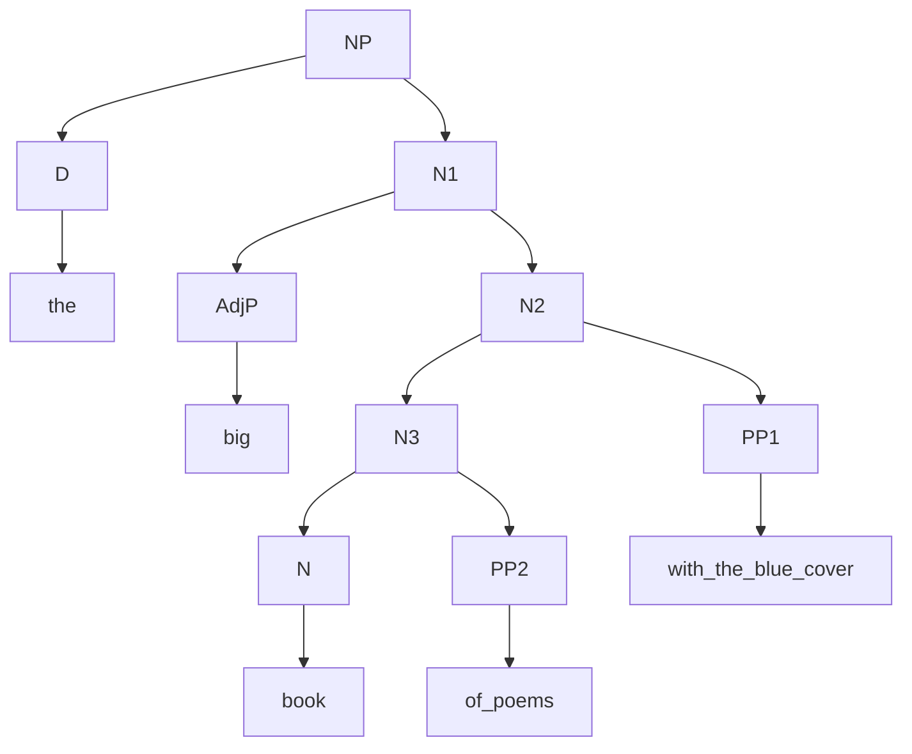

# X-bar theory

生成句法和成分句法之间的区别

```latex
[The big book of poems with the blue cover] is on the table.
```

成分句法做出来，subject是一个高度为1的树

句子之间的成分通过两两组合还能做出新的高度

one-replacement

- The big one with the blue cover is on the table
- The big one of poems with the blue cover is on the table
- The big book of poems with the blue one is on the table
- I bought the big book of poems with the blue cover but not that one
- I bought the book of poems with the blue cover but not that one with the red cover

用one-replacement探测限定词之间的距离关系（动词用did so/did too）

- 如果两个成分之间不能插入one说明关系更近
- 如果两个成分可以被一个one替代说明关系更近

```latex
Mika loved the policeman intensively.
Susan did so half-heartedly.
*Susan did so the baker.
```



加入了bar level，book与of poems构成一个中间投射X-bar，构成一个constituent。使得每个句子都能被画成一个二叉树形式

生成句法学派：上世纪五十年代。classical theory and standard theory。1988年提出了government and binding theory。lexicon, D-S, S-S, PF, LF

### N-bar

原本NP根据一系列规则不是二叉树，比如N→

N-bar theory认为可以都变成二叉树

规则比如

```latex
NP -> Det N'
N' -> AP N'
N' -> N PP
```

第一条称为一个最大投射

### V-bar

```latex
VP -> V'   // 预留一个位置给潜在的specifier，即使没有
V' -> AdvP V' | V' PP | V' AdvP
V' -> V(NP)
```

### Abj-bar

```latex
AdjP -> Adj'
Adj' -> (AdvP) Adj' | Adj' (AdvP)
Adj' -> Adj(PP)
```

### P-bar

```latex
PP -> P'
P' -> P'(PP) | (AdvP)P'
P' -> P(NP)
```

中心词X → 中间投射X’ → 最大投射XP。不能直接到XP，一定要有中间投射

### Parameter of Word Orders 管约论， 原则与参数理论

根据X-bar理论，可以对一些语言的不同语序（如SVO，SOV等）给出语法参数化解释

specifier和complement可以出现在其sister的两侧，这种投射的左右区别被称为parameter setting

### 画树的

- 首先界定成分在X-bar框架中的句法位置，即complement & adjunct & specifier & head
- 先找到head（以及其sister complement成分），注意complement & adjunct（& specifier）必须也要是独立的XP成分，不能是一个单独的X
- 按照head → complement → adjunct → specifier 的顺序画树
- Even if there is no specifier, put an XP on top of the projection. This indicates that there are no more modifiers of the head X.
- Keep in mind that none of the X-bar rules are optional. This indicates that there are no more modifiers of the head X.

## Head Movement 中心语移位

head movement: movement from a head to another head position

句子可以发生movement的标志

- 一个句法结构具有两种reading
- 

shortest movement

shortest: let the path of a movement be the set of nodes that dominate the original position of the moved item, and do not dominate the leading site.