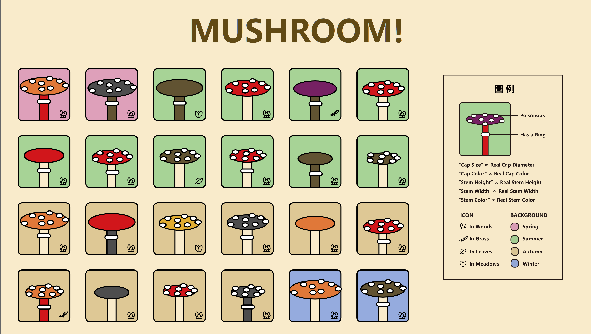
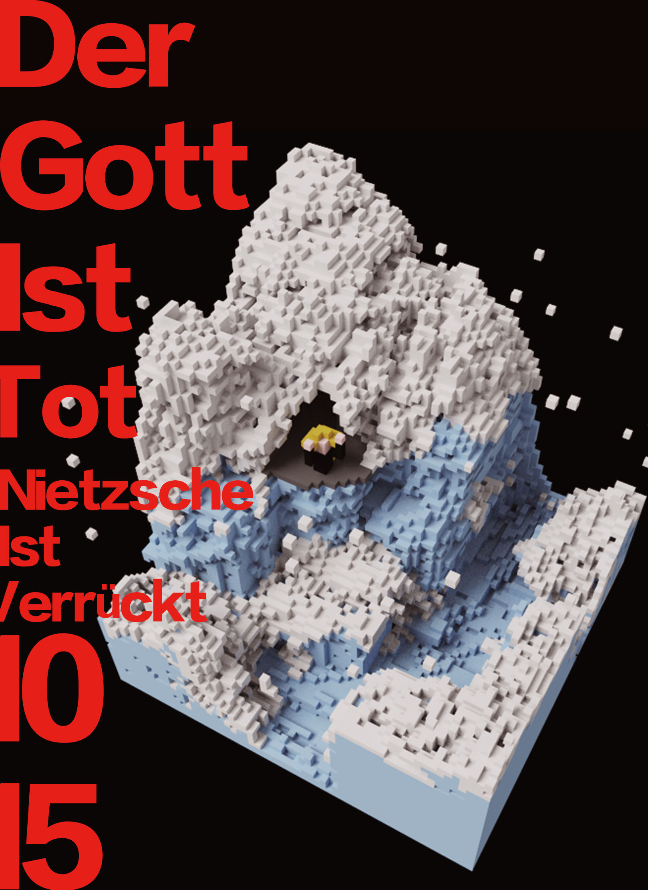
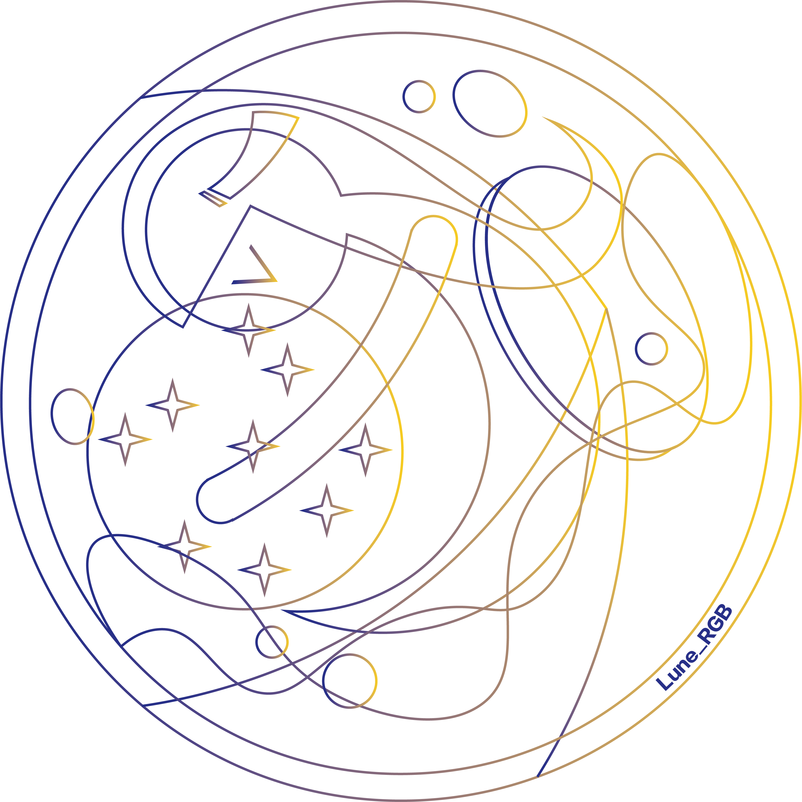
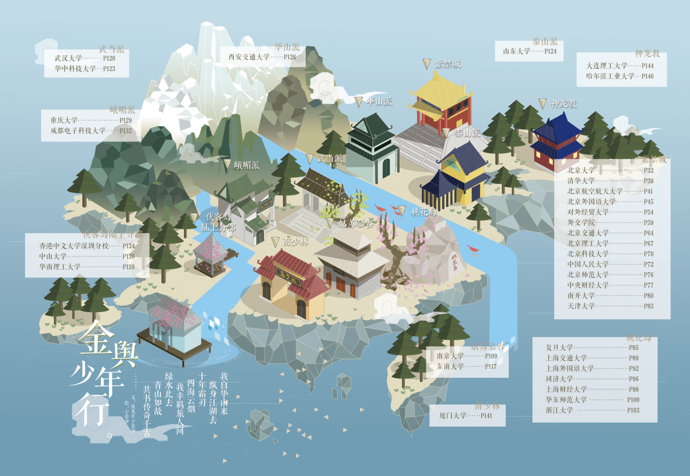
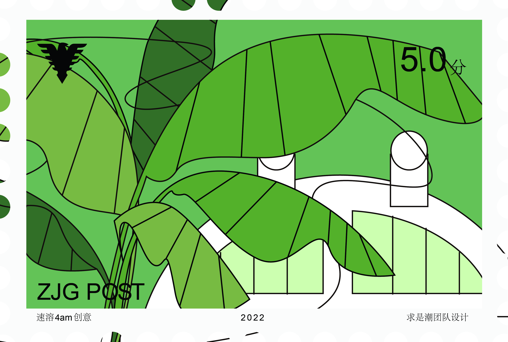

# Portfolio for CMU METALS Application

Hi there! 👋

This site is a temporary portfolio for CMU METALS application.

## Frontend Works

<figure markdown>
  { width="100%" }
  <figcaption>Glyph</figcaption>
</figure>

[Gun violence in US visualization](https://gun-violence-us-visualization.github.io/)

<figure markdown>
  { width="100%" }
  <figcaption></figcaption>
</figure>

<figure markdown>
  { width="100%" }
  <figcaption></figcaption>
</figure>

<figure markdown>
  { width="100%" }
  <figcaption></figcaption>
</figure>

## Graphic Design

<figure markdown>
  { width="100%" }
  <figcaption>Calendar</figcaption>
</figure>

<figure markdown>
  { width="100%" }
  <figcaption>Card1</figcaption>
</figure>

<figure markdown>
  { width="100%" }
  <figcaption>Card2</figcaption>
</figure>

<figure markdown>
  { width="100%" }
  <figcaption>Card3</figcaption>
</figure>

logo

<figure markdown>
  { width="100%" }
  <figcaption></figcaption>
</figure>

<figure markdown>
  { width="100%" }
  <figcaption></figcaption>
</figure>

<figure markdown>
  { width="100%" }
  <figcaption></figcaption>
</figure>

<figure markdown>
  { width="100%" }
  <figcaption></figcaption>
</figure>

<figure markdown>
  { width="100%" }
  <figcaption></figcaption>
</figure>

<figure markdown>
  { width="100%" }
  <figcaption></figcaption>
</figure>

<figure markdown>
  { width="100%" }
  <figcaption></figcaption>
</figure>

<figure markdown>
  { width="100%" }
  <figcaption></figcaption>
</figure>

<figure markdown>
  { width="100%" }
  <figcaption></figcaption>
</figure>
<figure markdown>
  { width="100%" }
  <figcaption></figcaption>
</figure>
<figure markdown>
  { width="100%" }
  <figcaption></figcaption>
</figure>
<figure markdown>
  { width="100%" }
  <figcaption></figcaption>
</figure>
<figure markdown>
  { width="100%" }
  <figcaption></figcaption>
</figure>
<figure markdown>
  { width="100%" }
  <figcaption></figcaption>
</figure>
<figure markdown>
  { width="100%" }
  <figcaption></figcaption>
</figure>
<figure markdown>
  { width="100%" }
  <figcaption></figcaption>
</figure>