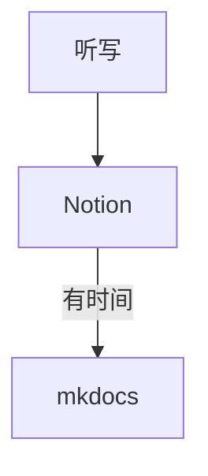

# 我的工具箱！
记录一点好用的工具

## 我的workflow

### 选择Notion和Obsidian

先写一个简单的结论

| 优点/工具 | Notion | Obsidian |
| --- | --- | --- |
| 语法 | 自己的一套语法，部分是markdown | 纯markdown |
| 书写速度 | 慢 | 快 |
| 文档整齐程度 | 高 | 低 |
| 部署到mkdocs难易 | 易，可直接用 | 难，需调整很多格式 |
| 导出中文支持程度 | 只有三种字体，部分中文缺字 | 字体多，支持比较好 |

目前我选择的 workflow: 完全抛弃 Ob 了！

### TODO list 用什么做

TODO

### 文献管理工具

TODO

其实仓库里本文件夹下的asset里现在有个怎么配置zotero的ppt，太懒没时间整过来，可以先去仓库里找找orz

## 零散工具

### 二维码生成器
生成长得不像二维码的二维码
直接扫下面的二维码可以进入网站

### 在线打时间轴工具

https://judes.me/lrc_editor/