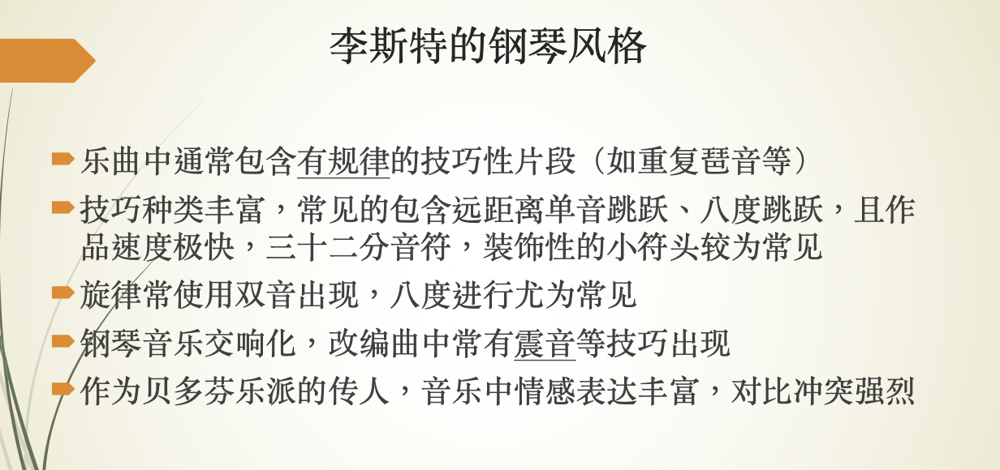
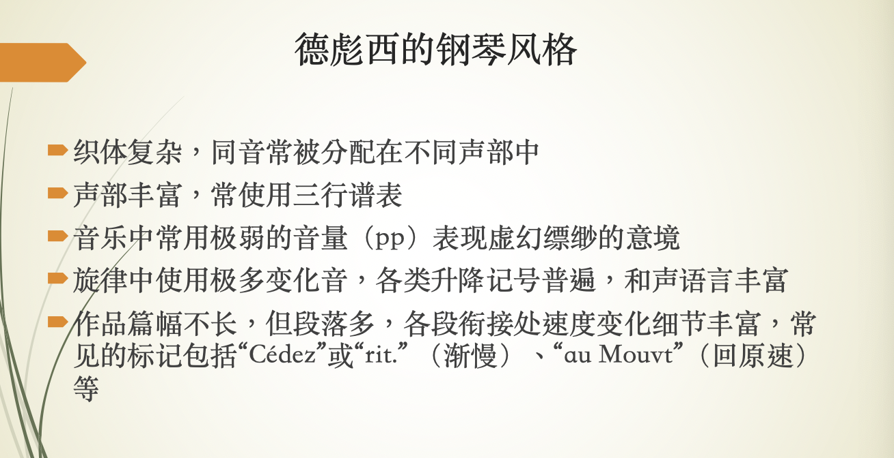

可用于复习期末考试看谱识曲题。

## 上课讲的
斯卡拉蒂

斯科里亚宾

普罗科菲耶夫

## 看谱识曲

乐谱初始标记：
- 速度标记
- 拍号
- 调号
- 临时变音记号
- 运音法记号
- 装饰音记号
- 踏板标记
- 织体——伴奏与旋律的关系

(第一行思捷的，第二行我的)

1. 巴赫C大调前奏曲，平均律作品第二节
    
	C大调奏鸣曲【4/4拍】分声部 复调音乐 没有跳音 一般都没有连音线 有跨过拍子/小结的延音线 pedal tone 管风琴 节奏型的模仿 没有踏板标记
    
    C（44拍），C大调，没有啥装饰音，没有踏板，没有啥强弱记号，升降记号比较多（因为是C大调），左右手感觉是在交替弹音阶，经常有左手很长很长的保持音的伴奏。
    
2. 斯卡拉蒂D大调奏鸣曲. K. 119
    
	D大调奏鸣曲【2个升号 3/8拍】：技巧性 跳跃 模仿响板 快速下行的音阶，连音线连到跳音
    
    38拍，D大调（升fa do），有几处间断的延音踏板（不超过1小节），零星有p/mf记号，中间有一大段紧挨着的fp（在干嘛），旋律通常有整句整句的上升和下降，伴奏要么是三个跳音，要么是三个相同的和弦
    
3. 莫扎特C大调钢琴奏鸣曲Kv.330
    
	C大调奏鸣曲【2/4拍】 短跳音 装饰音 双音重复 两音连两音跳 左手没有跨越很长的音程 柱式和弦伴奏居多 喜欢倚音 closing部分同样的节奏型
    
    24拍，C大调，左手有移动到高音谱表，有零星的mf/p记号，有很多很多装饰音（倚音），没有踏板，主旋律的伴奏是一个上下颠倒的阿贝尔蒂低音，右手音符的时值都很短
    
4. 贝多芬月光奏鸣曲第三乐章
    
    月光奏鸣曲【升C小调 8分音符，2拍】，第三乐章【四个升号】 sf中音快速跳音 琶音
    
    C（44拍），（升fa do so re），有少量短暂的延音踏板，有少量两三个一组的倚音，有很多sf，ff记号，语句全都是上升的，或连续的重音，后面伴奏也有一段阿贝尔蒂低音，最后有一段巨大的上升下降
    
5. 舒伯特即兴曲op90, no3
    
    即兴曲【6个降号8拍】：发展逐步 和声张力推进 4个二分时值
    
    88拍，降6个，右手旋律分高中，高音是保持音，中音是拆分和弦，低音也是保持音，没有太大的起伏变化，没有踏板，没有太多强弱标记
    
6. 肖邦升C小调圆舞曲，op64，no2
    
    圆舞曲伴奏形  【3/4拍 4升号变5降号】
    
    34拍，有4个升号(E)，主要动机是那个sol-la-sol-re, sol-la-sol-do组合，后面有一次变调，5个降号（升C），有很多踏板，记号大多数是pp等弱音记号，有少量装饰音（这个叫伴音还是倚音？与前面不一样的），因为是圆舞曲，左手伴奏一直是典型的圆舞曲伴奏
    
7. 肖邦升C小调幻想即兴曲，op66
    
    升C小调幻想即兴曲【6/8拍】： 右手四个音和左手三个音卡点  很多重音记号  第一次强调低声 第二次强调高声（大于号）
    左手起伏的伴奏形 右手单音旋律 内声部
    
    68拍，4个升号（E）， 依然有很多踏板， 左手是拆分的音很多的和弦，右手很快，左右手根本对不上笑死，依旧变调一次到5个降号（升C）， 有装饰音，有零星几个sf记号，
    
8. 肖邦升C小调夜曲
    
    升C小调夜曲【4/4拍】：超过八度的伴奏 4音组 6音组 连续上下的音阶 18连音 35连音 串音
    
    E，C（44拍），很多踏板，左手是低-中-高-中的拆分，中间右手有一句很叙事性的句子，有ppp这样非常弱的记号，
    
9. 舒曼冲动op12, no2
    
    冲动【4降号→5降号→2降号 6/8拍】： 旋律在左手 会出现sf
    
    68拍，降A（四个降号）到E到升C到降B（两个降号），变调很多，右手要么是很多和弦的三连敲击，要么就是重复的拆分和弦（每一组都有一个保持音），降B调时伴奏非常低， 无踏板
    
10. 李斯特爱之梦
    
    爱之梦【4降号→5降号→5升号 6/4拍】：伪声乐 艺术歌曲 单音旋律 在低音谱号高音谱号间左右手间跳跃  李斯特的印象派特色  转调后到旋律到最高音 规整的对位   双音旋律    左手高音谱号低音谱号变化  【双音旋律在高声】且强调 appassionato 贝多芬和李斯特爱用   左手跨越
    piu smorz
    
    64拍，降A，旋律分高中低，中是保持音，高是拆分和弦，中间有很李斯特的变态的手滚键盘语句和大跨度砸琴语句，后面有一段变到中是拆分和弦高是保持音，
    
11. 李斯特钟
    
    钟【5升号 6/8拍】：很远的跳跃音程 上下符干 高音跳跃 快速跑动
    
    68拍，B（降C，5个升号）， 充满非常李斯特的大跨度砸琴和手滚键盘，
    
12. 柴可夫斯基六月船歌
    
    船歌【总体上两降号 会出现单升号 4/4拍】：两单音一和声伴奏
    
    44拍（C），降B（两个降号），右手非常叙事性，有很多短暂踏板，主导动机是一句re-mi-fa-sol-si-do-re-sol-fa-sol-re，中间有两小节的和弦全部用琶音弹出
    
13. 勃拉姆斯间奏曲
    
    间奏曲【3升号 3/4拍】：柱式和弦的织体 比较和缓
    
    34拍，A大调（3个升号），主导动机是do-si-re，do-si-la（也有一些伴奏是上下颠倒的这个动机），没有踏板，
    
14. 德彪西水中倒影
    
    水池倒影【5降号→0降号→3降号→5降号 4/8拍】：法文 重复出现pp弱音 加上保持音的旋律旋律线条 没在谱子写踏板 平行八度上下行 Mesure doux et expression au Mouv 快速轻巧弱跑动
    
    48拍，降D（升C，五个降号），非常多曲内升降记号，无踏板，有长句的7度音拆分滚键盘，后半段有跨越左右手的语句，ff和ppp交替出现，有变调（到降E，三个降号），很多法语（啊这是可以说的吗），结尾处许多极高与极低的八度保持音，记号写着有辽远感
    
15. 拉威尔水之嬉戏
    
    水的嬉戏【4升号 4/4拍 中间穿插了 2/4拍】：简短重复 pp 小单元重复 左手旋律 两个小结从pp→ff→pp 
    
    44拍，E（四个升号），右手拆分得没有德彪西全，是五度音（但其实我看不出来你知道吗），他不是很有辽远感，重复的小节很多，主旋律在后半段有回归
    
16. 拉赫马尼诺夫G小调前奏曲op23 no5
    
    G小调前奏曲【2降号】：跳音和保持音同时出现， 左右同样的旋律 短短长节奏型 4个音一起的跳音 肢体很整齐
    
    C（44拍），两个降号，很多和弦的连续敲击，敲完缓和了一阵，左手是升降升降的音阶，然后又开始和弦敲琴，没有踏板，和弦上有巨多跳音重音符号，
    
17. 斯科里亚宾练习曲 op8 no12
    
    练习曲【5升号】八度旋律
    
    44拍，六个升号（升F），一直在用八度演奏旋律，无踏板，好像找不出什么别的特点，就左右手全是八度，
    
18. 普罗科菲耶夫年轻的朱丽叶
    
    年轻的朱丽叶【4/4】vivace活版 变化音很多 短跳音 psubito
    
    44拍，C大调，无踏板，右手很多类似阿贝尔蒂和弦但不是的的跳音，或在用上升的音阶，跳音非常多，中间变调到A大调，略平静(tranquillo)，后面变回C大调和跳音很多状态，然后到G大调又开始叙事，右手是伴奏左手是旋律。感觉变调和情感变化很多是这曲的特点，因为是歌剧
    
19. 格什温前奏曲no1
    
    前奏曲【两降号 2/4】重复 切分（大于号） 现代 拉美风
    
    24拍，降B大调，开头看到保持音记号和强音，左手看起来是不太和谐的有打击性的伴奏，右手主旋律是do-re-fa-si-si, do-re-fa-la-la，出现两次，很短的一首（这个能算吗啊啊啊）
    
20. 巴托克在户外
    
    在户外【2/4拍】第一段 打击乐 经常有左右交换的感觉 正反拍中印 两个低音谱号
    
    24拍，C大调，左右手都在低音，到处是不和谐的打击乐声（大部分有降号的和弦，或相邻音挤在一起构成的和弦都是），中间变化到34拍，也很短