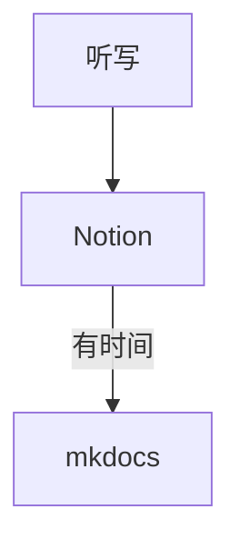

# 对笔记工具和信息记录的思考

## 为什么要写这些笔记

- 因为废 man 学习法：不用废人了，自己用自己的话复述一遍也是讲课
- 因为学了会忘
- 因为学了会忘是正常的事
- 因为学完忘了但是还是自己的笔记查起来快

本来想写多一点的，但是太懒了

## 笔记工具？

对我来说一个完全面向过程的 -> 一个完全面向对象的

比如 notion 是面向流程的

而如果要有结构写作，就用 mkdocs 

### 选择Notion和Obsidian

先写一个简单的结论

| 优点/工具 | Notion | Obsidian |
| --- | --- | --- |
| 语法 | 自己的一套语法，部分是markdown | 纯markdown |
| 书写速度 | 慢 | 快 |
| 文档整齐程度 | 高 | 低 |
| 部署到mkdocs难易 | 易，可直接用 | 难，需调整很多格式 |
| 导出中文支持程度 | 只有三种字体，部分中文缺字 | 字体多，支持比较好 |

目前我选择的 workflow: 完全抛弃 Ob 了！

### 文献管理工具

TODO

其实仓库里本文件夹下的asset里现在有个怎么配置zotero的ppt，太懒没时间整过来，可以先去仓库里找找orz

### 论文笔记

TODO

### TODOlist？

对我来说也需要一个面向过程的（想到需要做所以记下来的模糊任务）+ 一个面向对象的（一个有明确起止时间的、结束标志的任务）。

前者我希望是一个可以无限扩展的 list，并且允许添加各种 sublist -> 一个很舒服的 markdown 编辑器即可。

后者则最好有天、周、月等 view 可以看任务的 availability。

我现在的方法

