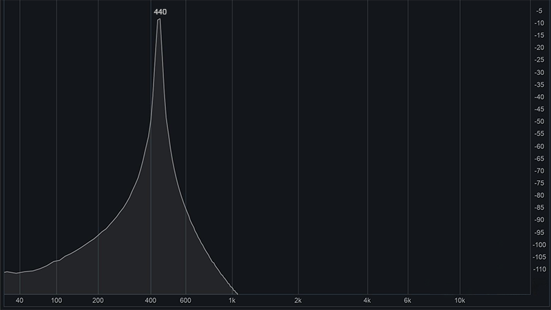
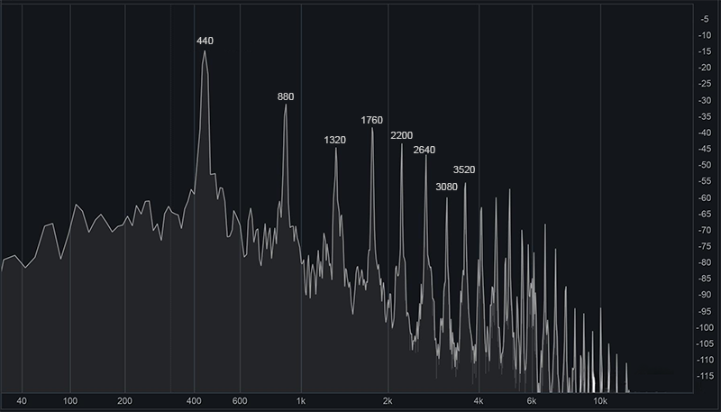
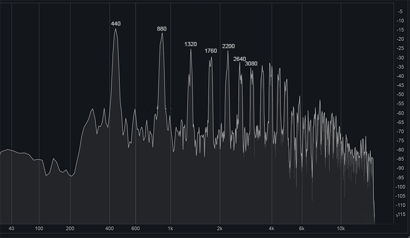
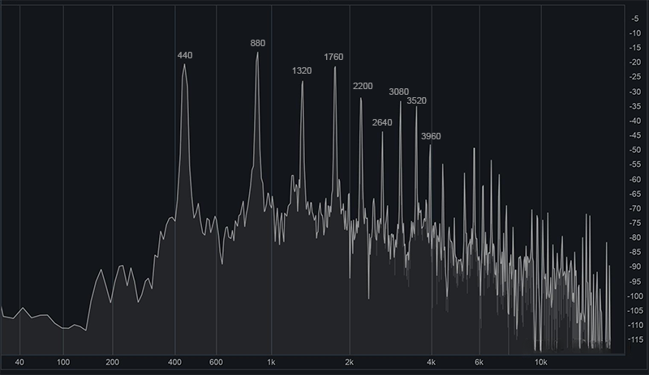
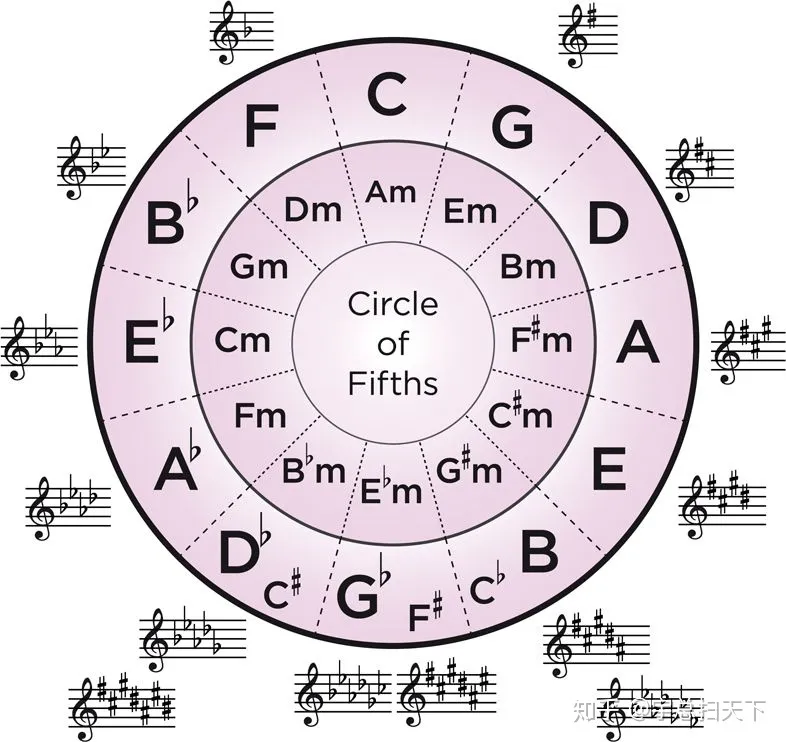
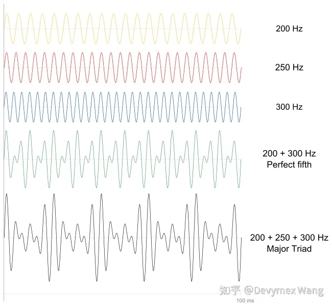
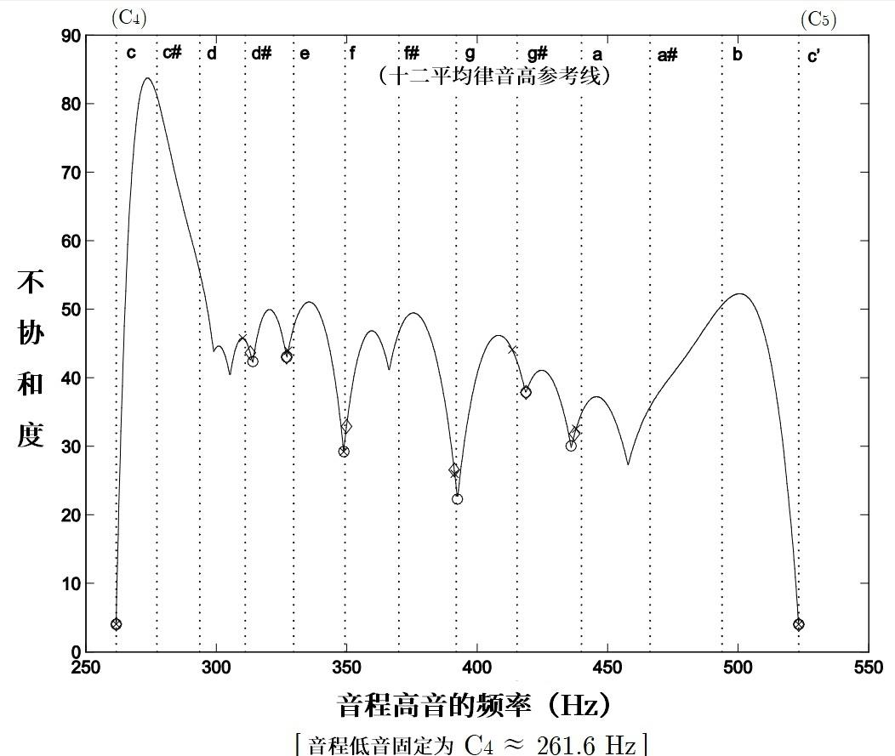
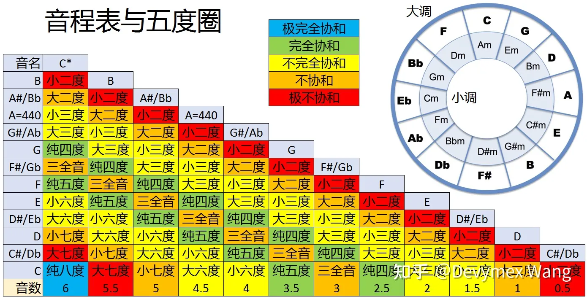
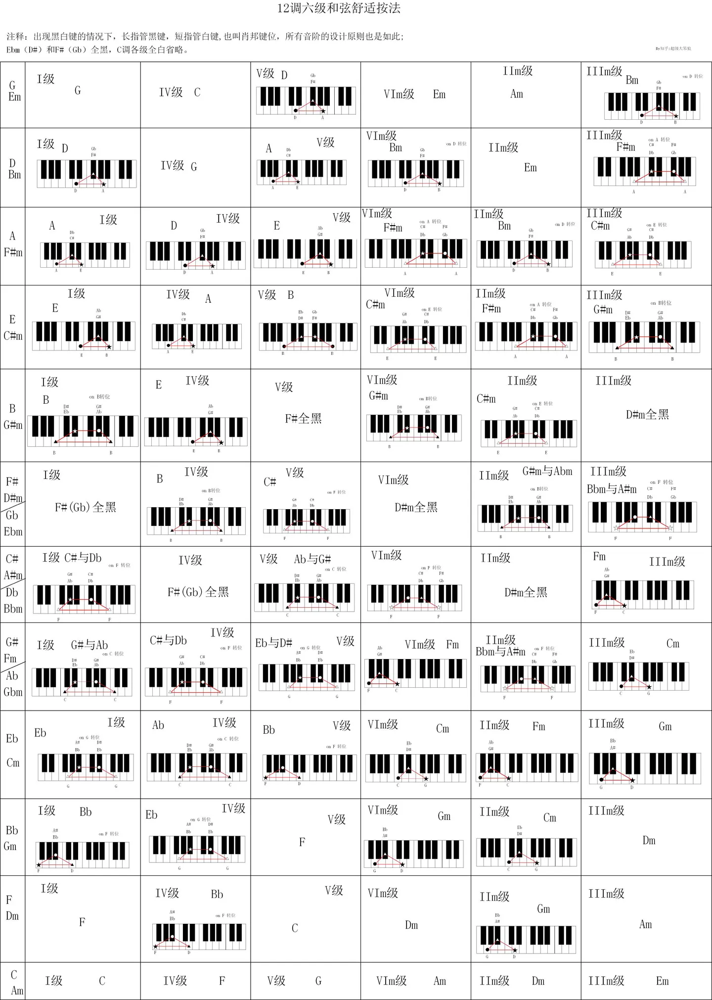

# 乐理

## 概述

一些物理概念

- 音乐：是由声音构成的。噪音也是声音构成的，噪音是不和谐的声音。
- 声音：是一个宽泛的概念，泛指人耳可以听到的声波，一般是 20hz - 20000 hz。钢琴最低音频率是 27.5 hz，最高音频率是 4186hz。
- 声波：是一种机械波，由物体（声源）震动，带动空气振动，从而形成声波。
- 音源：能够产生音的设备/装置/器官等，比如乐器、人的声带

乐理的基础规则有三条

- 应该弹哪个键（音高）或弹哪几个键（和声和弦）
- 应该弹多久（节奏）
- 应该弹多重（强弱）

以及以此延伸的几条规则

- 各个键/弦的来源（频率&五度相生律&十二平均律）
- 乐曲中应该选用哪些音和主音（音阶&调式&调性）
- 怎么记录音乐（五线谱&简谱）
- 两个音之间的差异与关系（音程）
- 乐谱需要在整体频率加高或降低，以适应不同乐曲（移调）
- 乐谱改变，改主音或改选用的音（转调）

## 声音

!!!
    💡 TODO: 这个显示频率的是什么工具？

### 纯音

只包含一种频率的音称为纯音。

多种频率复合在一起的音称为复合音。

实际演奏中，一般比如演奏某频率的音时，也会同时产生2倍频率（第2泛音，基音）、3倍频率（第3泛音）…等音。这是由于声音在空气中传播时反射，反射后的波形会与原波形叠加产生N倍泛音。每个乐器的音色不同，本质上是它们的泛音的振幅与基音不同。

### 钢琴

### 小提琴

减弱幅度没有钢琴大，所以比钢琴尖锐（因为频率越高越尖锐）

### 双簧管

第2泛音比基音大

## 音律

音律可以认为是指一种“选择哪些频率来作为一件乐器的音”这种规则或以此选出来的一组频率。如果具体一点来讲，乐器可以抽象成一组长度不同的弦，由于长度不同所以发出不同频率的音，而乐器设计者最关心的问题就是怎样设计这组弦长（这组频率），以使发出的频率最符合听众心中那些和谐的音。

一个常识是，一般需要差异 5% 及以上的两个频率，可以被正常人分辨为两个不同的音。所以两个音之间的最小差距不必小于这个频率差。

在此额外提出一个音程的定义：两个音之间的频率之差叫音程。我们在这里主要关心的音程是一个八度。

设定音律的著名做法主要有以下三种，三分损益法，五度相生法，和十二平均律，我们依次介绍。

- 三分损益法
    
    取一根弦，分别在其1/2，1/3，1/4处取一个音。
    
- 五度相生法
    
    由毕达哥拉斯提出。分别在2/3，4/9，8/27，16/81，32/243处取5个音。
    

- 十二平均律 Equal temperament
    
    由明代朱载堉（yù）在万历十二年提出，后传入西方，它的贡献主要是修正了五度相生法产生的音，在转调后会与原来的音程有一些区别这个问题。是现代音乐体系中最底层的一个设定，它规定了两个单音的相对音高，具体做法是将一个纯八度分成12份，每份称一个半音，两份一个全音，这样就定义出了所有中间的单音。八度音的频率分为十二等份的做法，就是分为十二项等比数列，每个音的频率为前一个音的 2 的 12 次方根。
    
    西方7音取的是其中7个（白键），东方5音取了5个（黑键）。
    

## 调性

调性主要包含了调高（主音）与调式两大方面。

### 调式

李重光《基本乐理通用教程》中定义调式为

> 几个音（一般不超过七个，不少于三个）按照一定的关系（高低关系、稳定与不稳定的关系等）联结在一起，构成一个音组织，并以某一个音为中心，这个音组织就叫“调式”。
> 

- 调式：概念强调组织方法和模式，即重点是调式内各音的地位与功能。
- 音阶：强调的是由哪些音构成，组织的思路则不是音阶所关心的。

调式之间的差异既有音，也有音程

e.g. 分析两个调每两个音之间的音程关系。

- C自然大调：1、2、3、4、5、6、7、1 全全半全全全半
    
    音程结构为大二度（1-2），大二度（2-3），小二度（3-4），大二度（4-5），大二度（5-6），大二度（6-7），小二度（7-1）
    
- a自然小调：6、7、1、2、3、4、5、6 全半全全半全全
    
    音程结构为大二度（6-7），小二度（7-1），大二度（1-2），大二度（2-3），小二度（3-4），大二度（4-5），大二度（5-6）
    
另一个回答则说区别在与主音之间的音程关系。应该是一样的。

### 关系大小调和五度圈

上述两个调是关系大小调，也就是只有循环顺序改变了，升降关系是相同的。以此我们得到一个五度圈

这个图上可以得到的信息有：

- 小调和大调的调号有对应关系，在循环圈里，内外环相对应的为关系大小调，使用相同的调号。
- 当已知大调的调号后，向下找小三度即可得到小调的名称。

如何高效记忆五度圈：

上午11点，Fat Cat Go Down And Eat Bread，所以五度圈从11点开始顺时针方向是FCGDAEB

下午6点，Go Down And Eat Bread，从6点方向开始又是GDAEB，由于是晚上所以都要降半音

### 大调与小调

上述例子中引入了大调与小调的概念。一个更正式的定义如下

- 大调和小调的全半音结构：全全半全全全半、全半全全半全全。
- 大调的音程结构：纯一度、大二度、**大三度**、纯四度、纯五度、**大六度**、**大七度**
- 小调的音程结构：纯一度、大二度、**小三度**、纯四度、纯五度、**小六度**、**小七度**

### 调号

当把上述音程关系套入一个用任意主音开始的音节，就会出现带各种升降号的调性，每种有一个调号来命名。

调号的一个记忆规则是

- 升4152637
- 降7362514
- 升号最后一个调号往高一个半音是调性名称、降号倒数第二个调号是调性名称。

受限于以前的律制和每个音频率之间的比例关系，以前是无法随意站换调性的，因为如果转换，音符之间的比例就与之前不一样了。但因为有十二平均律，转调变得随意。

上述讨论的五度圈和大小调是理论得出的，可能也可以称为自然音阶调式，待考证。下面来介绍一些历史上常用的经典调式。

### 7种中古调式（教会调式）

| 教会调式  | 音名    | 半音间隔 | 特点                                                                                   |
| --------- | ------- | -------- | -------------------------------------------------------------------------------------- |
| Ionian大  | CDEFGAB | 2212221  | 大调，听起来明朗开阔                                                                   |
| Dorian    | DEFGABC | 2122212  | 民族音乐，常用于游戏和电影音乐                                                         |
| Phrygian  | EFGABCD | 1222122  | 小二度的Phrygian调式听起来沉重，常用于悲剧电影音乐                                     |
| Lydian    | FGABCDE | 2221221  | 没有纯四度的Lydian调式遥远浩瀚，有科幻感，常用于科幻电影音乐。                         |
| Mixoly    | GABCDEF | 2212212  | 比大调重叠率高（具体重叠率的计算可以见下方帖子），且明朗生动的Mixoly常用蓝调和硬核摇滚 |
| Aeolian小 | ABCDEFG | 2122122  | 柔和暗淡                                                                               |
| Locrian   | BCDEFGA | 1221222  | 没有纯五度的Locrian听起来恐怖黑暗，常用于灾难恐怖电影音乐                              |

一个教会调式中具有的度与听感的关系分析如这个帖子所示：

[音程 - 音乐理论的科学与起源 - 音乐理论自学入门基础教程 (pianoabrsm.com)](https://www.pianoabrsm.com/lesson-music-theory/zh-CN/05-interval){target="_blank"}

### 调号与情绪色彩的关系

自然音阶各调式与情绪色彩的关系。很有意思

- https://www.163.com/dy/article/FUFDF5FI0514UGFI.html
- https://hysylvia.blogspot.com/2018/04/blog-post_8.html
- https://www.chinaviolin.net/article-2869-1.html
- https://www.sohu.com/a/242333831_595449
- https://www.sohu.com/a/391841484_681125
- http://www.360doc.com/content/22/1213/22/63514826_1060165042.shtml

我的个人观点（TODO 待更新）

| 调式   | 色彩   | 意象                 |
| ------ | ------ | -------------------- |
| C 大调 |        |                      |
| C 小调 |        |                      |
| D 大调 | 金色   | 金碧辉煌的宫殿       |
| D 小调 |        |                      |
| E 大调 |        |                      |
| E 小调 |        |                      |
| F 大调 |        |                      |
| F 小调 | 墨蓝色 | 黑云密布海浪翻涌     |
| G 大调 |        |                      |
| G 小调 |        |                      |
| A 大调 |        |                      |
| A 小调 | 冰川蓝 | 灿烂阳光下闪耀的冰川 |
| B 大调 |        |                      |
| B 小调 |        |                      |

## 和声理论

- 拍音：一种复合音，来自于同一种乐器或不同乐器的两个单音相互叠加，形成具有规律的强弱变化。与谐波不同的是，拍音一般要求两个音的振幅相近，但不一定频率为倍数关系。如图
    
    
    
- 和声：由超过一个单音组合成的声音。一般西方理论中和声主要指两个音的关系，而三个及三个以上则属于和弦的范畴。

拍音都是和声，但是和声不一定产生拍音，因为超出人耳可以听到的频率的不算拍音，不同乐器发出的也不叫拍音，同时拍音也严格要求所有音的频率起始位置严格对齐，而和声只要有同时发声的时刻即可。

### 和声与和谐程度的关系

首先有相邻两个音之间的频率比约为 1.06（记为p）。各个音程的频率比（即，相距某个音程的低音与高音频率之比）则可以由其音数t按公式算得 $1/2^{2t/12} = 1/06^{-2t}$ ，其中，等式左边是，等式右边是

于是得到的所有关系（并经过实验）得到一个经验表格。这个表格应该最早是由公元前毕达哥拉斯得出的，他表述为：两个音的琴弦长之比的最大公约数越小，两个音同时弹奏就越和谐。（如果回忆我们上面讨论的泛音，泛音重叠比例越高就越和谐）

- 排在最前面的（包括纯一度）纯八度、纯五度、纯四度在音乐理论中是认为很和谐悦耳的。
- 中间的大三度、小三度、大六度、小六度是不完全协和的。
- 大二度、小二度、大七度、小七度、（增四度减五度）是完全不协和的。

十二平均律音高参考线：

可查阅的和谐与不和谐表格：

## 伴奏

每种调式可采用的和弦种类，可以用以下表格来查阅。

伴奏不一定是和弦中所有音一起弹，也可以拆解。常见的拆解法有

- 不拆解，称为柱式和弦，例 135 一起按下占一拍。
- 拆解为四分音符或八分音符占两拍（根据节拍，我不知道怎么总结）：例 1-3-5，或 1-3-5-1。
- 阿尔贝蒂低音（Domenico Alberti）：例 1-5-3-5。

三和弦转位 TODO

比如有一个三和弦CEG，称为原位，将C变成高八度的C，称为第一转位，在第一转位基础上将E变成高八度的E，称为第二转位。

终止式 TODO

不完全终止式 TODO

七和弦 TODO

[和弦 - 音乐理论的科学与起源 - 音乐理论自学入门基础教程 (pianoabrsm.com)](https://www.pianoabrsm.com/lesson-music-theory/zh-CN/06-chord){target="_blank"}

## 参考资料

- [pianofanie - 知乎 (zhihu.com)](https://www.zhihu.com/people/pianofanie){target="_blank"} **【课程】乐理知识讲重点**

- [Devymex Wang - 知乎 (zhihu.com)](https://www.zhihu.com/people/devymex){target="_blank"} **写给理工科人看的乐理**

- [【阳光讲乐理】小白向乐理教程12集全【doyoudo出品】_哔哩哔哩_bilibili](https://www.bilibili.com/video/av4500081/?from=search&seid=8477771140843688396&vd_source=add8ed6a0a0c3142a3e6ce9e4b286af6){target="_blank"}

- [【乐理知识入门】什么是调性？什么是大小调式？科学理解大小调知识，探讨有效学习背后的思维模式 - 知乎 (zhihu.com)](https://zhuanlan.zhihu.com/p/104798436){target="_blank"}

- [概述 - 音乐理论的科学与起源 - 音乐理论自学入门基础教程 (pianoabrsm.com)](https://www.pianoabrsm.com/lesson-music-theory/zh-CN/00-guide){target="_blank"}

- [十二平均律 - 维基百科，自由的百科全书 (wikipedia.org)](https://zh.wikipedia.org/wiki/%E5%8D%81%E4%BA%8C%E5%B9%B3%E5%9D%87%E5%BE%8B){target="_blank"}

- 《音乐理论基础》，李重光编著，人民音乐出版社；

- 《基本乐理教程》，赵小平编著，人民音乐出版社；

- 《基本乐理教程》，童忠良编著，上海音乐出版社。
