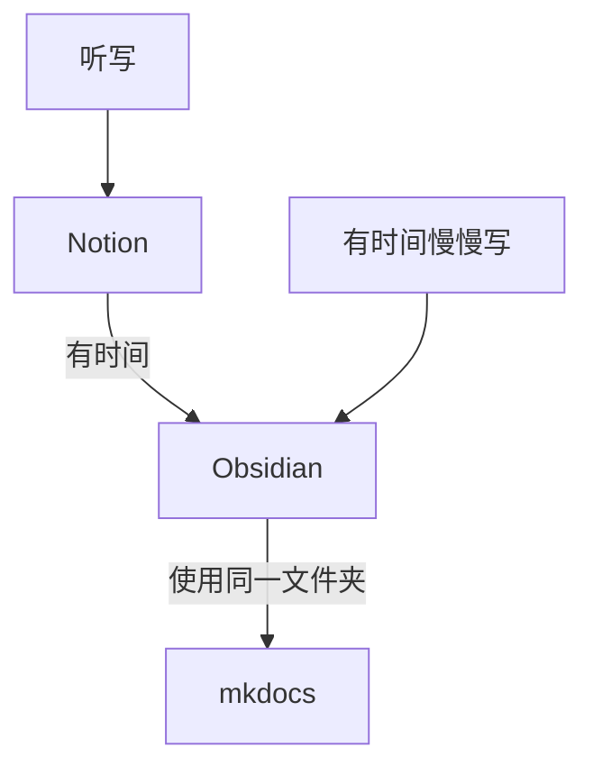

先写一个简单的结论

| 优点/工具 | Notion | Obsidian |
| --- | --- | --- |
| 语法 | 自己的一套语法，部分是markdown | 纯markdown |
| 书写速度 | 慢 | 快 |
| 文档整齐程度 | 高 | 低 |
| 部署到mkdocs难易 | 易，可直接用 | 难，需调整很多格式 |
| 导出中文支持程度 | 只有三种字体，部分中文缺字 | 字体多，支持比较好 |

目前我选择的workflow

Obsidian to mkdocs
1. 图片路径问题：需要在设置中关闭使用wiki路径，保证所有图片都用md语法``
